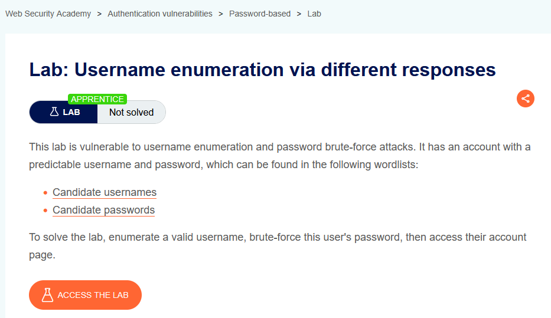
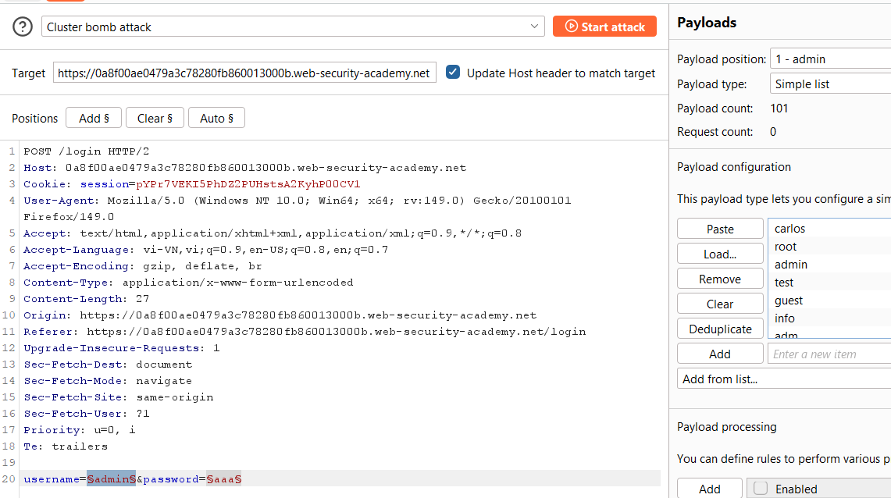
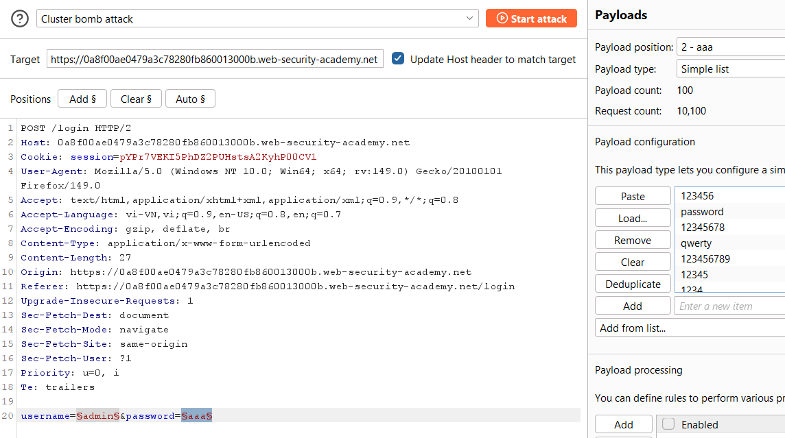
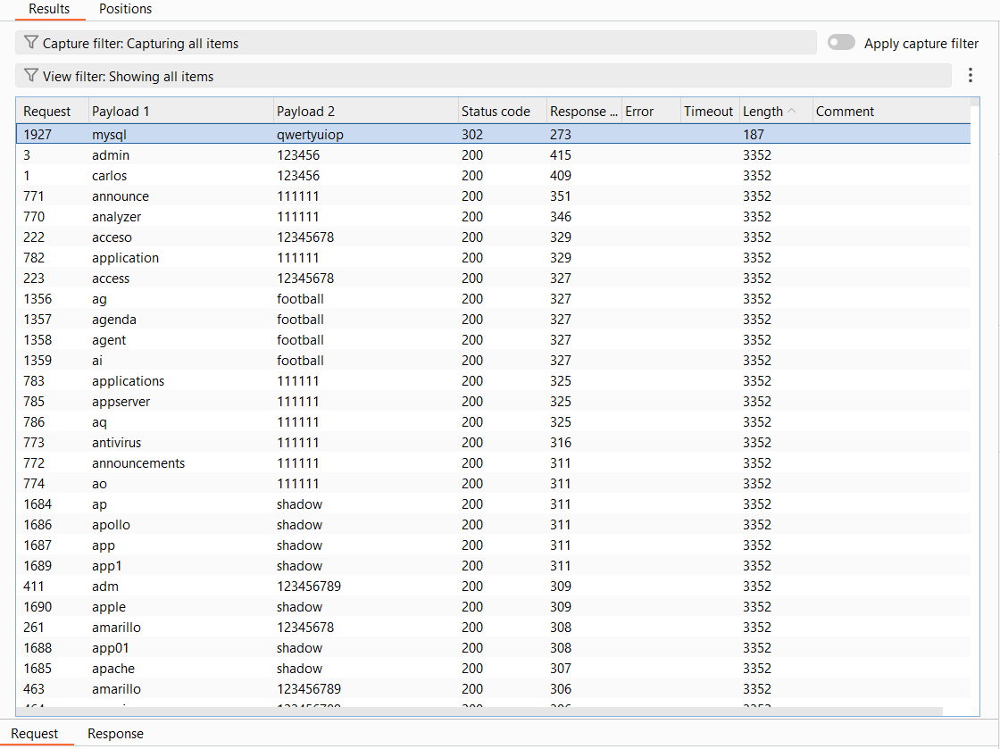
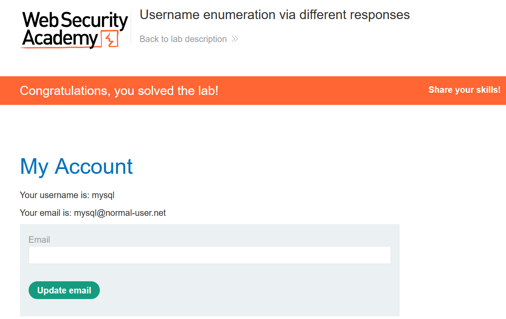

# Authentication Lab 01: Username Enumeration via Different Responses

## Mục tiêu
Dùng khác biệt phản hồi của endpoint đăng nhập để tìm username hợp lệ và brute-force mật khẩu tương ứng.

## Đề bài

<br><br>

## Bước 1: Bắt request đăng nhập và đưa vào Intruder
Từ form login, gửi request `POST /login` vào Burp Intruder và đánh dấu 2 vị trí payload:
- `username=§...§`
- `password=§...§`


<br><br>

<br><br>

## Bước 2: Cấu hình Cluster bomb với wordlist đề bài
- Payload 1: danh sách `Candidate usernames`
- Payload 2: danh sách `Candidate passwords`

Chạy `Cluster bomb attack`, sau đó sort theo `Status code` và `Length` để tìm response bất thường.


<br><br>

Từ kết quả, dòng nổi bật có:
- `Status code = 302`
- `username = mysql`
- `password = qwertyuiop`

## Bước 3: Đăng nhập tài khoản tìm được
Đăng nhập bằng credential đã tìm:

```text
username: mysql
password: qwertyuiop
```


<br><br>

## Kết quả
Đăng nhập thành công tài khoản `mysql` và hoàn thành lab.
