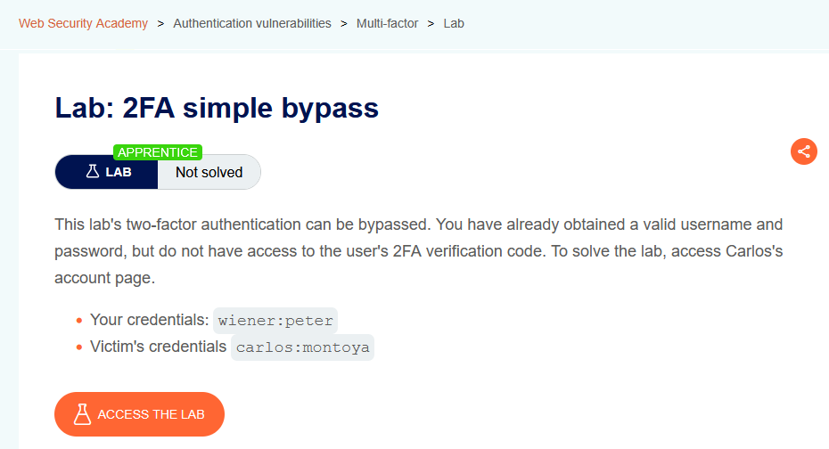
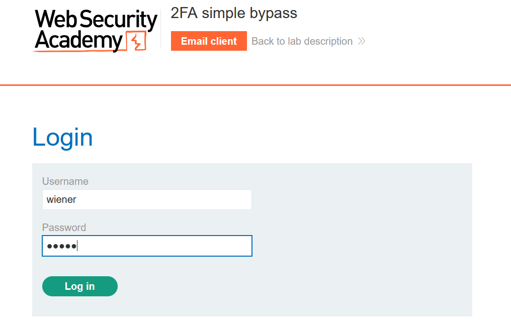
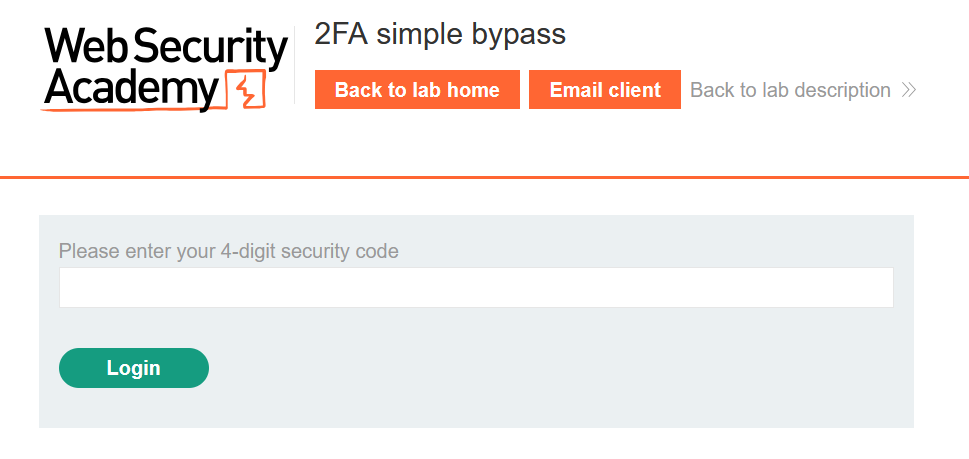
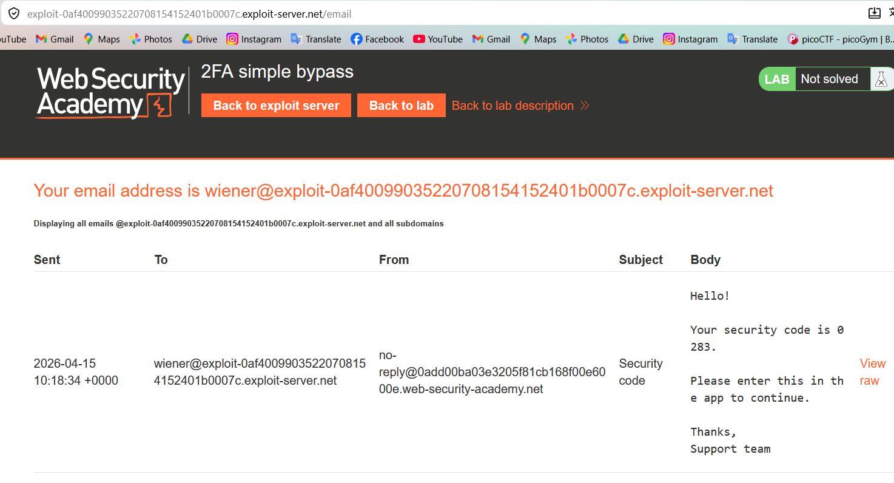
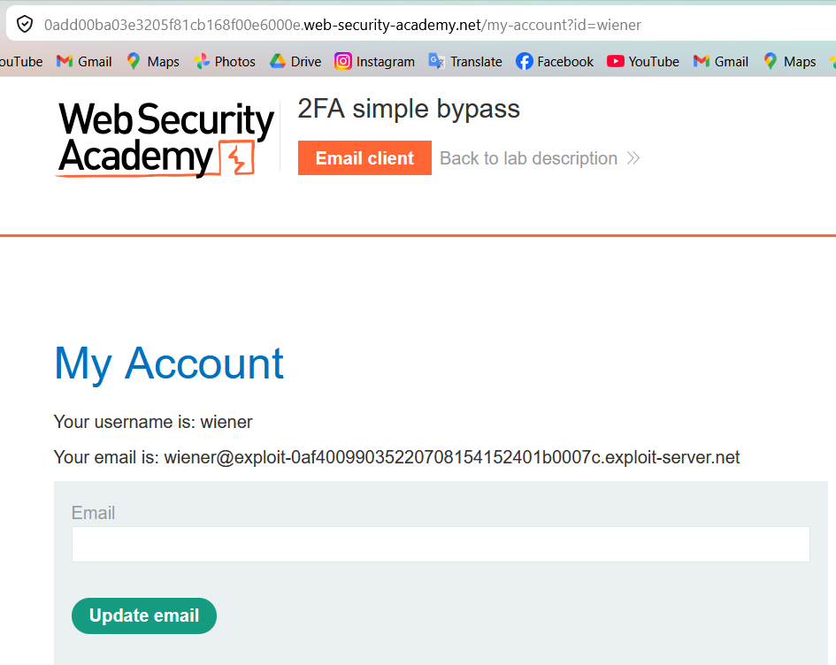
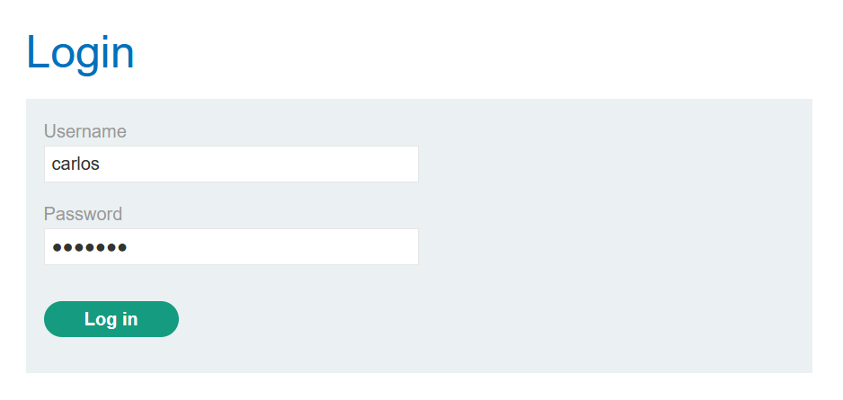
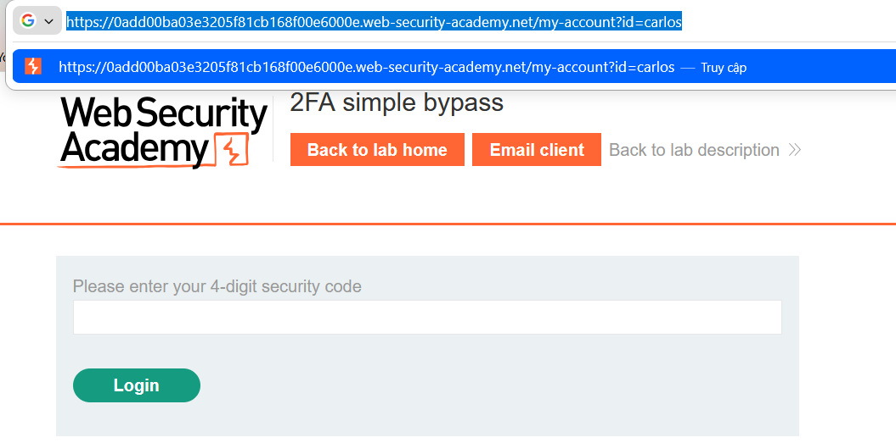
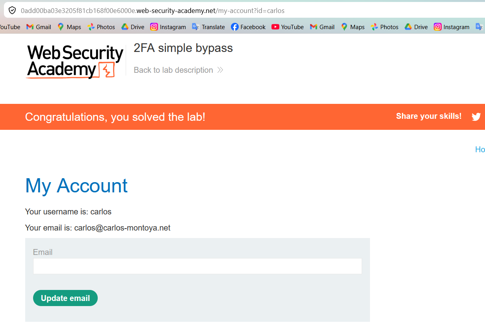

# Authentication Lab 02: 2FA Simple Bypass

## Mục tiêu
Truy cập trang tài khoản của `carlos` mà không cần nhập mã 2FA.

## Đề bài

<br><br>

## Bước 1: Đăng nhập tài khoản hợp lệ để hiểu luồng 2FA
Dùng credential được cấp:

```text
wiener:peter
```

Sau khi đăng nhập, hệ thống chuyển sang màn hình nhập mã 2FA và gửi OTP qua email client.


<br><br>

<br><br>

<br><br>

Nhập OTP để vào trang tài khoản và ghi nhận endpoint:

```http
GET /my-account?id=wiener
```


<br><br>

## Bước 2: Đăng nhập tài khoản nạn nhân và dừng ở bước 2FA
Đăng nhập bằng credential nạn nhân:

```text
carlos:montoya
```

Hệ thống cũng đưa đến màn hình nhập 2FA.


<br><br>

## Bước 3: Bypass 2FA bằng truy cập thẳng trang tài khoản
Không nhập OTP, truy cập trực tiếp URL:

```http
GET /my-account?id=carlos
```


<br><br>

<br><br>

## Kết quả
Truy cập thành công tài khoản `carlos` mà không cần mã 2FA và hoàn thành lab.
