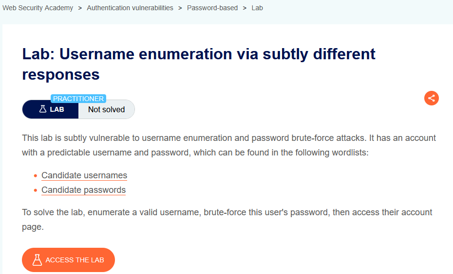
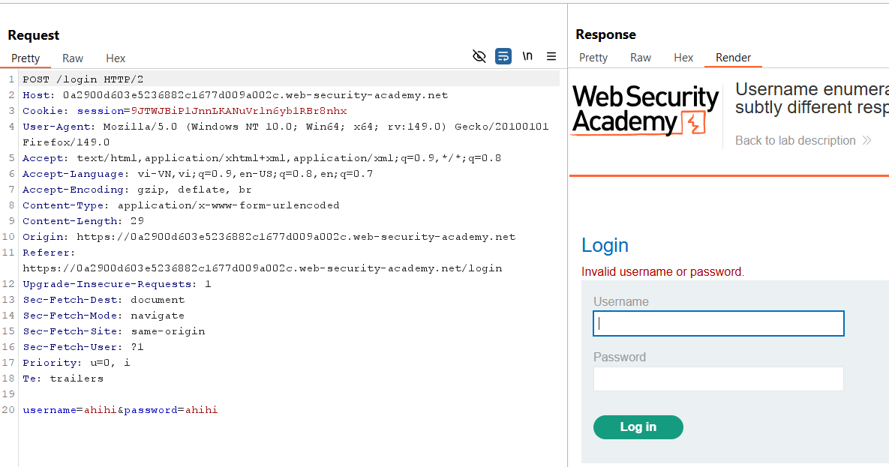
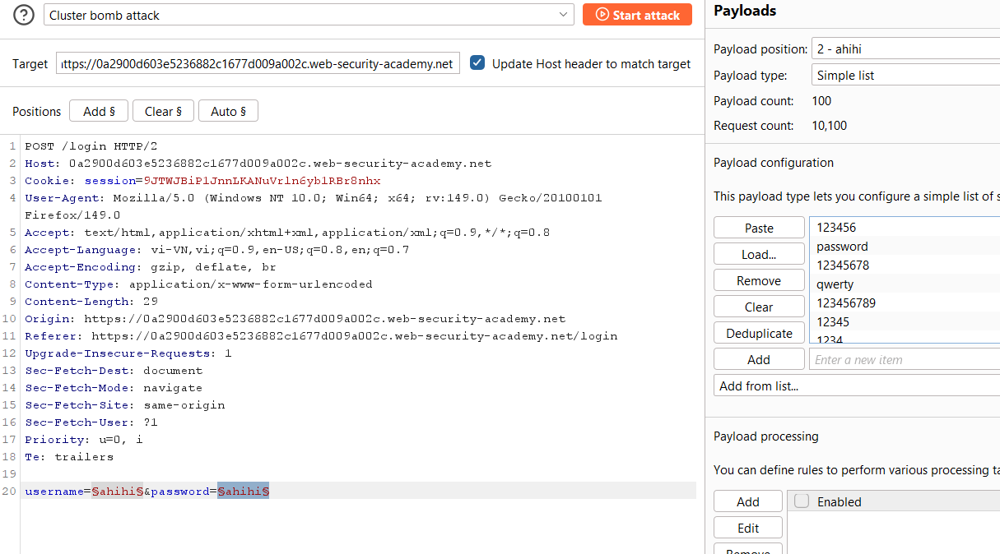
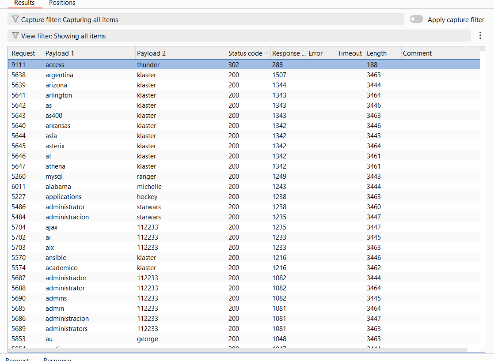

# Authentication Lab 04: Username Enumeration via Subtly Different Responses

## Mục tiêu
Tìm cặp username/password hợp lệ bằng khác biệt phản hồi tinh vi của endpoint login, sau đó đăng nhập để solve lab.

## Đề bài

<br><br>

## Bước 1: Bắt request đăng nhập
Gửi request `POST /login` vào Burp Repeater để quan sát phản hồi mặc định khi nhập sai.


<br><br>

## Bước 2: Đưa request vào Intruder và cấu hình Cluster bomb
Đánh dấu 2 vị trí payload:
- `username=§...§`
- `password=§...§`

Dùng wordlist đề bài:
- Payload 1: `Candidate usernames`
- Payload 2: `Candidate passwords`


<br><br>

## Bước 3: Phân tích kết quả và lấy credential đúng
Sau khi chạy attack, sort theo `Status code` và `Length` để tìm dòng bất thường.

Vì sao cách này hiệu quả:
- Đa số cặp sai trả về cùng mẫu phản hồi (thường `200`, độ dài gần nhau).
- Cặp đúng thường tạo hành vi khác (ví dụ `302` redirect sau đăng nhập), nên rất dễ nổi bật khi sort.

Kết quả nổi bật trong ảnh:

```text
username: access
password: thunder
status: 302
```


<br><br>

## Bước 4: Đăng nhập bằng cặp đúng
Đăng nhập với:

```text
access:thunder
```

Trang chuyển hướng thành công, hoàn thành lab.

## Payload/Request Solve

```http
POST /login HTTP/2
Content-Type: application/x-www-form-urlencoded

username=§candidate_usernames§&password=§candidate_passwords§
```

## Kết quả
Tìm được credential hợp lệ `access / thunder` và solve lab thành công.
