# Authentication Lab 05: Username Enumeration via Response Timing

## Mục tiêu
Dò username hợp lệ bằng chênh lệch thời gian phản hồi, sau đó brute-force mật khẩu để đăng nhập thành công.

## Đề bài
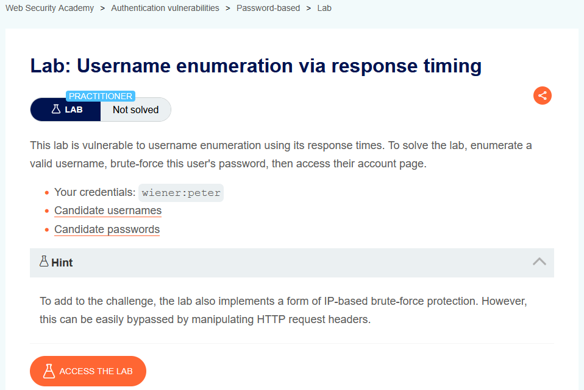
<br><br>

## Bước 1: Lấy request login chuẩn để làm baseline
Đăng nhập bằng tài khoản được cấp (`wiener:peter`) và bắt request `POST /login`.

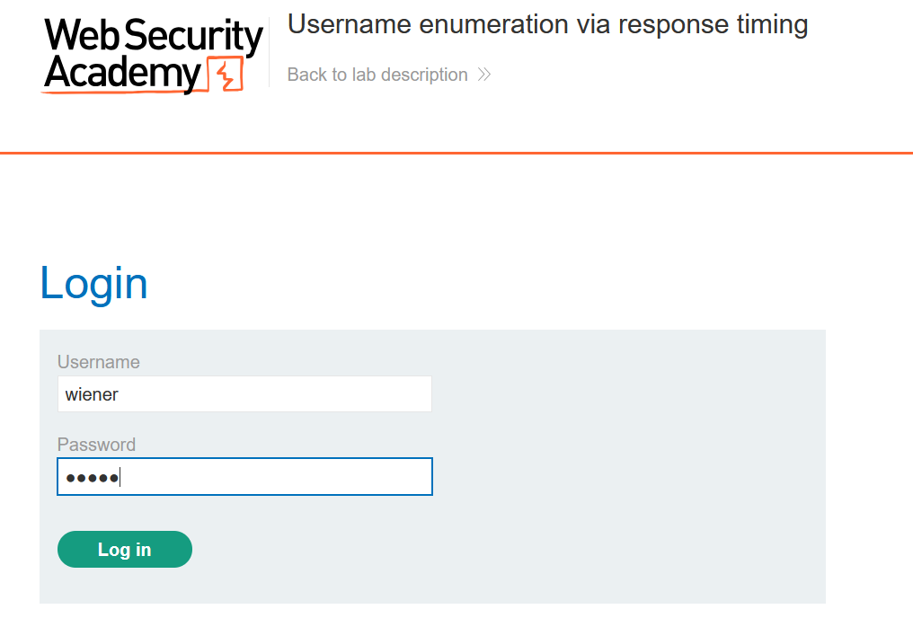
<br><br>

Đưa vào Repeater để quan sát thời gian phản hồi mặc định.

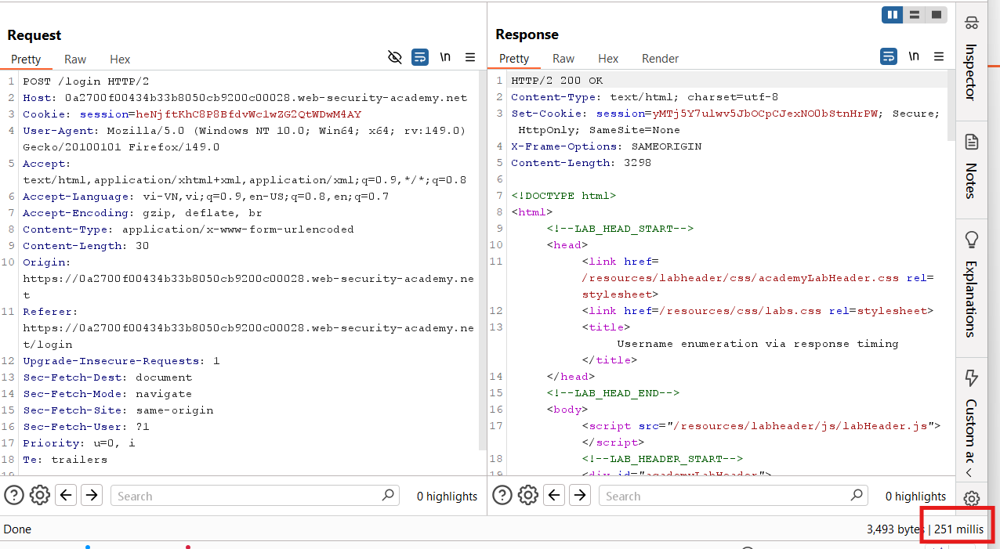
<br><br>

## Bước 2: Tạo tín hiệu timing rõ hơn bằng password rất dài
Thử password rất dài với username hợp lệ (`wiener`) và username sai (`wiener333`) để so sánh.

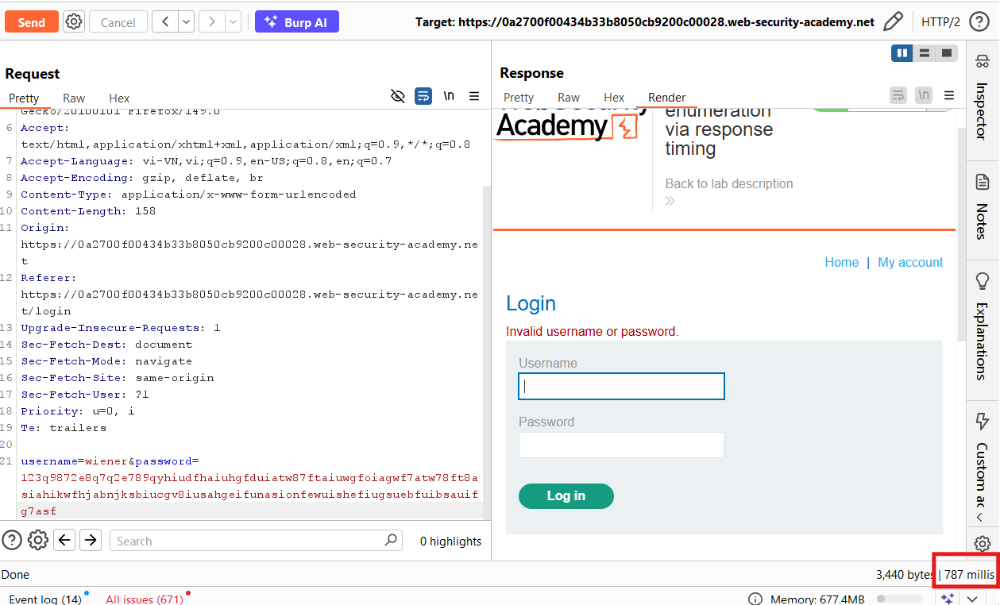
<br><br>
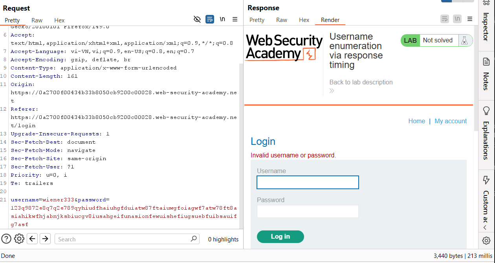
<br><br>

Vì sao cách này hiệu quả:
- Khi username sai, backend thường fail sớm nên phản hồi nhanh.
- Khi username đúng, backend đi sâu hơn vào bước kiểm tra password (hash/so khớp), nên với password dài sẽ tạo khác biệt timing rõ hơn.

Từ đó, ta giữ password dài cố định và dò username dựa trên request nào có thời gian phản hồi cao bất thường.

## Bước 3: Bypass cơ chế rate-limit theo IP
Lab giới hạn số lần đăng nhập sai theo IP.

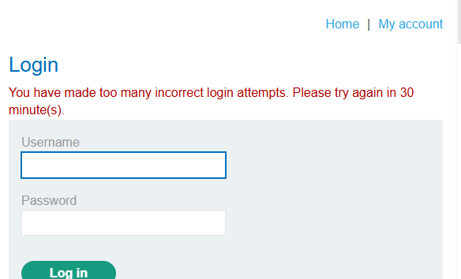
<br><br>

Bypass bằng cách thêm header `X-Forwarded-For` và thay đổi giá trị IP ở mỗi request.

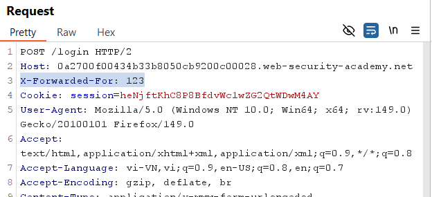
<br><br>

## Bước 4: Dò username bằng Intruder (Pitchfork)
Cấu hình `Pitchfork`:
- Payload 1: giá trị giả IP cho `X-Forwarded-For`
- Payload 2: danh sách `Candidate usernames`
- Password: giữ cố định chuỗi rất dài

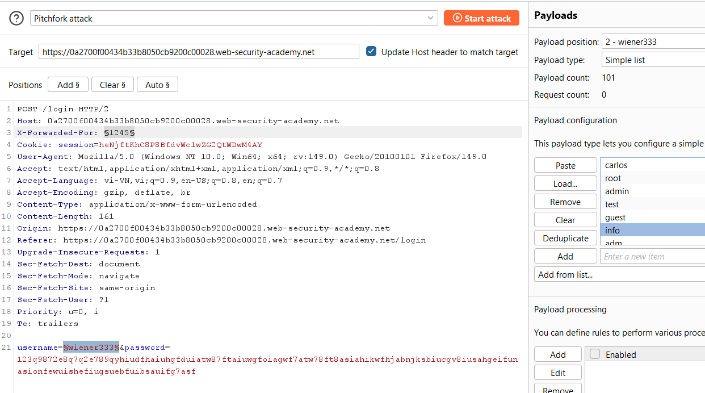
<br><br>

Kết quả cho thấy username `autodiscover` có thời gian phản hồi cao nhất, suy ra đây là username hợp lệ.

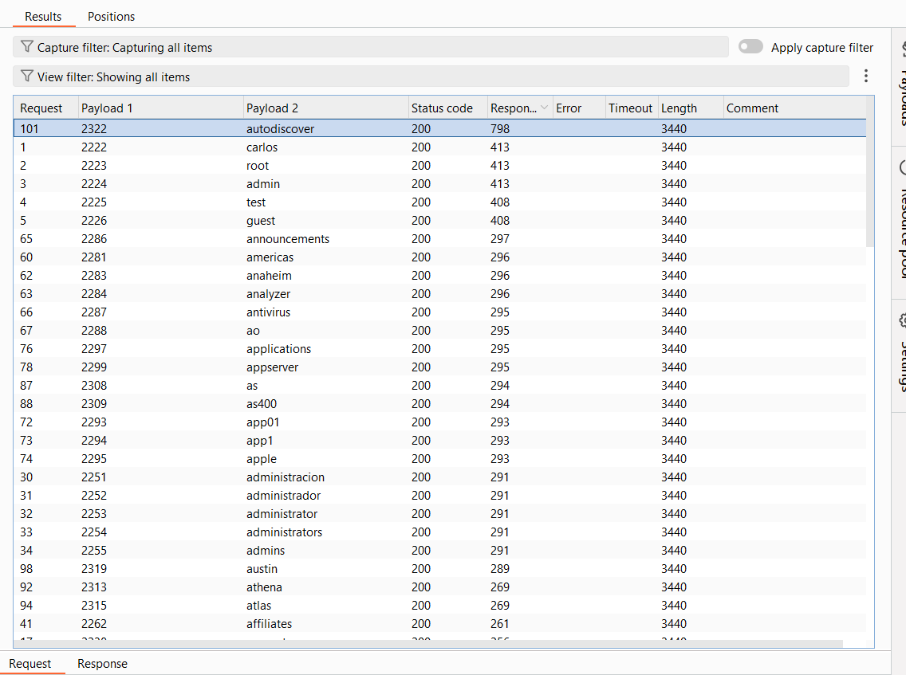
<br><br>

## Bước 5: Brute-force mật khẩu cho username đã tìm được
Đổi request thành `username=autodiscover`, tiếp tục dùng `Pitchfork` để xoay:
- Payload 1: IP giả (`X-Forwarded-For`)
- Payload 2: `Candidate passwords`

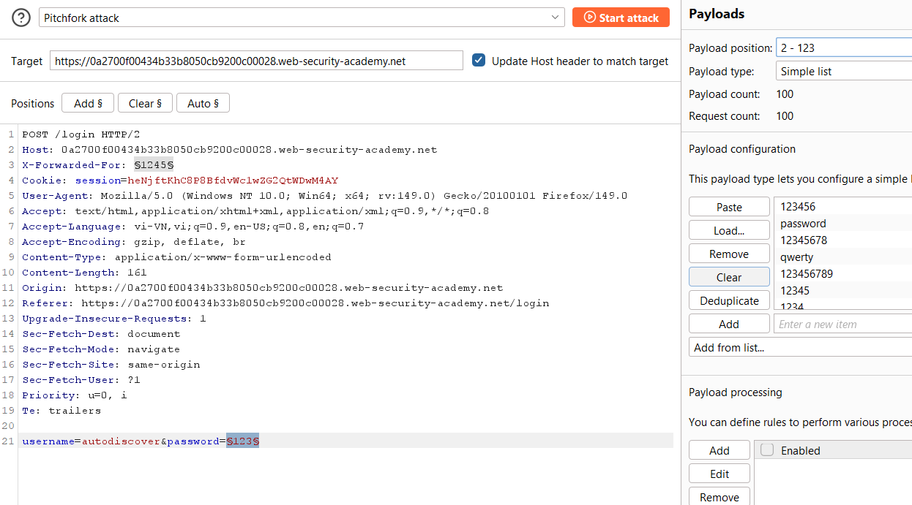
<br><br>

Sort theo `Status code`, tìm dòng `302` để lấy cặp credential đúng:

```text
username: autodiscover
password: 666666
```

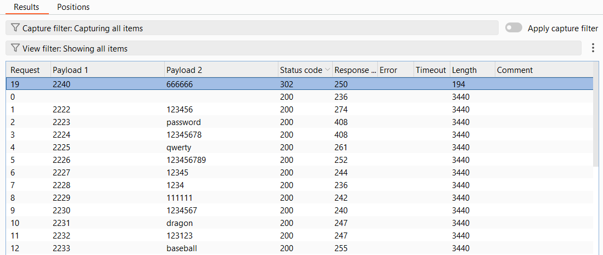
<br><br>

## Payload/Request Solve

```http
POST /login HTTP/2
Host: <lab-host>
Content-Type: application/x-www-form-urlencoded
X-Forwarded-For: §ip§

username=autodiscover&password=§candidate_password§
```

## Kết quả
Tìm được tài khoản hợp lệ `autodiscover / 666666` và hoàn thành lab.
