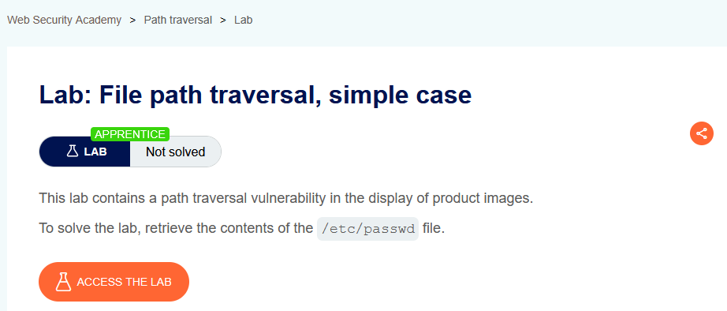
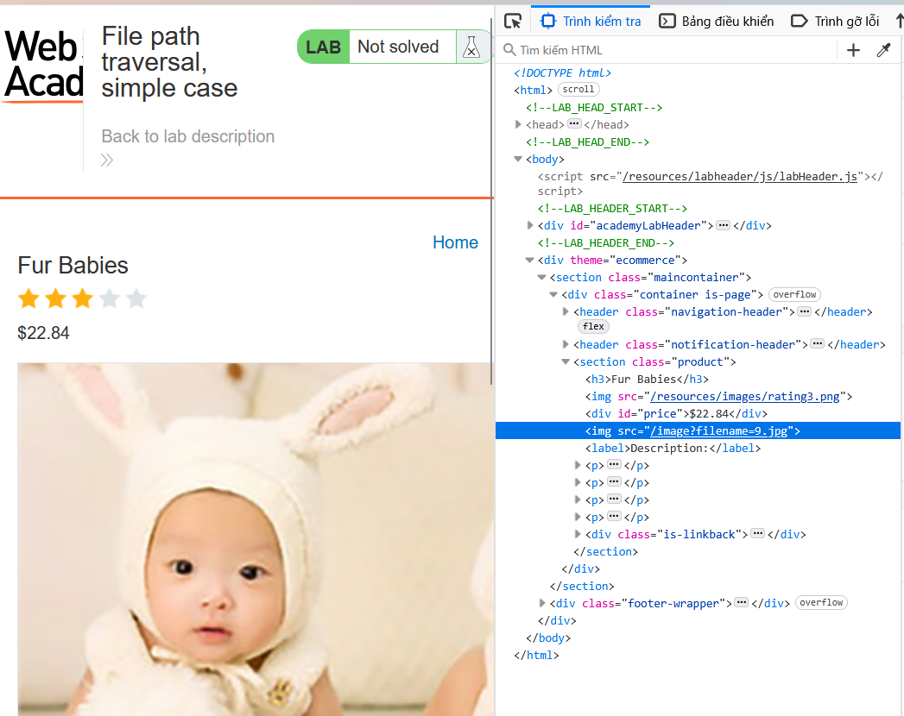
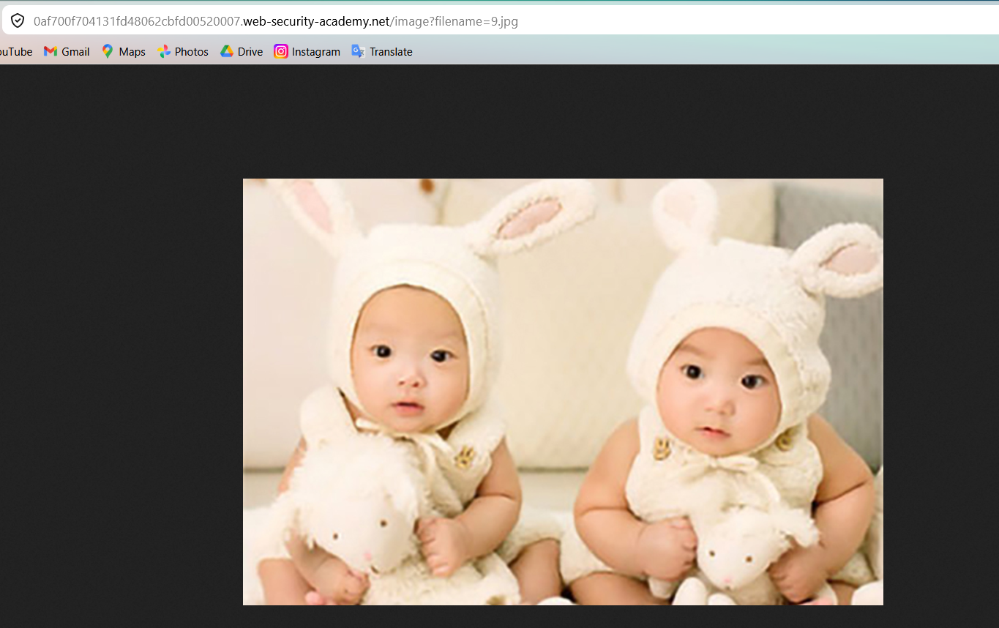
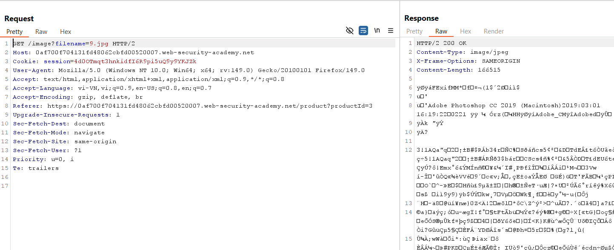
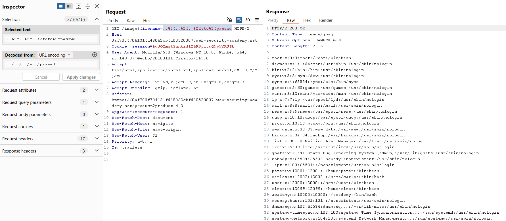

# Path Traversal Lab 01: Simple Case

## Mục tiêu
Khai thác tham số `filename` của endpoint ảnh để đọc nội dung file hệ thống `/etc/passwd`.

## Đề bài

<br><br>

## Bước 1: Xác định endpoint tải ảnh
Từ giao diện sản phẩm, kiểm tra phần tử ảnh để lấy URL nguồn.


<br><br>

<br><br>

Mở ảnh ở tab mới để thấy request mẫu:

```http
GET /image?filename=9.jpg
```


<br><br>

## Bước 2: Thử path traversal trên tham số filename
Gửi request qua Burp Repeater và thay `filename` bằng chuỗi traversal.


<br><br>

Payload:

```text
../../../etc/passwd
```

Vì sao payload này hoạt động:
- `..` giúp lùi lên thư mục cha.
- Lặp lại nhiều lần để thoát khỏi thư mục hiện tại của ứng dụng.
- Sau đó trỏ tới file tuyệt đối cần đọc: `/etc/passwd`.

## Bước 3: Đọc file /etc/passwd thành công
Sửa tham số `filename` thành payload traversal và gửi lại request.

```http
GET /image?filename=../../../etc/passwd
```

Response trả về nội dung `/etc/passwd`, chứng minh khai thác thành công.


<br><br>

## Payload Solve

```text
../../../etc/passwd
```

## Kết quả
Truy xuất thành công nội dung file `/etc/passwd` và hoàn thành lab.
