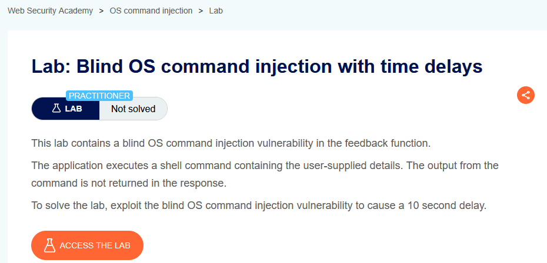
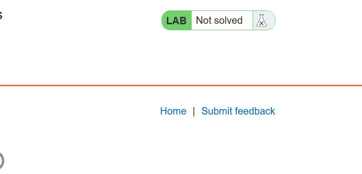
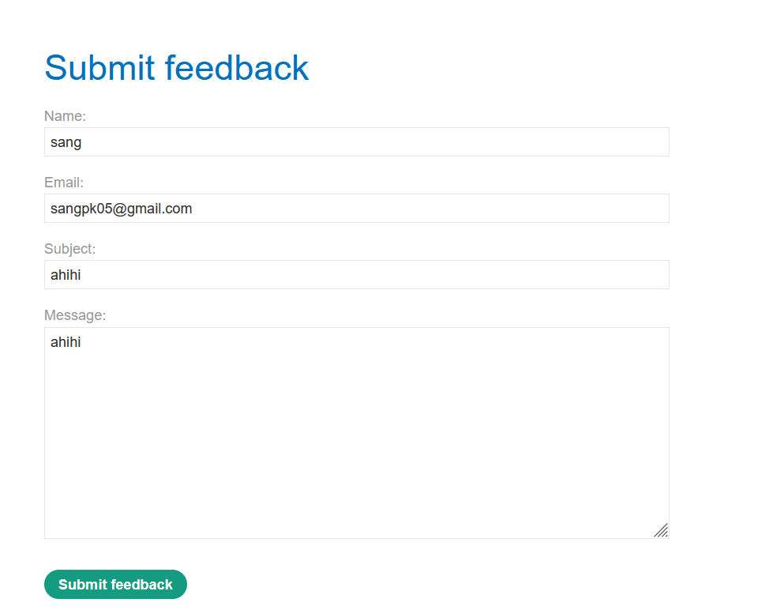
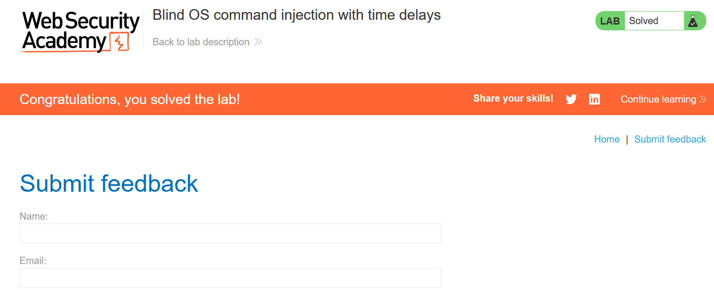

# Lab 02: Blind OS Command Injection with Time Delays

## Mục tiêu
Khai thác lỗ hổng Blind OS Command Injection trong chức năng gửi feedback để tạo độ trễ 10 giây.

## Đề bài

<br><br>

## Bước 1: Xác định điểm tấn công
Từ trang lab, vào chức năng `Submit feedback`.


<br><br>

## Bước 2: Gửi feedback và kiểm tra từng tham số
Điền form, submit và chặn request bằng Burp Repeater.


<br><br>

Thử chèn payload vào từng trường. Trường `email` là vị trí khai thác được:

```txt
test||sleep 10||
```

Ví dụ request body:

```http
csrf=<token>&name=sang&email=test||sleep 10||&subject=ahihi&message=ahihi
```

## Giải thích vì sao payload hoạt động
- Đây là **blind** command injection: server không trả output lệnh về response.
- Ứng dụng nhiều khả năng ghép giá trị `email` vào một shell command (ví dụ command gửi mail/log).
- Toán tử `||` giúp chèn thêm lệnh shell; khi `sleep 10` được thực thi, response bị chậm khoảng 10 giây.
- Dấu hiệu xác nhận là thời gian phản hồi tăng rõ rệt, lặp lại nhiều lần vẫn ổn định.

## Kết quả
Sau khi gửi payload đúng vị trí, lab chuyển sang trạng thái `Solved`.


<br><br>
