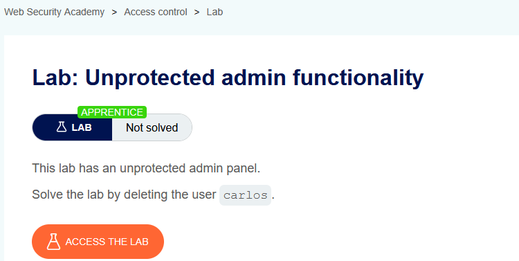
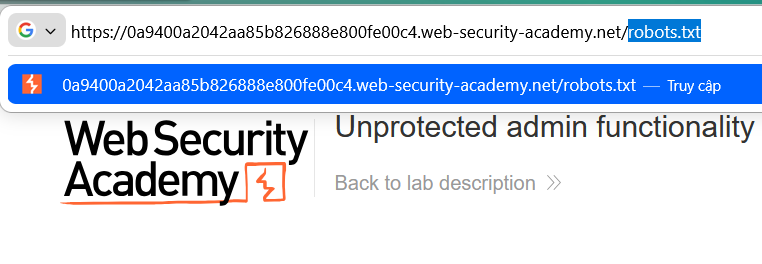
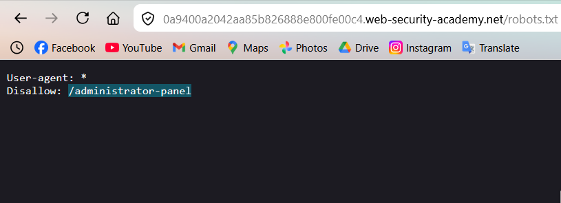
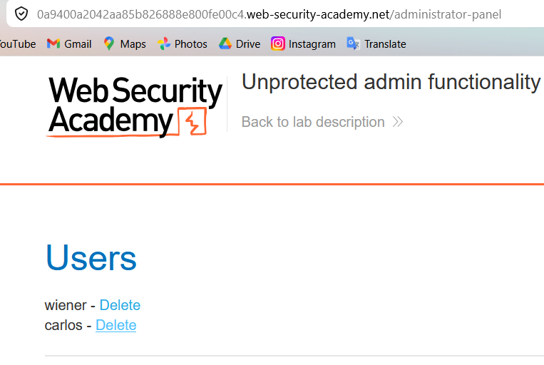
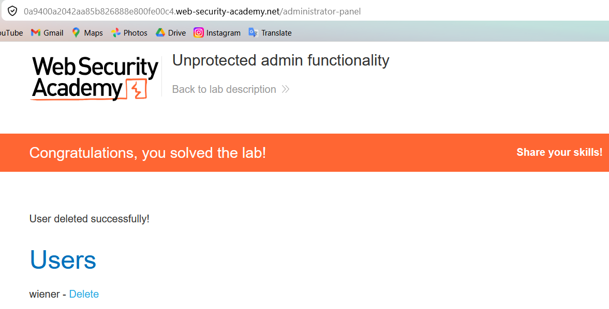

# Lab 01: Unprotected Admin Functionality

## Mục tiêu
Truy cập trang quản trị không được bảo vệ và xóa user `carlos`.

## Đề bài

<br><br>

## Bước 1: Kiểm tra robots.txt
Mở file:

```http
GET /robots.txt
```


<br><br>

Trong nội dung `robots.txt` có:

```txt
Disallow: /administrator-panel
```


<br><br>

Giải thích ngắn: `robots.txt` chỉ là hướng dẫn cho crawler, không phải cơ chế kiểm soát truy cập. Nếu endpoint admin không có auth, người dùng thường vẫn vào được trực tiếp.

## Bước 2: Truy cập trang admin
Mở trực tiếp:

```http
GET /administrator-panel
```


<br><br>

## Bước 3: Xóa user carlos
Tại trang admin, bấm `Delete` ở user `carlos`.


<br><br>

## Kết quả
Đã giải quyết lab bằng cách truy cập trực tiếp `/administrator-panel` lộ từ `robots.txt` và xóa user `carlos`.
