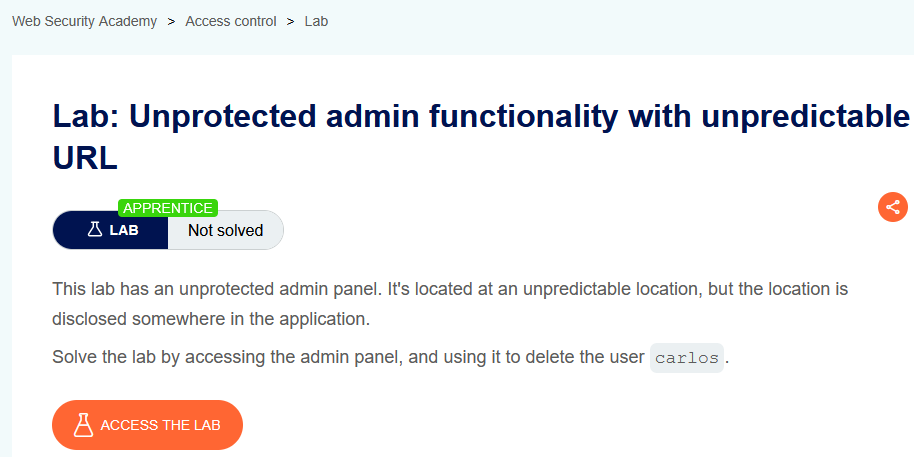
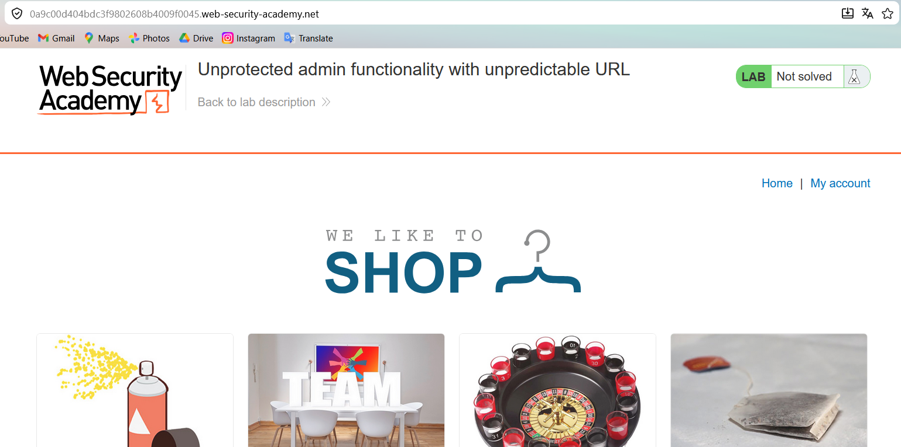
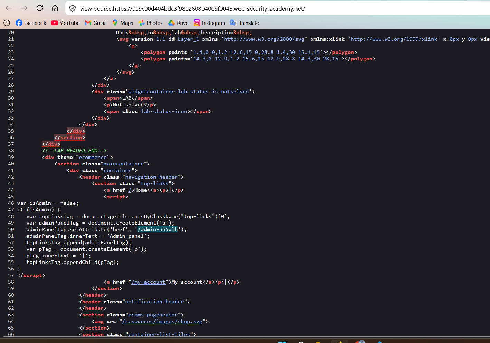
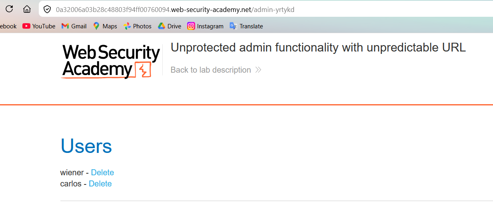
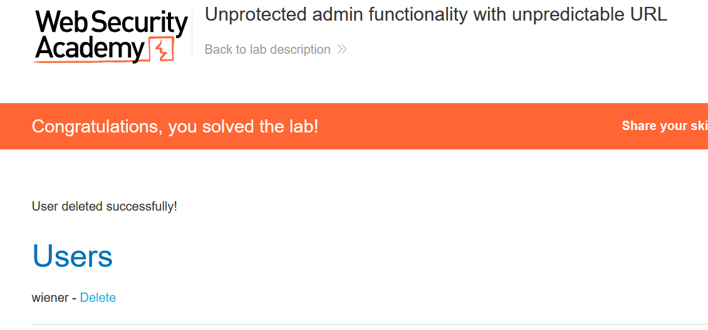

# Lab 02: Unprotected Admin Functionality with Unpredictable URL

## Mục tiêu
Tìm đường dẫn admin bị ẩn và xóa user `carlos`.

## Đề bài

<br><br>

## Bước 1: Khảo sát bề mặt ứng dụng
Kiểm tra nhanh các endpoint phổ biến như trang chủ và `robots.txt`, nhưng không thấy đường dẫn admin rõ ràng.


<br><br>

## Bước 2: Xem source để tìm endpoint ẩn
Mở source trang (Ctrl + U) và phát hiện đoạn code bị ẩn, trong đó lộ URL admin:

```txt
/admin-u55qlh
```


<br><br>

## Bước 3: Truy cập trang admin
Mở trực tiếp endpoint vừa tìm được:

```http
GET /admin-u55qlh
```


<br><br>

## Bước 4: Xóa user carlos
Trong admin panel, nhấn `Delete` tại user `carlos`.


<br><br>

## Kết quả
Lab được giải bằng cách đọc source để tìm URL admin khó đoán (`/admin-u55qlh`) và truy cập trực tiếp để xóa `carlos`.
