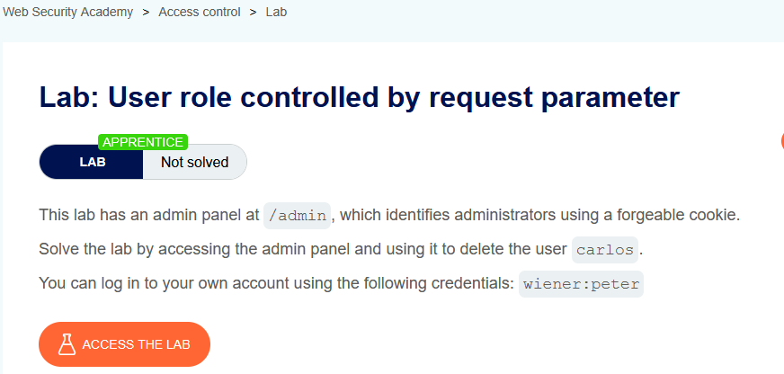
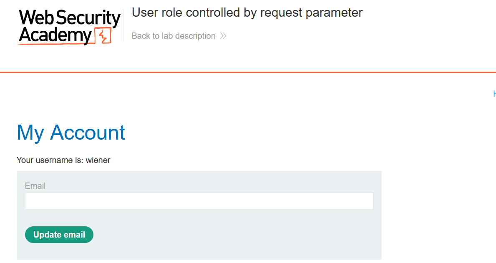
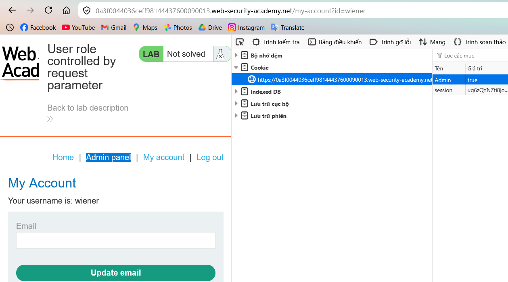
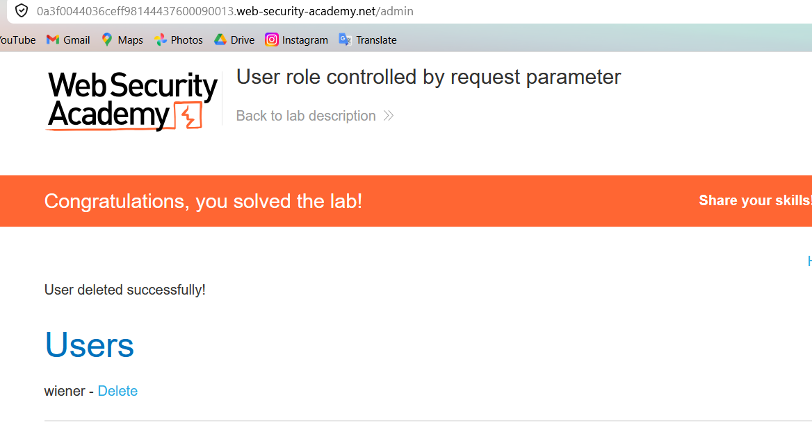

# Lab 03: User Role Controlled by Request Parameter

## Mục tiêu
Nâng quyền từ user thường lên admin bằng cách sửa tham số role trong cookie, rồi xóa user `carlos`.

## Đề bài

<br><br>

## Bước 1: Đăng nhập bằng tài khoản được cấp
Sử dụng tài khoản:

```txt
wiener:peter
```


<br><br>

## Bước 2: Sửa cookie phân quyền
Mở DevTools, vào phần cookie và sửa:

```txt
Admin=false  ->  Admin=true
```

Reload trang sau khi sửa cookie.


<br><br>

Giải thích ngắn: ứng dụng tin giá trị role từ phía client (cookie có thể forge). Khi đổi `Admin=true`, server cấp quyền admin và hiện `Admin panel`.

## Bước 3: Truy cập admin và xóa carlos
Mở `/admin`, sau đó bấm `Delete` ở user `carlos`.


<br><br>

## Kết quả
Đã giải quyết lab bằng cách giả mạo cookie `Admin=true` để truy cập admin panel và xóa `carlos`.
