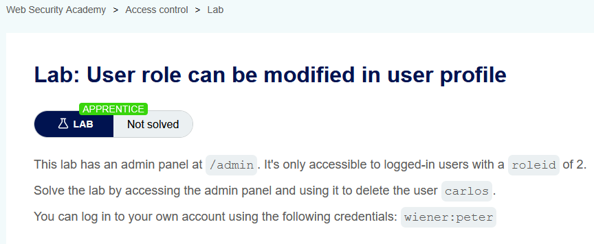
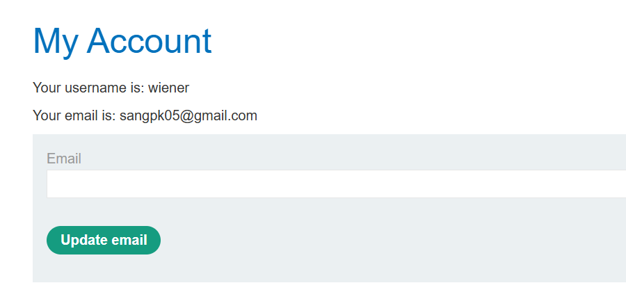
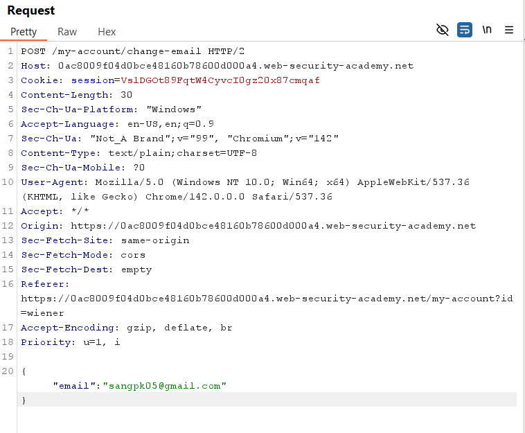
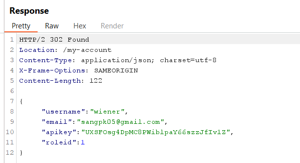
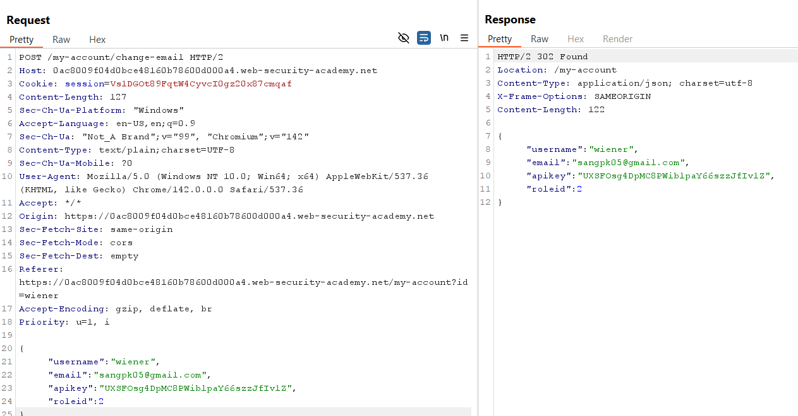
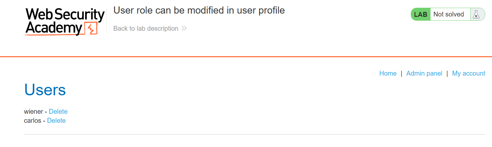
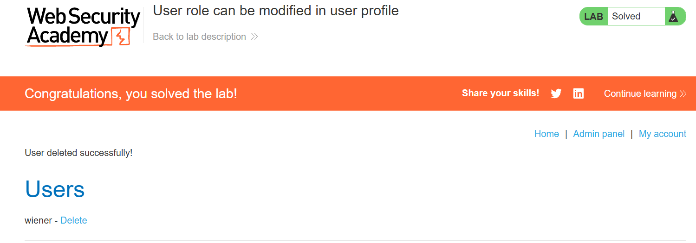

# Lab 04: User Role Can Be Modified in User Profile

## Mục tiêu
Nâng quyền từ user thường lên admin bằng cách chỉnh sửa tham số `roleid` trong request cập nhật profile, sau đó xóa user `carlos`.

## Đề bài

<br><br>

## Bước 1: Đăng nhập và gửi request thay đổi email
Đăng nhập bằng tài khoản được cấp:
```txt
wiener:peter
```
Truy cập **My account**, thay đổi email và bấm **Update email**:

<br><br>

## Bước 2: Phân tích request và response qua Burp Suite
Bắt request `POST /my-account/change-email` trong Burp Suite:

<br><br>

Response trả về dữ liệu người dùng dạng JSON, chứa trường `"roleid": 1`:

<br><br>

## Bước 3: Thêm tham số roleid để nâng quyền admin
Gửi request sang **Repeater**, thêm cặp key-value `"roleid": 2` vào JSON body và gửi đi:

<br><br>

Response trả về `"roleid": 2` cho thấy tài khoản đã được nâng quyền thành công.

## Bước 4: Truy cập Admin panel và xóa carlos
Quay lại trình duyệt, tải lại trang sẽ thấy xuất hiện nút **Admin panel**. Truy cập vào trang admin:

<br><br>

Bấm **Delete** để xóa user `carlos` và hoàn thành lab:

<br><br>

## Kết quả
Đã giải quyết lab bằng cách chèn thêm tham số `"roleid": 2` vào JSON body của request cập nhật profile để nâng quyền admin và thực hiện xóa user `carlos`.
