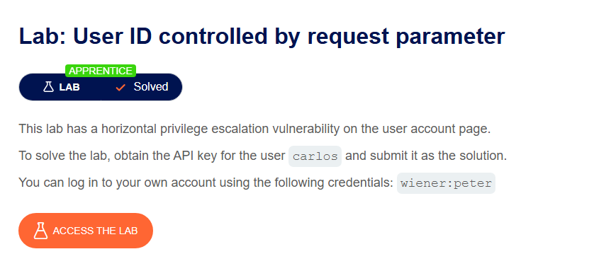
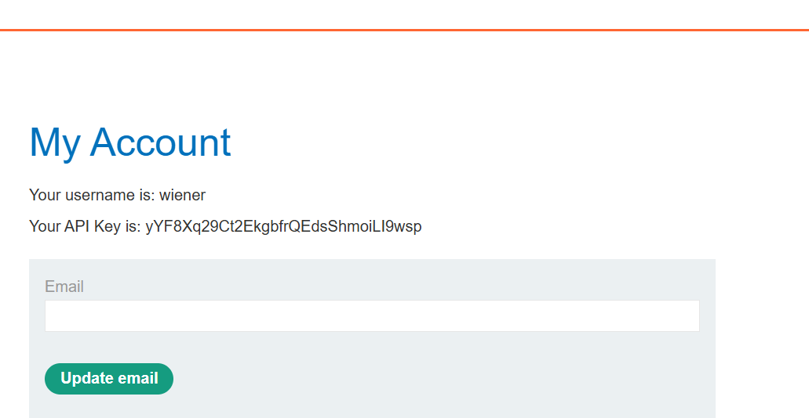
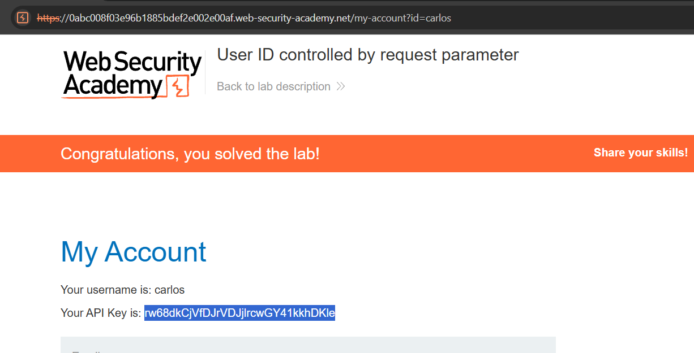

# Lab 05: User ID Controlled by Request Parameter

## Mục tiêu
Khai thác lỗ hổng Insecure Direct Object Reference (IDOR) trên trang thông tin cá nhân để lấy **API Key** của người dùng `carlos`.

## Đề bài

<br><br>

## Bước 1: Đăng nhập vào hệ thống
Sử dụng tài khoản được cấp để đăng nhập:
```txt
wiener:peter
```
Sau khi đăng nhập thành công, truy cập vào trang **My account**. Ở đây ta thấy URL có dạng `/my-account?id=wiener` và hiển thị API Key của user `wiener`:

<br><br>

## Bước 2: Thay đổi tham số id trên URL để lấy API Key của carlos
Thay đổi giá trị tham số `id` trên thanh địa chỉ URL từ `wiener` thành `carlos`:
```http
/my-account?id=carlos
```
Sau khi gửi request, trang cá nhân của `carlos` sẽ hiện ra. Lấy giá trị **API Key** của carlos:
```txt
rw68dkCjVfDJrVDjJlrcwGY41kkhDKle
```

<br><br>


## Kết quả
Đã giải quyết lab thành công bằng cách sửa đổi trực tiếp tham số `id` trên URL để truy cập thông tin nhạy cảm (API Key) của tài khoản khác mà không bị server chặn phân quyền.
