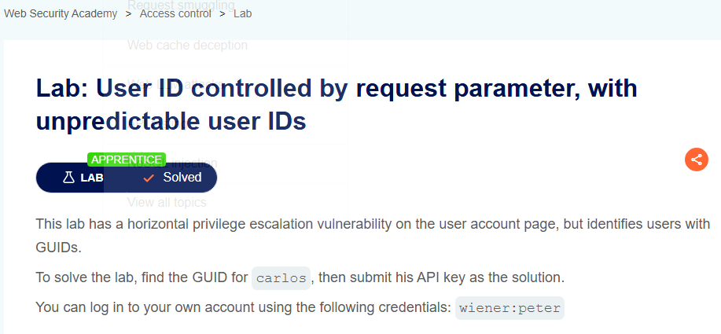
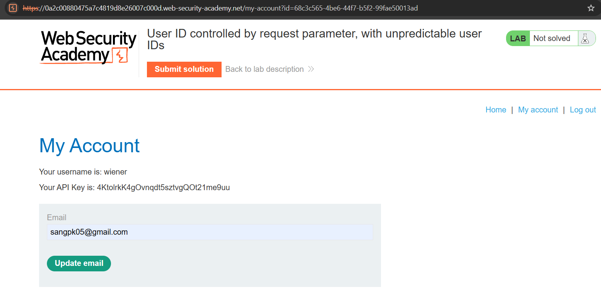
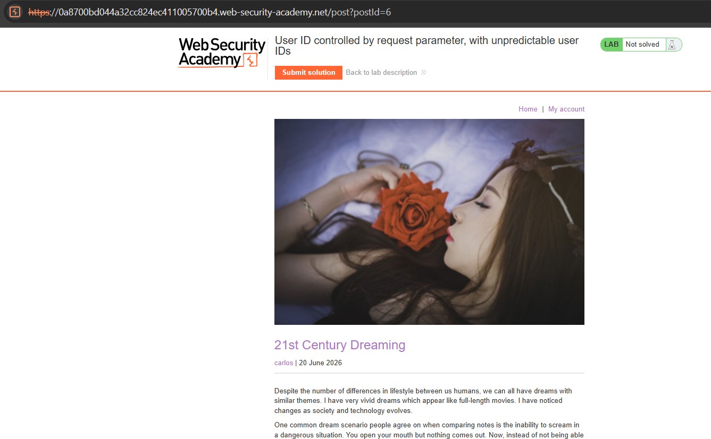
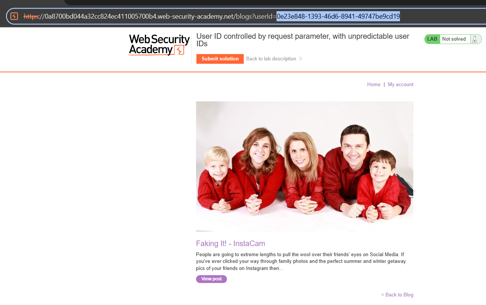
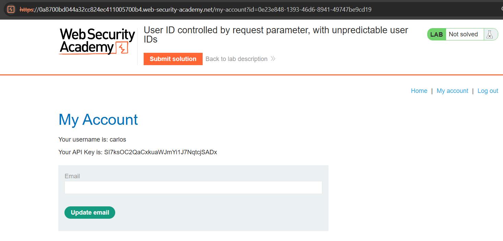

# Lab 06: User ID Controlled by Request Parameter, with Unpredictable User IDs

## Mục tiêu
Khai thác lỗ hổng Insecure Direct Object Reference (IDOR) khi hệ thống sử dụng định danh người dùng khó đoán (GUID) bằng cách tìm GUID bị lộ trên bài viết công khai, từ đó truy cập trái phép tài khoản của `carlos` để lấy API Key.

## Đề bài

<br><br>

## Bước 1: Đăng nhập và phân tích cấu trúc URL tài khoản
Đăng nhập bằng tài khoản được cấp:
```txt
wiener:peter
```
Truy cập vào **My account**, ta nhận thấy tham số `id` được định danh bằng một chuỗi GUID ngẫu nhiên không thể tự đoán trước được:

<br><br>

## Bước 2: Tìm kiếm GUID của user carlos
Do GUID không thể bruteforce hay đoán trước, ta cần tìm nơi hệ thống có thể làm lộ GUID của người dùng khác. 

Quay lại trang chủ (Blog):

<br><br>

Tìm thấy một bài viết được đăng bởi tác giả `carlos`:

<br><br>

Bấm vào tên tác giả `carlos`. URL lúc này sẽ chuyển hướng lọc bài viết và làm lộ tham số `userId` chứa GUID của `carlos`:
```http
/blogs?userId=0e23e848-1393-46d6-8941-49747be9cd19
```

<br><br>

## Bước 3: Khai thác IDOR để lấy API Key
Quay lại trang cá nhân và thay thế GUID của `wiener` bằng GUID của `carlos` vừa tìm được trên URL:
```http
/my-account?id=0e23e848-1393-46d6-8941-49747be9cd19
```
Hệ thống chấp nhận request và hiển thị thông tin tài khoản của `carlos`. Lưu lại giá trị **API Key**:
```txt
SI7ksOC2QaCxkuaWJmYi1J7NqtcjSADx
```

<br><br>

## Bước 4: Submit đáp án
Quay lại trang đề bài, bấm **Submit solution** và nộp API Key của `carlos` để hoàn thành bài lab.

## Kết quả
Đã giải quyết bài lab thành công bằng cách thu thập GUID của `carlos` thông qua bài viết blog công khai, sau đó thay đổi tham số `id` để thực hiện IDOR truy xuất API Key.
