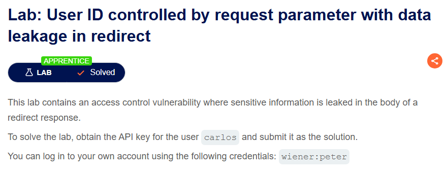
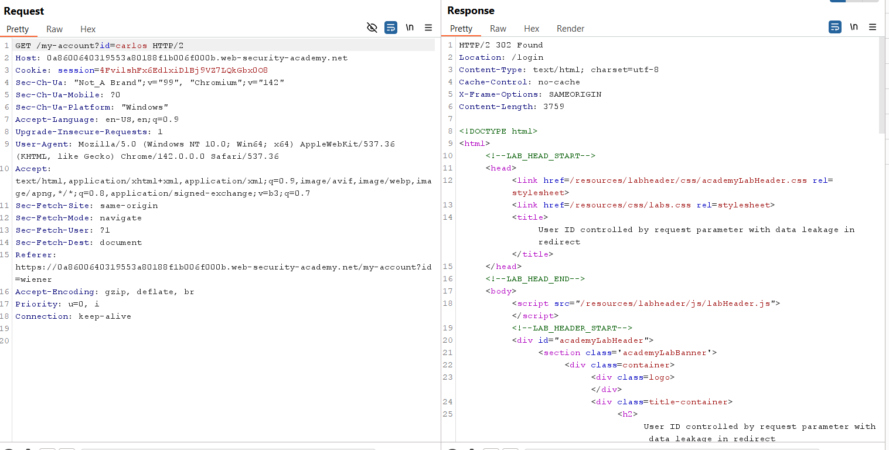
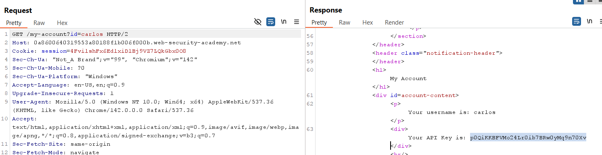

# Lab 07: User ID Controlled by Request Parameter with Data Leakage in Redirect

## Mục tiêu
Khai thác lỗi cấu hình kiểm soát truy cập kém dẫn đến việc rò rỉ dữ liệu nhạy cảm ngay trong phần body của response redirect 302, nhằm lấy **API Key** của người dùng `carlos`.

## Đề bài

<br><br>

## Bước 1: Đăng nhập và thử truy cập tài khoản carlos trên trình duyệt
Đăng nhập bằng tài khoản được cấp:
```txt
wiener:peter
```
Truy cập **My account**. Thử thay đổi trực tiếp tham số `id` trên thanh URL của trình duyệt thành `carlos` (`/my-account?id=carlos`). Lúc này, trình duyệt sẽ lập tức chuyển hướng (redirect) ta về trang đăng nhập `/login`.

## Bước 2: Phân tích request qua Burp Suite
Bắt gói tin request `GET /my-account?id=carlos` bằng Burp Suite và gửi sang **Repeater**.

Kiểm tra Response trả về: Mặc dù máy chủ trả về mã trạng thái `HTTP/2 302 Found` và yêu cầu redirect thông qua header `Location: /login`, nhưng phần body của response vẫn chứa toàn bộ mã HTML trang quản lý tài khoản của người dùng được truy vấn:

<br><br>

## Bước 3: Thu thập API Key của carlos
Kéo xuống phía dưới phần body của response, ta sẽ tìm thấy thông tin của `carlos` cùng với **API Key** bị rò rỉ:
```txt
pOQiKKBFVMo24Lr0ib7BRwOyMq9n70Xv
```

<br><br>

## Bước 4: Submit đáp án
Quay lại trang đề bài, nhấn vào **Submit solution** và nộp API Key của `carlos` để hoàn thành bài lab.

## Kết quả
Đã giải quyết bài lab thành công bằng cách đọc phần body của response 302 redirect. Lỗi xảy ra do ứng dụng chỉ thực hiện redirect ở client-side bằng header chuyển hướng mà vẫn render dữ liệu ở server-side và trả về cho client.

