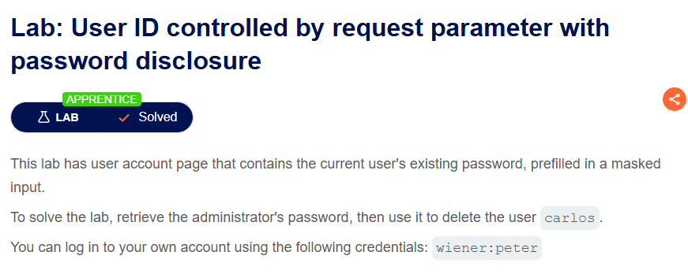
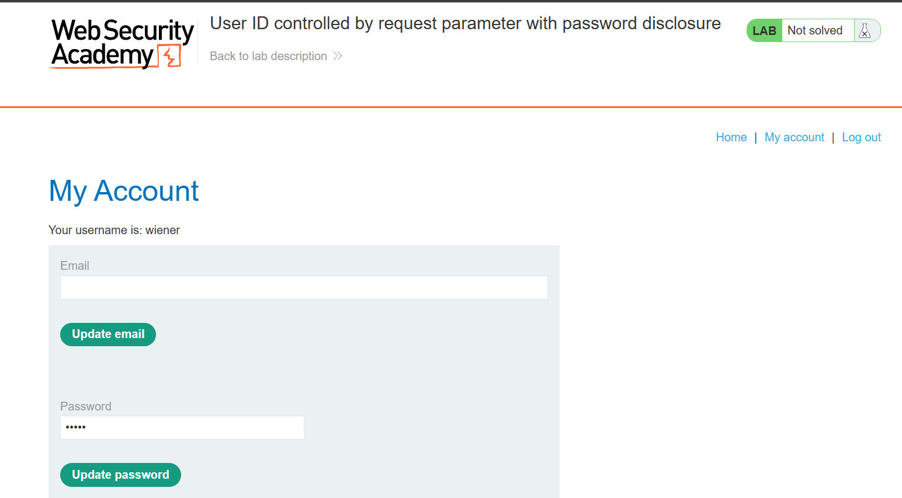
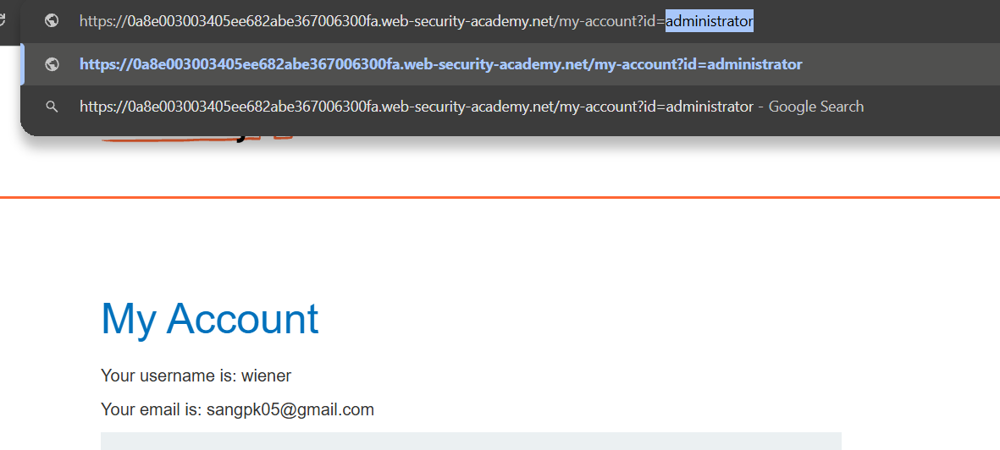
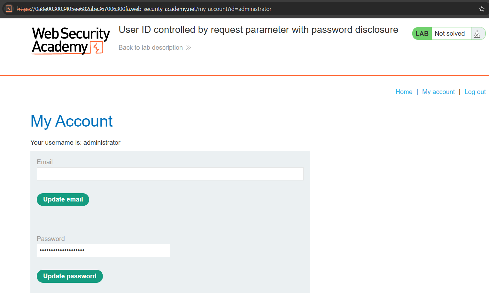
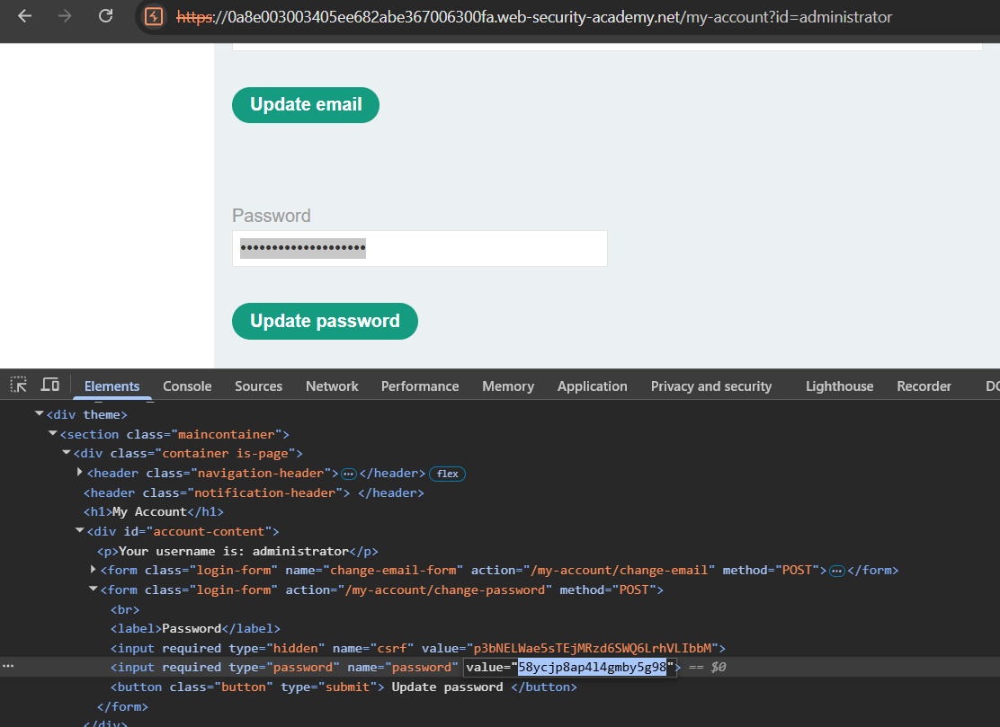
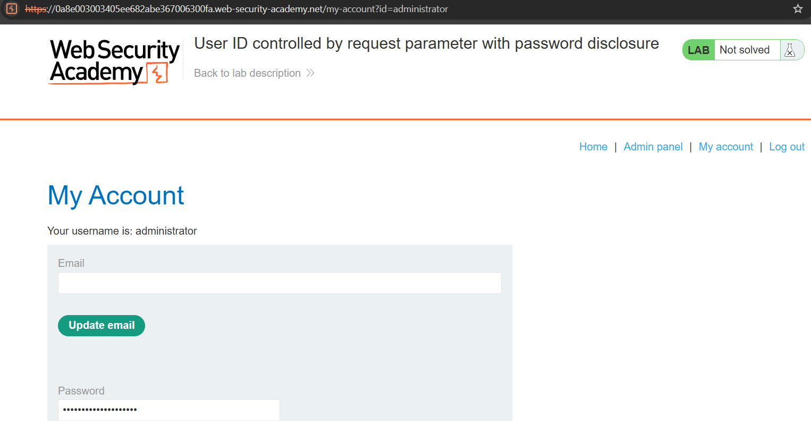
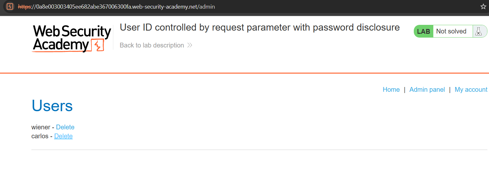

# Lab 08: User ID Controlled by Request Parameter with Password Disclosure

## Mục tiêu
Khai thác lỗ hổng IDOR trên trang tài khoản để truy cập trang cá nhân của `administrator`, trích xuất mật khẩu của admin từ mã nguồn HTML (F12), đăng nhập và thực hiện xóa người dùng `carlos`.

## Đề bài

<br><br>

## Bước 1: Đăng nhập tài khoản thường
Đăng nhập bằng tài khoản được cung cấp:
```txt
wiener:peter
```

<br><br>

## Bước 2: Khai thác IDOR truy cập trang cá nhân của administrator
Thay đổi tham số `id` trên thanh URL từ `wiener` thành `administrator`:
```http
/my-account?id=administrator
```

<br><br>

Hệ thống cho phép truy cập thành công trang thông tin của `administrator`. Tại đây, mật khẩu hiện tại của admin đã được điền sẵn dưới dạng masked (dấu chấm):

<br><br>

## Bước 3: Xem mật khẩu admin qua Developer Tools (F12)
Sử dụng chức năng **Inspect Element (F12)** trên trình duyệt để kiểm tra thẻ input mật khẩu. Ta thấy mật khẩu dạng cleartext của `administrator` nằm trong thuộc tính `value`:
```txt
58ycjp8ap414gmby5g98
```

<br><br>

## Bước 4: Đăng nhập admin và xóa carlos
Đăng xuất tài khoản hiện tại, tiến hành đăng nhập lại bằng tài khoản `administrator` với mật khẩu vừa lấy được. Sau khi đăng nhập thành công, nút **Admin panel** sẽ xuất hiện trên thanh điều hướng:

<br><br>

Truy cập vào trang **Admin panel** và thực hiện xóa user `carlos` để hoàn thành bài lab:

<br><br>
