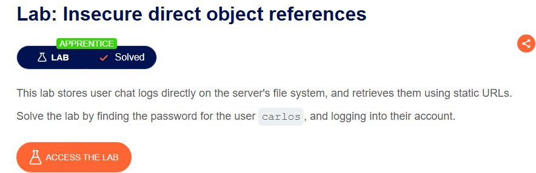
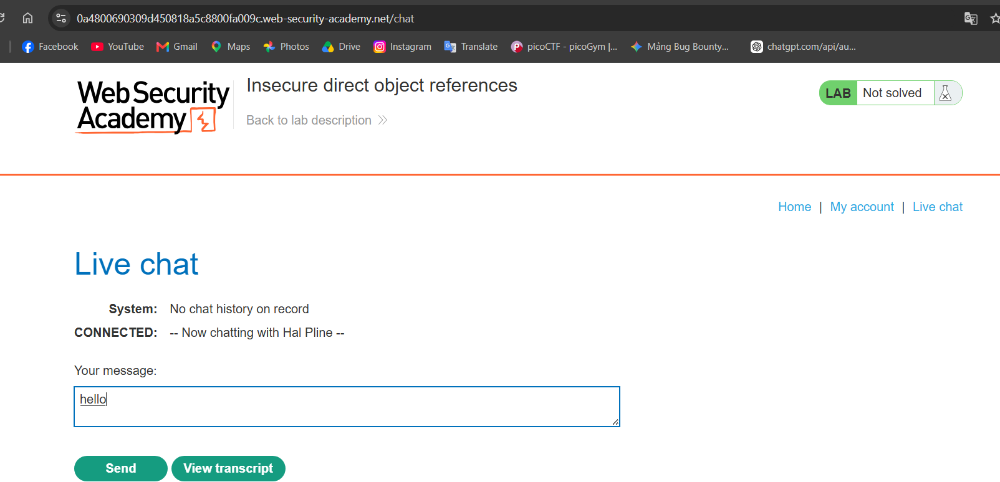
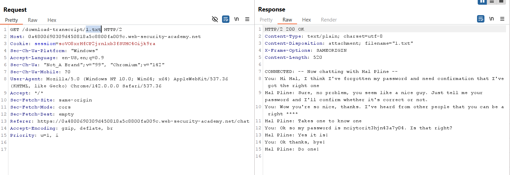
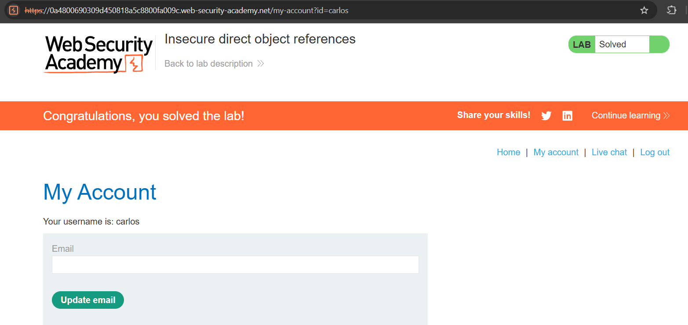

# Lab 09: Insecure Direct Object References

## Mục tiêu
Khai thác lỗ hổng Insecure Direct Object Reference (IDOR) trong tính năng tải tệp lịch sử chat của hệ thống để tìm mật khẩu của người dùng `carlos`, sau đó đăng nhập và hoàn thành lab.

## Đề bài

<br><br>

## Bước 1: Sử dụng tính năng Live chat
Truy cập mục **Live chat** trên trang web và gửi tin nhắn để tạo lịch sử trò chuyện:

<br><br>

## Bước 2: Khai thác IDOR để tải lịch sử chat cũ (1.txt)
Khi bấm vào **View transcript**, ta nhận thấy hệ thống tải tệp tin txt chứa nội dung chat với tên file tăng dần theo số thứ tự (2.txt, 3.txt...). 

Bắt request trong Burp Suite và thử sửa tên file cần tải thành `1.txt`:
```http
GET /download-transcript/1.txt HTTP/2
```

<br><br>

Đọc nội dung tệp `1.txt` trả về, ta phát hiện cuộc hội thoại chứa mật khẩu bị lộ của `carlos`:
```txt
nciytorit3hjn43a7y04
```

## Bước 3: Đăng nhập tài khoản carlos
Quay lại trang đăng nhập, sử dụng username `carlos` cùng mật khẩu trên để đăng nhập thành công và hoàn thành bài lab:

<br><br>
