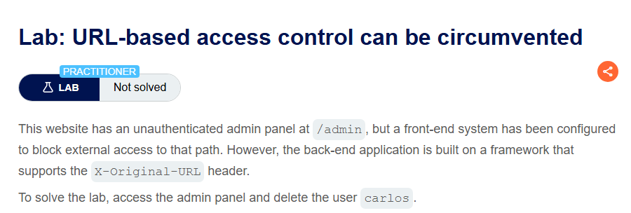
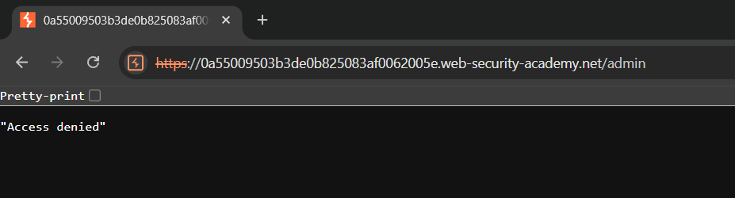
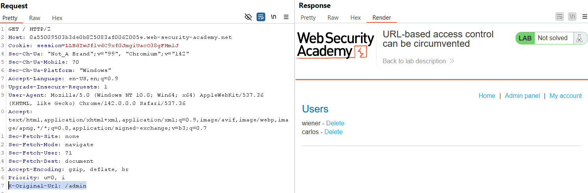
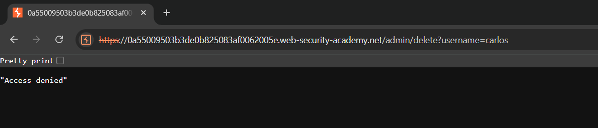
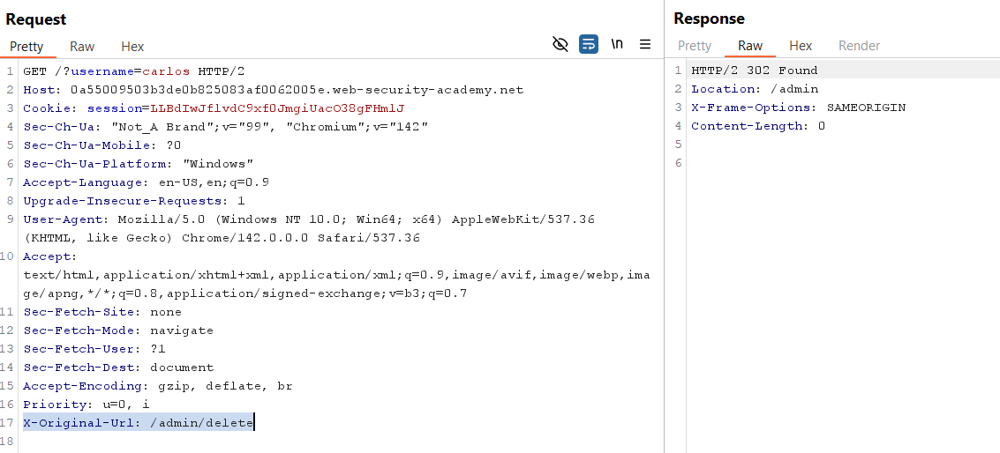
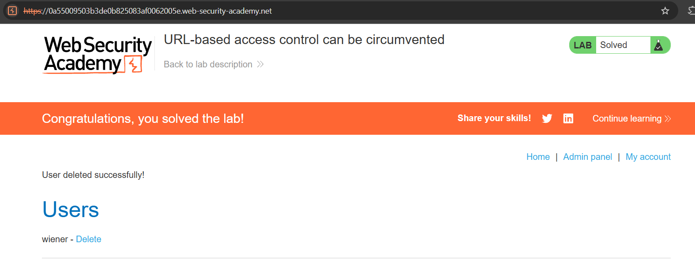

# Lab 10: URL-based Access Control Can Be Circumvented

## Mục tiêu
Khai thác cấu hình bất đối xứng giữa WAF/Proxy và Backend thông qua header `X-Original-URL` để bypass cơ chế kiểm soát truy cập dựa trên URL, thực hiện truy cập Admin panel và xóa người dùng `carlos`.

## Đề bài

<br><br>

## Bước 1: Thử truy cập trang quản trị trực tiếp
Thử truy cập admin panel thì bị chặn với mã 403:

<br><br>

## Bước 2: Sử dụng header X-Original-URL để bypass vào Admin panel
Đề bài gợi ý về việc sử dụng header origin url. Cách khai thác: thêm header vào request:
```http
X-Original-Url: /admin
```
WAF/Proxy sẽ chặn `/admin`, nhưng nếu ta đặt 1 đường dẫn public như trang chủ `/`, nó sẽ nghĩ: "À, user vào trang chủ `/`. Trang này public, cho qua!". Nó chuyển tiếp request nguyên vẹn đến backend.

Backend nhận request: Nó đọc header `X-Original-URL` thấy giá trị là `/admin`. Nó tin tưởng hoàn toàn và xử lý request này:

<br><br>
Vậy là ta có thể vào được admin panel.

## Bước 3: Thực hiện xóa user carlos
Khi cố gắng thực hiện hành động xóa user `carlos`, ta cũng bị chặn:

<br><br>

Cần áp dụng phương pháp đã làm: gửi request `GET /?username=carlos` và thêm header `X-Original-Url: /admin/delete`.

WAF sẽ coi `/?username=carlos` là đường dẫn tại trang chủ kèm tham số vớ vẩn nên không chặn, đồng thời backend nhận được header này và hiểu rằng user muốn truy cập vào `/admin/delete`. Nó sẽ thực hiện endpoint này kèm tham số `username=carlos`, và từ đó xóa thành công user `carlos`:

<br><br>

Sau khi request được thực thi, user `carlos` đã bị xóa thành công và hoàn thành bài lab:

<br><br>
