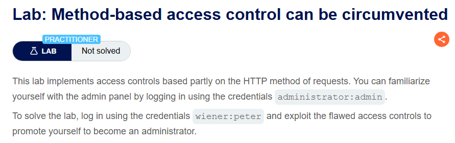
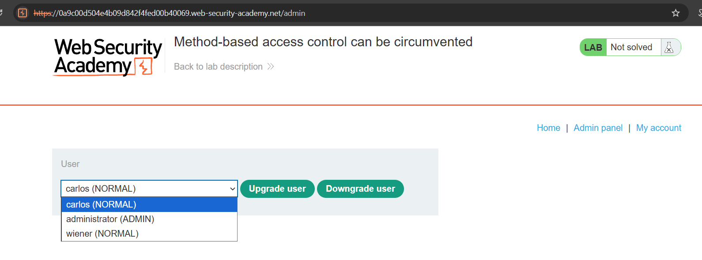
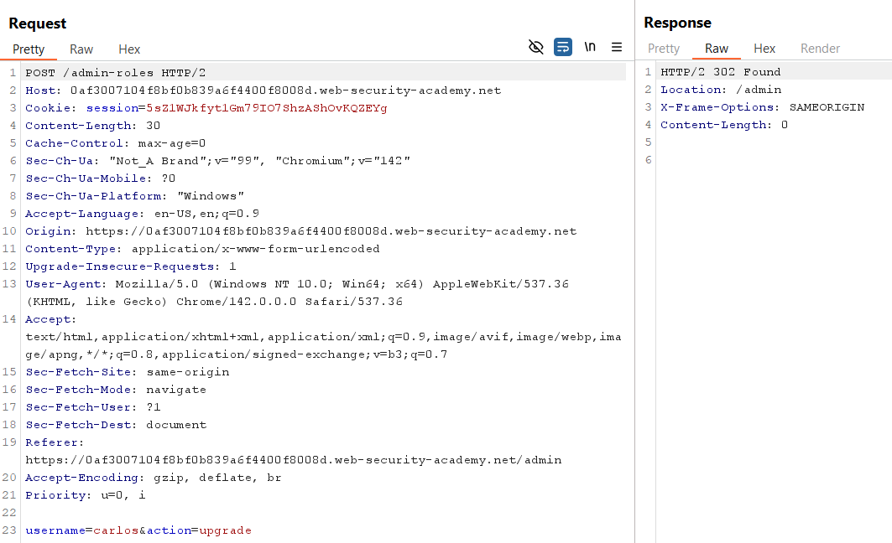
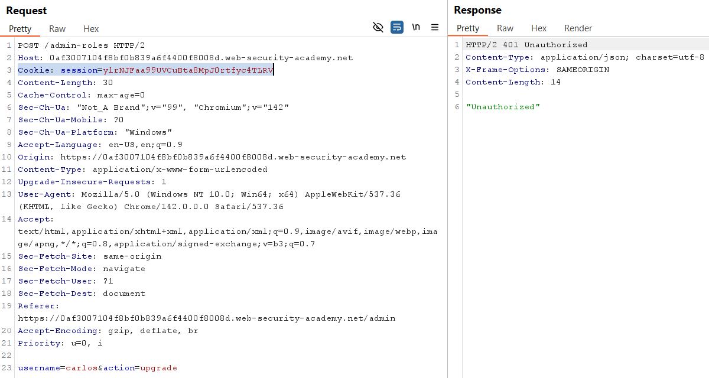
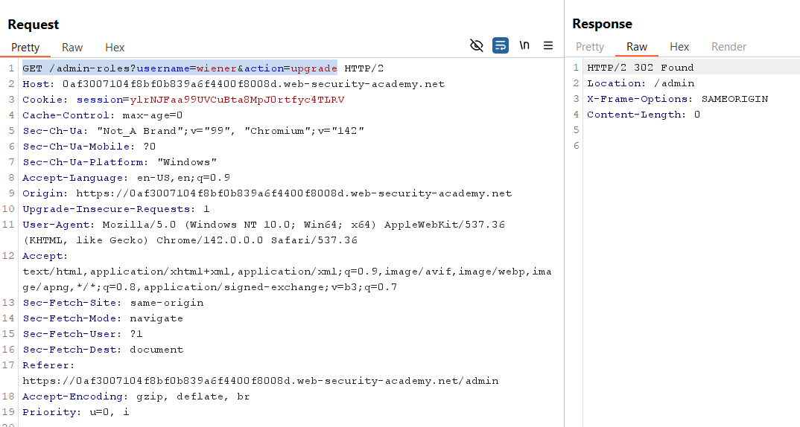
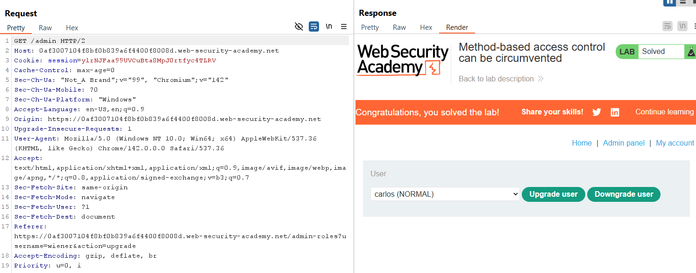

# Lab 11: Method-based Access Control Can Be Circumvented

## Mục tiêu
Khai thác cơ chế kiểm soát truy cập phân quyền chỉ chặn theo phương thức POST để bypass và thực hiện thăng cấp tài khoản `wiener` lên quyền administrator thông qua phương thức GET, sau đó tiến hành xóa tài khoản `carlos`.

## Đề bài
  

  

## Bước 1: Khảo sát request nâng quyền bằng tài khoản administrator
Đăng nhập bằng tài khoản `administrator` và truy cập trang quản trị Admin panel:
  

  

Thực hiện nâng quyền cho người dùng `carlos` để bắt gói tin POST trong Burp Suite, sau đó thu hồi quyền để đưa về trạng thái ban đầu:
  

  

## Bước 2: Thử nghiệm gửi request bằng tài khoản wiener
Đăng nhập bằng tài khoản `wiener` để lấy session cookie. Thay thế session trong request nâng quyền vừa bắt được bằng session của `wiener` và gửi đi:
  

  

## Bước 3: Bypass bằng cách thay đổi phương thức HTTP
Hệ thống trả về `401 Unauthorized`. Điều này cho thấy cơ chế WAF/phân quyền đang chặn trực tiếp các request POST từ người dùng không phải admin. 

Để vượt qua, ta chuyển request sang phương thức `GET` và đưa các tham số cần thiết (`username=wiener&action=upgrade`) lên URL:
  

  

Ta thấy request trả về mã `302 Found` và redirect thành công. Đồng nghĩa với việc cơ chế kiểm soát theo method đã bị vượt qua và tài khoản `wiener` được thăng cấp lên administrator, qua đó giải quyết thành công bài lab:
  

  
