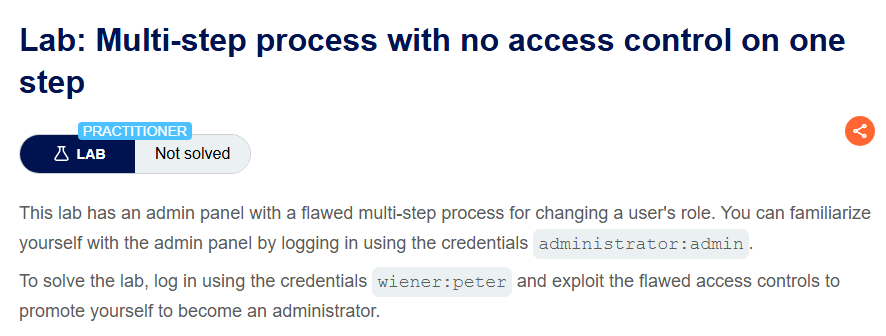
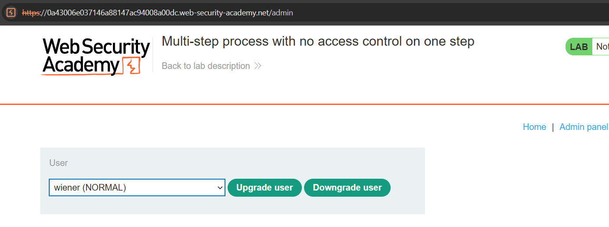
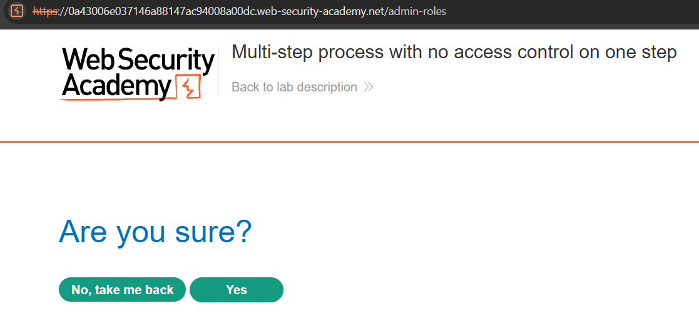
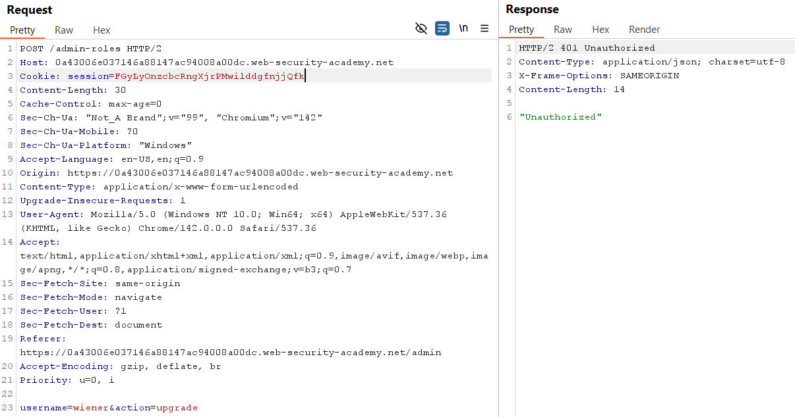
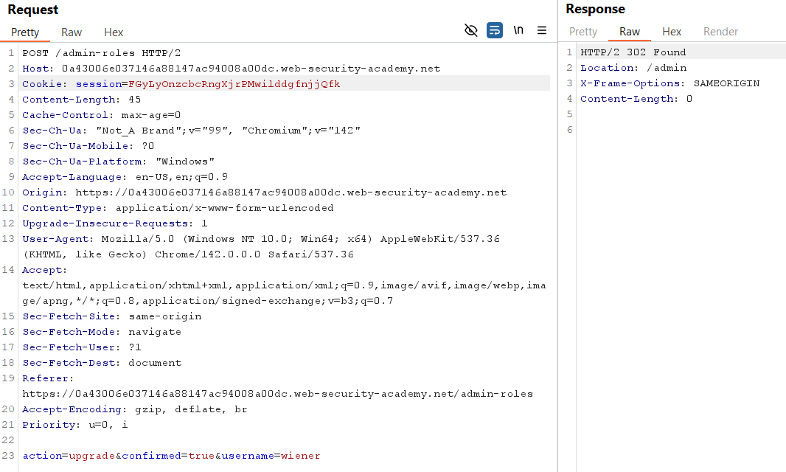
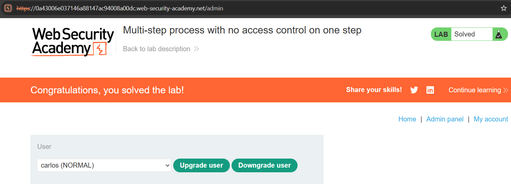

# Lab 12: Multi-step Process with No Access Control on One Step

## Mục tiêu
Khai thác lỗ hổng thiếu kiểm soát truy cập ở một bước trong quy trình multi-step để tự thăng cấp tài khoản `wiener` lên admin và hoàn thành lab.

## Đề bài

  

## Bước 1: Khảo sát quy trình nâng quyền của Admin
Đăng nhập tài khoản `administrator`, truy cập trang quản trị và thực hiện nâng quyền cho người dùng `wiener` để bắt request:

  

Khác với bài trước, hệ thống có thêm một bước xác nhận với giao diện "Are you sure?":

  

## Bước 2: Tấn công bypass bằng tài khoản wiener
Sau khi đã bắt được cả 2 request gồm yêu cầu nâng quyền ban đầu và yêu cầu xác nhận, đăng nhập bằng tài khoản `wiener` để lấy session cookie và thử gửi lần lượt từng request với session này.

Gửi request đầu tiên với session của `wiener` thì bị lỗi `401 Unauthorized`, kể cả khi đổi phương thức sang `GET` cũng không thành công:

  

Tuy nhiên, khi thử gửi tiếp request thứ hai dùng để xác nhận:

  

Lần này hệ thống phản hồi `302 Found` và thăng cấp thành công cho tài khoản `wiener` lên admin, hoàn thành bài lab:

  

