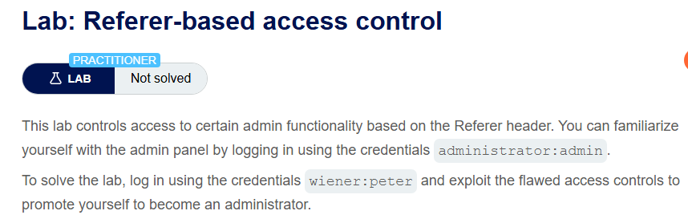
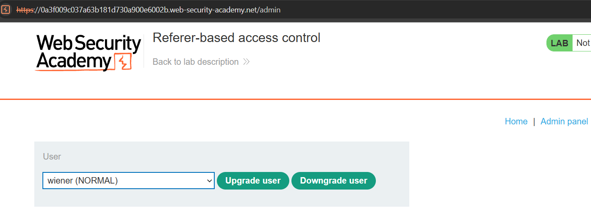
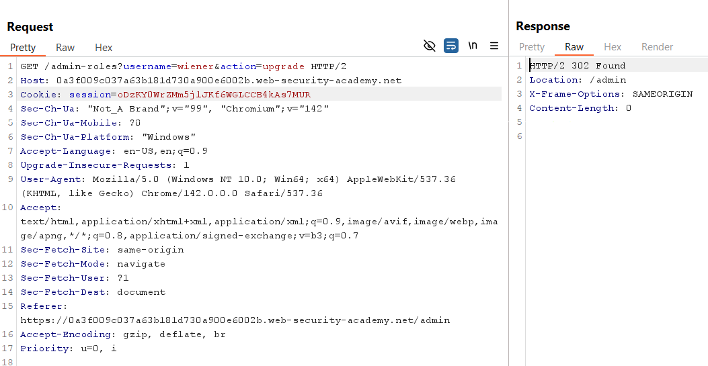
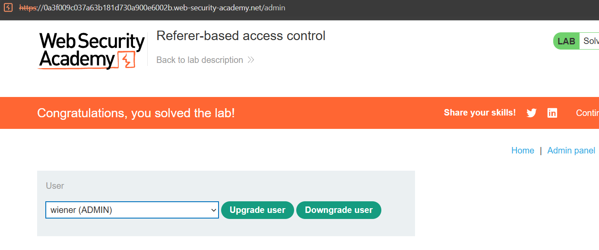

# Lab 13: Referer-based Access Control

## Mục tiêu
Khai thác cơ chế kiểm soát truy cập kém an toàn dựa trên tiêu đề `Referer` để tự nâng quyền tài khoản `wiener` lên administrator và hoàn thành lab.

## Đề bài

  

## Bước 1: Khảo sát request nâng quyền của Admin
Đăng nhập tài khoản `administrator` và truy cập trang quản trị để thực hiện nâng quyền cho người dùng `wiener` nhằm bắt request hợp lệ:

  

## Bước 2: Tấn công bypass phân quyền bằng tài khoản wiener
Đăng nhập tài khoản `wiener` để lấy session cookie, sau đó thay thế session cookie này vào request nâng quyền của admin đã bắt được ở Bước 1:

  

Gửi request đi, hệ thống chấp nhận thực thi lệnh thăng cấp do request chứa tiêu đề `Referer` trỏ từ trang quản trị `/admin`. Bài lab được giải quyết thành công:

  
