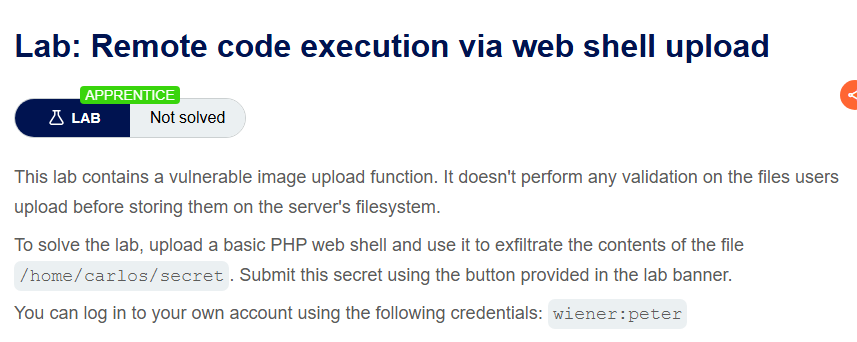
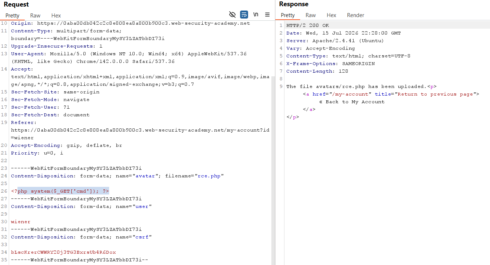
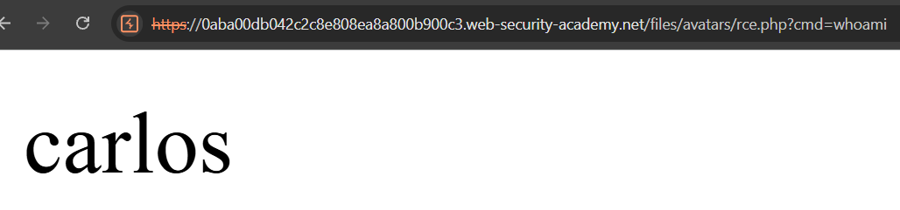
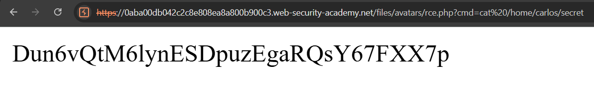
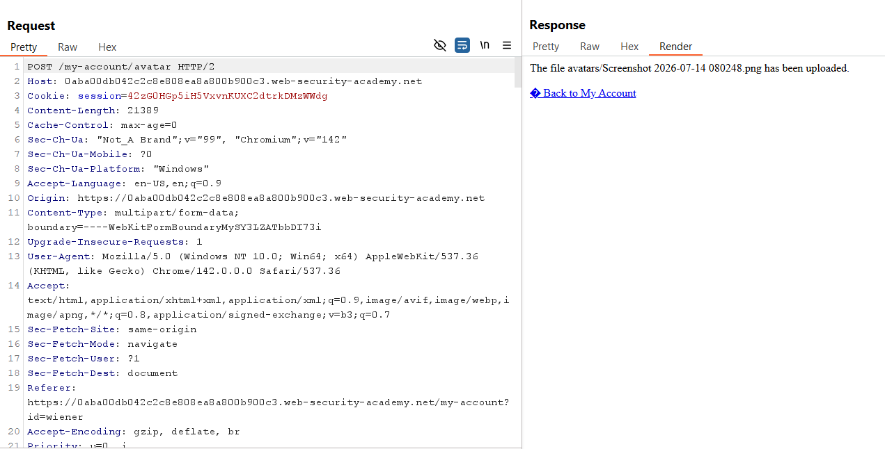
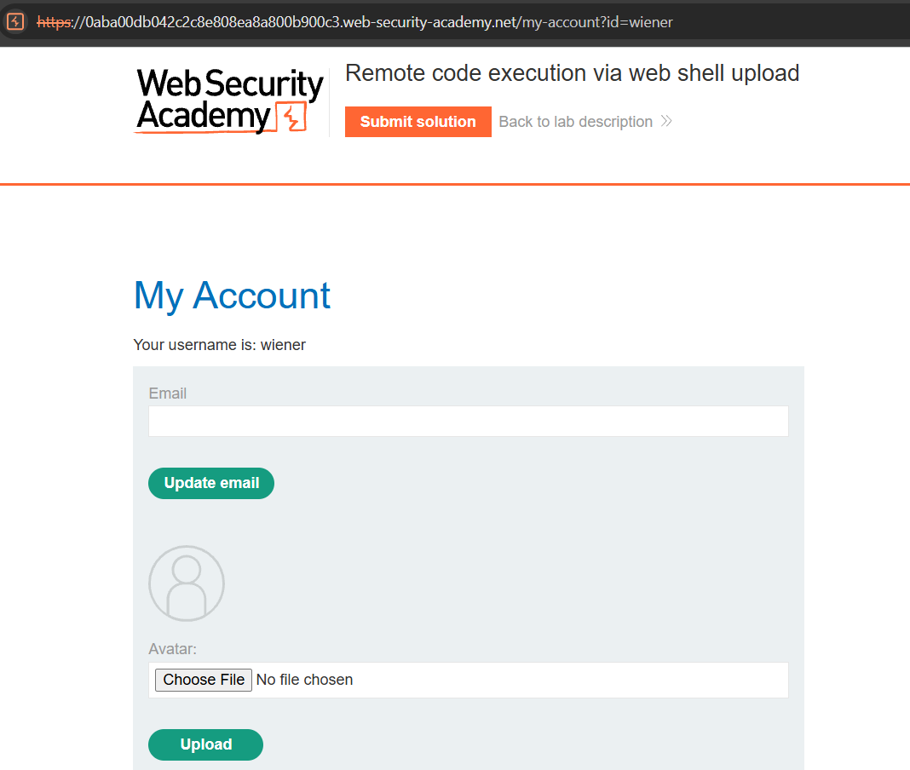

# Lab 01: Remote Code Execution via Web Shell Upload

## Mục tiêu
Khai thác chức năng tải lên ảnh đại diện không thực hiện bất kỳ kiểm tra nào để tải lên một webshell PHP, thực hiện thực thi mã nguồn từ xa (RCE) để lấy nội dung file `/home/carlos/secret`.

## Đề bài


<br><br>

## Bước 1: Khảo sát chức năng tải lên file
Đăng nhập tài khoản `wiener` với mật khẩu `peter`. Trang thông tin cá nhân hiển thị chức năng tải lên ảnh đại diện:


<br><br>

Thực hiện tải lên một tệp ảnh bất kỳ để bắt request trong Burp Suite:


<br><br>

## Bước 2: Tải lên webshell và khai thác RCE
Sửa đổi tham số `filename` thành `rce.php` và thay đổi phần nội dung tệp thành mã độc PHP để thực thi câu lệnh hệ thống:
```php
<?php system($_GET['cmd']); ?>
```


<br><br>

Sau khi tải lên thành công, truy cập đường dẫn của tệp webshell `/files/avatars/rce.php` và truyền câu lệnh kiểm tra thông qua tham số `cmd=whoami`:


<br><br>

Hệ thống phản hồi tên người dùng thực thi lệnh là `carlos`. Tiếp tục đổi câu lệnh sang `cat /home/carlos/secret` để đọc mã bí mật:


<br><br>

Sao chép mã bí mật này gửi lên hệ thống để hoàn thành bài lab.
